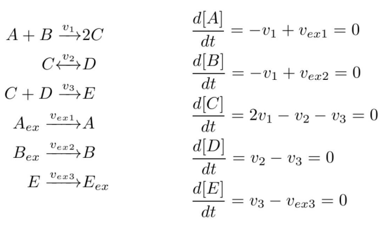
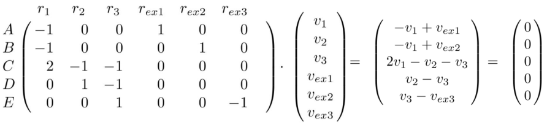
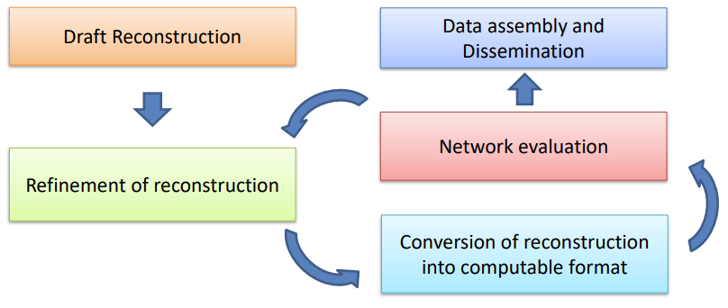

# Constraint Based Modeling of Cellular Network

## 목차

- [Constraint Based Modeling of Cellular Network](#constraint-based-modeling-of-cellular-network)
  - [목차](#목차)
  - [Matrix Properties](#matrix-properties)
    - [Matrix multiplication](#matrix-multiplication)
  - [Linear System](#linear-system)
    - [Gaussian Elemination](#gaussian-elemination)
    - [Row Echelon Form](#row-echelon-form)
    - [Solving homogeneous linear system](#solving-homogeneous-linear-system)
      - [Unique Solution](#unique-solution)
    - [Solving non-homogeneous linear system](#solving-non-homogeneous-linear-system)
  - [Linear Programming](#linear-programming)
    - [LP Model](#lp-model)
      - [Examples of LP Model: Product Mix Problem](#examples-of-lp-model-product-mix-problem)
      - [Examples of LP Model: Product Scheduling Problem](#examples-of-lp-model-product-scheduling-problem)
      - [Examples of LP Model: Transportation Problem](#examples-of-lp-model-transportation-problem)
      - [Examples of LP Model: Flow Capacity Problem](#examples-of-lp-model-flow-capacity-problem)
      - [Developing LP Model](#developing-lp-model)
      - [Example LP model](#example-lp-model)
      - [Multiple solution](#multiple-solution)
    - [Simplex Methode](#simplex-methode)
      - [Simplex Methode: Example](#simplex-methode-example)
      - [Simplex Methode: Tableau](#simplex-methode-tableau)
      - [Simplex Methode: non-standard From LPs](#simplex-methode-non-standard-from-lps)
  - [Modeling biochemical reactions](#modeling-biochemical-reactions)
    - [Stochiometric matrix](#stochiometric-matrix)
  - [Metabolic Networks](#metabolic-networks)
    - [Reaction Rate](#reaction-rate)
    - [Steady State](#steady-state)
  - [Flux Balance Analysis - FBA](#flux-balance-analysis---fba)
    - [Metabolic Network Reconstruction](#metabolic-network-reconstruction)
      - [Defining the biomass reaction](#defining-the-biomass-reaction)
      - [(Non-) Growth associated maintenance](#non--growth-associated-maintenance)

## Matrix Properties

### Matrix multiplication

Matrix multiplication을 살펴보자.

$$A= 
\begin{bmatrix}
a_{11} & ... & a_{1n} \\
... & & ... \\
a_{m1} & ... & a_{mn}
\end{bmatrix}
$$

이고, 

$$b=
\begin{bmatrix}
b_1\\
...\\
b_n
\end{bmatrix}
$$

일때, 다음과 같이 나타낼 수 있다.

$$
\begin{bmatrix}
a_{11}b_1+a_{12}b_2+...+a_{1n}b_n\\
a_{21}b_1+a_{22}b_2+...+a_{2n}b_n\\
...\\
a_{m1}b_1+a_{m2}b_2+...+a_{mn}b_n
\end{bmatrix}
$$

$(m \times n) \times (n \times 1) = (m \times 1)$이고, 즉, 매트랙스 x 벡터는 벡터이다. 

만약 B가 row vector인 

$$B=
\begin{bmatrix}
b_1 & b_2&...& b_p
\end{bmatrix}
$$

이 형태 라면? 

$$AB=
\begin{bmatrix}
Ab_1 & ... & Ab_p
\end{bmatrix}
= C
$$

형태일 것이다.

## Linear System

### Gaussian Elemination

**가우스 소거법(Gaussian elimination)** 은 선형 시스템을 풀거나, 행렬을 다른 형태로 변환하는 데 사용되는 효과적인 방법입니다. 이 방법은 다음과 같은 기본 아이디어를 기반으로 합니다:

1. **기본 행 연산**: 두 행을 교환하거나, 특정 행에 상수를 곱한 후 다른 행에 더하는 등의 기본적인 행 연산을 사용하여 행렬을 원하는 형태로 변환합니다.
   
2. **전진 소거(Forward Elimination)**: 주어진 행렬을 상삼각 행렬(upper triangular matrix) 또는 삼각 행렬(triangular matrix)로 변환하는 단계입니다. 이를 위해 각 행마다 해당 열의 선행 항목을 0으로 만드는 작업을 수행합니다.

3. **후진 대입(Back Substitution)**: 변환된 상삼각 행렬에서 계수를 사용하여 변수를 역으로 추적하고, 각 변수의 값을 차례로 계산하여 시스템의 해(solution)를 찾습니다.

간단한 예를 통해 가우스 소거법을 설명해 보겠습니다. 다음과 같은 선형 시스템을 고려해 봅시다.

$$
\begin{cases} 
2x + 3y + z = 1 \\ 
4x + 4y + 3z = 2 \\ 
2x + 5y + 2z = 3 
\end{cases}
$$

1. **행렬 형태로 표현**: 위의 선형 시스템을 행렬로 표현하면 다음과 같습니다.

$$
\begin{bmatrix} 
2 & 3 & 1 \\ 
4 & 4 & 3 \\ 
2 & 5 & 2 \end{bmatrix} 
\begin{bmatrix} x \\
y \\ 
z \end{bmatrix} = \begin{bmatrix} 1 \\ 
2 \\ 
3 \end{bmatrix}$$

1. **전진 소거**: 이제 행렬을 상삼각 행렬로 변환하는 과정을 시작합니다. 이를 위해 첫 번째 열에서 첫 번째 행의 원소를 기준으로 다른 행의 원소를 0으로 만듭니다. 이 과정을 반복하면 다음과 같은 상삼각 행렬을 얻습니다.

$$\begin{bmatrix} 2 & 3 & 1 \\ 
0 & -2 & 1 \\ 
0 & 2 & 0 \end{bmatrix} \begin{bmatrix} 
x \\ 
y \\ 
z \end{bmatrix} = \begin{bmatrix} 
1 \\ 
-2 \\ 
1 \end{bmatrix}$$

1. **후진 대입**: 이제 상삼각 행렬에서 역으로 변수의 값을 추적하고, 각 변수의 값을 계산하여 시스템의 해를 찾습니다.
   
   먼저, z를 구합니다.

   $$2z = 1 \implies z = \frac{1}{2}$$
   
   그런 다음, y를 구합니다.

   $$-2y + \frac{1}{2} = -2 \implies y = \frac{5}{4}$$
   
   마지막으로, x를 구합니다.

   $$2x + 3(\frac{5}{4}) + \frac{1}{2} = 1 \implies x = -\frac{3}{4}$$

따라서, 이 선형 시스템의 해는 $x = -\frac{3}{4}$, $y = \frac{5}{4}$, $z = \frac{1}{2}$입니다.

이 과정을 통해 Row Echelon Form을 만들 수 있다.

### Row Echelon Form

로우 에켈론 형태(Row Echelon Form)는 행렬의 형태를 나타내는 용어 중 하나입니다. 특히 선형 대수학에서 많이 사용됩니다. 로우 에켈론 형태는 행렬의 각 행이 다음 행보다 왼쪽에 있는 가장 왼쪽에 위치한 비 영 원소가 0이 되도록 하는 특정 형태를 가집니다. 이 형태를 가진 행렬은 다음과 같은 특징을 갖습니다:

모든 비영 행의 첫 번째 열에 위치한 원소는 1입니다. 이를 "leading 1" 또는 "Pivot"이라고 합니다.

* leading 1이 속한 행보다 위쪽의 행의 모든 요소는 0입니다.
* 행의 순서대로 leading 1의 위치가 오른쪽으로 이동합니다.
  
로우 에켈론 형태는 가우스 소거법을 사용하여 얻을 수 있습니다. 가우스 소거법은 주어진 행렬을 계산하기 쉬운 형태로 변환하는 프로세스 중 하나입니다. 전진 소거 단계에서 가우스 소거법은 행렬의 첫 번째 열에서 0이 아닌 요소가 존재하는 행을 찾아 해당 요소를 기준으로 다른 행의 원소를 0으로 만듭니다. 이렇게 하면 로우 에켈론 형태를 얻을 수 있습니다.

로우 에켈론 형태는 선형 시스템의 해를 구하기 쉽게 만들어줍니다. 또한, 행렬의 랭크(rank)를 계산하는 데에도 사용됩니다. 로우 에켈론 형태의 행렬에서 비영 행의 개수가 행렬의 랭크와 같습니다.

로우 에켈론 형태를 갖는 행렬 예시:

$$
\begin{bmatrix} 
1 & 2 & 0 & 3 \\
0 & 0 & 1 & 4 \\
0 & 0 & 0 & 0 \\
\end{bmatrix} 
$$

여기서 피봇의 개수, 즉 모든 요소가 0인 행이 아닌 행의 개수는 2개이므로, rank는 2 입니다. 

Row Echelon Form을 만들기 위한 3가지 방법이 있다.

1. 두개의 row의 순서를 바꿈
2. 한 row에 non-zero scalar를 곱함
3. 한 row를 다른 row에 더하거나 빼서 0을 만듬

이 세 방법중 사용 순서는 상관이 없다. 항상 같은 값을 준다. 이 방법으로 요소를 0으로 만들거나, 피봇을 1로 만든다.

그냥 row echelon Form에서는 모든 피봇이 1이 아니여도 되지만, reduced row echelon From에선 모든 피봇이 1이어야 한다. 그러나 일반적으로 row echelon form이라고 하면 이 reduced REF를 의미한다.

### Solving homogeneous linear system

선형 시스템에서, 동차 선형 시스템이란 상수항이 없는 선형 방정식의 집합입니다. 즉, 형태가 Ax=0인 선형 방정식입니다. 여기서 A는 주어진 행렬이며, x는 미지수 벡터입니다.

homogeneous linear system을 해결할 때, 원래의 방정식이나 행렬에 대한 원래의 해(solution)는 바꾸지 않고도 기본 행 연산을 적용할 수 있습니다. 이는 elementary row operations이 homogeneous linear system의 해에 영향을 주지 않음을 의미합니다. 즉, homogeneous linear system에서는 행렬에 적용된 기본 행 연산이 해에 영향을 미치지 않습니다. 이는 위에서 row echelon form을 만드는 과정이 해에 영향을 주지 않는 것과 같습니다.

동차 선형 시스템의 해(solution)는 해당 행렬의 **null space N(A)** 입니다. Null space는 행렬 A의 영공간(zero space)으로도 불립니다. **N(A)는 주어진 행렬 A에 대한 모든 해(solution)의 집합을 나타냅니다.**

$$N(A) = \{c | Ac=0\}$$

* c = all vectors
* | : such that

줄여진 행 사다리꼴(Reduced Row Echelon Form, RREF)은 주어진 행렬의 null space를 결정하고 기록하는 데 사용될 수 있습니다. 줄여진 행 사다리꼴은 행렬을 기본적으로 영행렬(zero matrix)에 가깝게 만들며, 이러한 형태의 행렬은 null space를 쉽게 확인할 수 있도록 도와줍니다.

따라서, 동차 선형 시스템의 해(solution)는 주어진 행렬 A의 null space로서 줄여진 행 사다리꼴을 사용하여 확인하고 기록할 수 있습니다.

예시를 봅시다. 

어떤 linear homogeneous system A의 **general solution** 을 행렬 형태로 표현하려면 다음과 같은 단계를 따라야 한다.

* 주어진 해(solution)를 벡터로 나타냅니다.
* 벡터를 행렬 형태로 배열합니다.

벡터 A가 다음과 같을 때, 

$$A=
\begin{bmatrix}
0&1&2&0&3&-1\\
0&0&0&1&2&0
\end{bmatrix}
$$

Pivot 칼럼의 x 변수는 한개의 행에 유일하게 1로 존재하기 때문에, 다른 변수로 정의될 수 있다. 따라서, 

$$x_2 = -2x_3 -3x_5+x_6$$
$$x_4=-2x_5$$

따라서 general solution은 다음 형태로 나타낼 수 있다.

$$(x_1, -2x_3 - 3x_5 + x_6, x_3, -2x_5, x_5, x_6)$$

이제 행렬 형태로 배열할 수 있다. 여기서 Pivot variable, 즉 다른 변수로 나타내질 수 있는 pivot 칼럼의 변수는, $x_2$와 $x_4$이다. 나머지는 free variables로 불리며, 어떤 값을 가지든 상관이 없다. 자유변수는 $x_1$, $x_3$, $x_5$, $x_6$이다.

자 이제 general solution을 행렬 형태로 표현하면 다음과 같다.

$$\mathbf{x} = \begin{bmatrix} x_1 \\ -2x_3 - 3x_5 + x_6 \\ x_3 \\ -2x_5 \\ x_5 \\ x_6 \end{bmatrix} $$

자 이제 x를 각각의 free variables에 대한 방정식 행렬로 나타낼 수 있다. 여기서 행렬의 row는 총 variables의 수 n이 되고, column은 총 free variables의 개수 f가 된다. 

$$x=
\begin{bmatrix}
1&0&0&0\\
0&-2&-3&1\\
0&1&0&0\\
0&0&-2&0\\
0&0&1&0\\
0&0&0&1\\
\end{bmatrix}
$$

각각의 column은 free variables, 즉 $x_1$, $x_3$, $x_5$, $x_6$이다. 

* 피봇의 개수 + 자유 변수의 개수 = 전체 변수 개수
* 피봇의 개수 = 변수에 대한 constraints의 개수

즉 여기서 constraint의 개수는 2개이다. 

#### Unique Solution

homogeneous linear system의 solution이 unique한 경우는 언제인가?

- 영벡터 0은 항상 solution입니다. 이를 'trivial solution'이라고 합니다.
- 만약 solution이 고유하다면, 그러면 $N_A = \{0\}$입니다. 즉, solution이 1개 뿐이라면, $b= \{0\}$입니다. 
- 이는 free varialbes가 없을 때 발생합니다.
- 그렇지 않다면, 즉, 자유 변수가 존재한다면, 반드시 non-trivial solution이 존재합니다.
- **따라서, homogeneous linear system이 유니크 솔루션을 가지려면 모든 변수가 pivot 변수여야 합니다!**

### Solving non-homogeneous linear system

non-homogeneous linear system $Ax=b$의 해를 구하는 방법은 다음과 같습니다:

- 기본 행 연산의 적용은 방정식의 해를 변경하지 않습니다; 이는 augmented matrix [𝐴|𝑏]에 적용됩니다.

$$[A|b]= 
\begin{bmatrix}
a_{11} & ... & a_{1n}&|&b_1 \\
... & & ... &|&...\\
a_{m1} & ... & a_{mn}&|&b_m
\end{bmatrix}$$

- 만약 augmented matrix의 시스템이 particular solution(특성 해) 𝑝를 가진다면, 다른 모든 해는 𝑝 + 𝑥 형태를 가집니다. 여기서 𝑥 ∈ 𝑁(𝐴)입니다.

즉, $Ax=0$의 general solution $x_i$와 $Ax=b$의 particular solution $p$를 안다면, $Ax=b$의 general solution $w$는 다음과 같이 표현될 수 있습니다.

$$w= x_i + p$$

즉, general solution $w$를 알기 위해선 particular solution $p$를 먼저 알아야 합니다.

이것을 위해 echelon form으로 만들고, free variable에 대해 변수들을 다른 변수로 표현될 수 있도록 만듭니다. 상수는 $p$가 되고, coefficient는 general solution이 됩니다. 

> **_NOTE:_**  
> $x \in N(A)$일때,    
> $A(p+x)=b$    
> $Ap+Ax=b$    
> $Ax = 0$이므로, $Ap=b$

예를 들어, 

$$[A|b]= 
\begin{bmatrix}
1 & 2 & 3&|&a \\
4&5&6 &|&b\\
7 & 8 &9&|&c
\end{bmatrix}$$

일 때,  이걸 reduced row echelon form(rref)으로 만들면, 

$$rref[A|b]= 
\begin{bmatrix}
1 & 0 & -1&|&-\frac{5}{3}a+\frac{2}{3}b \\
0&1&2 &|&\frac{4}{3}a-\frac{1}{3}b\\
0 & 0 &0&|&c-2b+a
\end{bmatrix}$$

따라서, 만약 $c - 2b + a \neq 0$이면 해가 없습니다 (System inconsistent).

이는 시스템의 모든 방정식을 만족하는 해가 존재하지 않음을 의미합니다. 즉 이러한 경우 시스템은 해를 가지지 않습니다. 이는 linear 시스템이 모든 제약 조건을 동시에 충족하는 해가 존재하지 않는 경우를 의미합니다. 

따라서, $c - 2b + a = 0$인 경우에만 시스템에 해가 존재하며, 이 경우 시스템은 coincide 또는 compatible 하다고 합니다.

만약 $a = b = c = 1$이라면, 시스템은 해를 갖습니다.

그러면 $x_1 = -1 + x_3$, $x_2 = 1 - 2x_3$입니다. $x_1$과 $x_2$는 $x_3$으로 표현될 수 있으니 pivot variables이고, $x_3$은 free variable입니다. 

해를 행렬 형태로 나타내면 다음과 같습니다:

$$\mathbf{x} =\begin{bmatrix} x_1 \\ x_2 \\ x_3 \end{bmatrix}=\begin{bmatrix} -1 + x_3 \\ 1 - 2x_3 \\ x_3 \end{bmatrix}= \begin{bmatrix} -1 \\ 1 \\ 0 \end{bmatrix} + x_3 \begin{bmatrix} 1 \\ -2 \\ 1 \end{bmatrix} $$

여기서 위의 $w=x_i+p$형태가 나타납니다. 

$$\begin{bmatrix} -1 \\ 1 \\ 0 \end{bmatrix}$$

는 particular solution $p$이고, 

$$\begin{bmatrix} 1 \\ -2 \\ 1 \end{bmatrix}$$

는 $x_i$의 coefficient, 즉 general solution입니다. 

## Linear Programming

많은 실전 상황에서, 우리는 목표(objectives)를 달성하기 위해 어떤 한정된 자원을 얼마나 사용해야 하는지 결정하는 최적의 해를 찾는 것에 관심이 있습니다.

수학적 프로그래밍은 최적의 해를 찾는 알고리즘을 제공합니다. 수학적 프로그래밍에는 다양한 종류가 있습니다. 그중 가장 간단한 것은 선형 프로그래밍입니다.

선형 프로그래밍은 모델에 사용되는 모든 수학적 함수가 선형(linear)이어야 합니다.

### LP Model

Standard Linear Programming(LP) 모델은 다음과 같은 표준 형식을 가집니다:

- decision variables가 m개 있습니다. 이들은 자원, 경쟁하는 활동 등을 모델링합니다.
    - $x_1, x_2, \ldots, x_n$으로 나타냅니다.
- 이러한 변수들은 (inequlity) 제약 조건(constraints)을 받습니다.
    - $a_{11}x_1 + a_{12}x_2 + \ldots + a_{1n}x_n \leq b_1$
    - $a_{21}x_1 + a_{22}x_2 + \ldots + a_{2n}x_n \leq b_2$
    - ...
    - $a_{m1}x_1 + a_{m2}x_2 + \ldots + a_{mn}x_n \leq b_m$
    - 모든 $x_j$는 0 이상이어야 합니다: $x_j \geq 0$, $1 \leq j \leq n$
- Objective는 변수들의 linear function을 maximaize하는 것입니다.
    - $z = c_1x_1 + c_2x_2 + \ldots + c_nx_n$

모델은 시그마 표기법을 사용하여 다음과 같이 작성될 수 있습니다:

$$\text{max } z = \sum_{i=1}^{n} c_i x_i $$

subject to (s.t.) (= 다음 조건 하에)

$$\sum_{j=1}^{n} a_{ij} x_j \leq b_i $$

for $1 \leq i \leq m$

여기서,

- $z$는 최대화하려는 objective function입니다.
- $x_j \geq 0$은 모든 decision variables가 0 이상임을 나타냅니다.
- $1 \leq j \leq n$는 decision variables의 인덱스 범위입니다.

#### Examples of LP Model: Product Mix Problem

Product Mix Problem는 다음과 같은 상황을 모델링하는데 사용됩니다:

- 제조업체가 서로 다른 자원(예: 원자재, 노동력, 장비)의 고정된 양을 가지고 있습니다.
- 이러한 자원은 여러 제품 중 하나를 생산하기 위해 조합될 수 있습니다.
- 각 자원의 양이 각 제품을 생산하는 데 필요한 양으로 알려져 있으며 고정되어 있습니다.
- 각 제품의 가격이 알려져 있고 고정되어 있습니다.
- 의사 결정자는 총 수입을 극대화하는 제품의 조합을 생산하려고 합니다.

이러한 문제는 Linear Programming(LP) 모델로 표현될 수 있으며, 각 제품의 생산량을 변수로 설정하고 Constraints로 자원 사용량을 제한하며, objective function로 총 수입을 최대화하도록 합니다.

---

#### Examples of LP Model: Product Scheduling Problem

Product Scheduling Problem는 다음과 같은 상황을 모델링하는데 사용됩니다:

- 제조업체는 다음 n개월 동안 특정 제품의 주어진 수량을 공급해야 한다는 것을 알고 있습니다.
- 이러한 제품은 월별 최대 제한이 있는 일반 시간에 생산되거나, 초과 근무 시간에 생산될 수 있습니다.
- 초과 근무 시간에 제품을 생산하는 비용은 정규 시간에 생산하는 것보다 더 높습니다.
- 매월 끝에 판매되지 않은 각 제품에는 저장 비용이 부과됩니다.
- 문제는 생산 및 저장 비용의 합계를 최소화하는 생산 일정을 결정하는 것입니다.

각 월의 생산량을 변수로 설정하고 제약 조건으로 생산량 및 저장량을 제한하며, objective function로 생산 및 저장 비용의 합계를 최소화하도록 합니다.

---

#### Examples of LP Model: Transportation Problem

Transportation Problem는 다음과 같은 상황을 모델링하는데 사용됩니다:

- 제품은 𝑚개의 출하 원산지에서 양들 𝑎1, 𝑎2, … , 𝑎𝑚으로 운송되어야 하며, 각각의 𝑛개의 운송 목적지에서 양들 𝑏1, 𝑏2, … , 𝑏𝑛으로 수령됩니다.
- 각 원산지와 목적지의 조합에 대해 단위당 운송 비용이 알려져 있습니다.
- 문제는 각 원산지에서 각 목적지로 운송할 양을 결정하여 전체 운송 비용이 최소화되도록 하는 것입니다.

각 원산지에서 각 목적지로의 운송량을 변수로 설정하고, 제약 조건으로 출하량과 수령량을 고려하며, objective function로 전체 운송 비용을 최소화하도록 합니다.

---

#### Examples of LP Model: Flow Capacity Problem

Flow Capacity Problem는 다음과 같은 상황을 모델링하는데 사용됩니다:

- 하나 이상의 상품(예: 교통, 물, 정보, 현금 등)이 제각각의 제약 조건과 유량 용량을 가진 네트워크를 통해 한 지점에서 다른 지점으로 흐릅니다.
- 각 분기의 유량 방향과 각 분기의 용량이 알려져 있습니다.
- 문제는 네트워크의 최대 유량을 결정하되, 용량을 준수하는 것입니다.

이러한 문제는 선형 프로그래밍(LP) 모델로 표현될 수 있으며, 각 분기에서의 유량을 변수로 설정하고, 제약 조건으로 용량 제한을 고려하며, objective function로 전체 네트워크의 최대 유량을 찾습니다.

---

#### Developing LP Model

1. **Specify the decision variables:**
    - 문제에서 결정해야 할 변수를 결정합니다. 이러한 변수는 원하는 결과를 얻기 위해 제어하거나 조작할 수 있는 요소여야 합니다.

2. **Determine the objective:**
    - 문제의 목표 또는 목적을 정의하고, 일반적으로 어떤 양을 최대화하거나 최소화하는 것으로 표현합니다. 이 목표는 결정 변수를 사용하여 기준 함수로 설명되어야 합니다.

3. **Find out the constraints:**
    - 문제를 해결하기 위해 준수해야 할 제한 사항이나 제약 사항을 식별합니다. 이러한 Constraints는 해결해야 하는 문제의 허용 가능한 영역을 정의합니다.

4. **Analysis:**
    - Objective function을 최적화하는 동안 모든 제약 조건을 만족하는 값을 찾기 위해 문제를 분석합니다. 이는 목적에 따라 최적의 결과를 이끌어내는 결정 변수의 값을 찾는 과정을 포함합니다.

#### Example LP model

The LP model for this example is then:

Maximize:

$$z = 13x_1 + 11x_2$$

Subject to:

$$4x_1 + 5x_2 \leq 1500$$

$$5x_1 + 3x_2 \leq 1575$$

$$x_1 + 2x_2 \leq 420$$

$$x_1 \geq 0$$

$$x_2 \geq 0$$

주어진 부등식 $4x_1 + 5x_2 \leq 1500$은 평면상의 두 축 $x_1$과 $x_2$에 대한 선의 한쪽을 정의합니다. 이 부등식은 평면상에서 점 $x_1$과 $x_2$의 조합 중에서 1500보다 작거나 같은 값을 갖는 모든 점들을 포함하는 영역을 정의합니다. 따라서 이 부등식은 직선 $4x_1 + 5x_2 = 1500$의 아래쪽 영역을 나타냅니다.

위의 설명을 그래픽으로 확인할 수 있는 그림은 위의 링크에서 확인할 수 있습니다. 회색 영역은 부등식 $4x_1 + 5x_2 \leq 1500$이 만족되는 영역을 나타냅니다.

이제 이 그래프에 다른 Constraints의 라인을 추가할 수 있습니다. 

* Extreme Points: Extreme Points는 실행 가능한 영역에서 선의 끝으로서 정의됩니다. 즉, 실행 가능한 영역을 결정하는 선분의 끝점에 해당합니다. 이러한 Extreme Points는 실행 가능한 영역의 경계에 위치하며, 해당 영역의 정점들입니다. Extreme Points는 LP 모델에서 중요한 역할을 합니다. 왜냐하면 LP 문제의 최적해는 종종 Extreme Points는서 발생하기 때문입니다. 

이제, Constraints들의 아래 회색부분은 feasible region 혹은 feasible solution space를 나타냅니다. 여기서 objective function `z`에 대한 선을 그리고, 그 선이 마주하는 extreme point가 objective가 됩니다. 따라서, 저 겹치는 부분 중에, 선들이 마주하는 부분(270,75)이 바로 Objective입니다. 

- **How to find extreme point**: 최적해를 찾기 위해서는 먼저 가능한 영역을 탐색해야 합니다. 가능한 영역 내에서 objective function의 값을 최대화 또는 최소화해야 합니다. 가능한 영역은 제약 조건을 모두 만족하는 영역을 의미합니다.

- **objective function의 값이 0인 선**: objective function의 값이 0인 선은 가능한 영역을 탐색할 때 유용하게 사용될 수 있습니다. 예를 들어, objective function가 $z = 13x_1 + 11x_2 = 0$인 경우, 이는 $x_1$과 $x_2$의 가능한 조합 중에서 objective function의 값이 0인 선을 나타냅니다.

- **optimal solution**: LP 문제의 최적해는 주로 feasible region의 extreme point에서 발생합니다. 이는 feasible region의 경계에 위치한 점으로서, 해당 점에서 objective function의 값을 최대 또는 최소로 만드는 점을 의미합니다. 이러한 extreme point는 objective function을 최대화하거나 최소화하는 데 있어서 중요한 지점입니다.

#### Multiple solution

LP 문제는 종종 여러 해를 가질 수 있습니다. 이는 objective function가 하나의 제약 조건과 평행한 경우에 발생할 수 있습니다. 이러한 경우에는 무한히 많은 최적해가 존재할 수 있습니다. 이러한 다중해 상황에서는 어떤 최적해를 선택해야 하는지 결정하는 것이 중요합니다.

### Simplex Methode

두 개 이상의 decision variables가 있는 경우 graphical methods는 다루기 어렵습니다. Simplex Methode는 모든 실행 가능한 해를 조사하는 데 사용되지 않습니다. 그 대신, 최적 해를 포함하는 convex feasible regions의 작고 고유한 집합인 extreme point의 집합만 다룹니다. 

> Feasible region이 convex하다는 것은 해당 영역 내의 두 점을 연결하는 선이 영역 내에 완전히 포함되는 경우를 의미합니다.

Extreme point: feasible region의 극점은 해당 영역의 경계에 위치한 점입니다. Simplex 방법은 이러한 극점에서 출발하여 최적해를 찾습니다. feasible region이 convex하기 때문에, Simplex 방법은 이러한 극점들을 순회하면서 최적해를 찾아나갈 수 있습니다.

Convexity: feasible region이 convex하다는 것은 해당 영역 내의 임의의 두 점을 연결하는 선분이 모두 feasible region 내에 있음을 의미합니다. 따라서 Simplex 방법은 convex feasible region을 탐색하는 과정에서 최적해를 발견할 수 있습니다.

 **Simplex Method**:

    1. Feasible region의 Extreme point을 찾습니다.
    2. 이 점에서 교차하는 각 경계 선분을 조사하여 objective function의 값을 증가시키는지 확인합니다.
    3. objective function의 값이 어떤 선분을 따라서도 증가한다면, 해당 선분을 따라 이웃하는 극점으로 이동합니다. 여러 선분이 개선을 나타내는 경우, 증가율이 가장 큰 선분을 선택합니다.
    4. objective function의 값이 더 이상 증가하지 않을 때까지 단계 2와 3을 반복합니다.

예시로 돌아가 보도록 하자.

#### Simplex Methode: Example

Simplex methode로 문제를 해결해 봅시다.
- 단계 1: 모든 inequlity constraints를 slack variables를 사용하여 등식으로 변환합니다.
- slack variables로 다음과 같이 정의합니다:
   - $s_1$: 사용되지 않은 저장 공간을 나타냅니다.
   - $s_2$: 사용되지 않은 원자재를 나타냅니다.
   - $s_3$: 사용되지 않은 생산 시간을 나타냅니다.
- slack variables의 도입으로 LP 모델의 정식화가 변경됩니다.
  
따라서, 업데이트된 Objective function과 Constraints는:

$$z - 13x_1 - 11x_2 = 0 $$

$$4x_1 + 5x_2 + s_1 = 1500 $$

$$5x_1 + 3x_2 + s_2 = 1575 $$

$$x_1 + 2x_2 + s_3 = 420 $$

$$x_1 \geq 0 $$

$$x_2 \geq 0 $$

$$s_1, s_2, s_3 \geq 0 $$

한 가지 실행 가능한 해는 다음과 같습니다:
  - $x_1 = 0, x_2 = 0, s_1 = 1500, s_2 = 1575, s_3 = 420, z = 0$

이것은 **basic feasible solution**라고 합니다.

**Basic variable**는 constraint에서 isolated variable로, 해당 제약 조건의 right-hand side으로 설정될 수 있는 변수입니다. 다른 모든 변수는 **non-basic**입니다.
$z$의 값을 어떻게 증가시킬 수 있을까요?
  - 첫 번째 방정식의 변수에 대한 negative coefficients
  - 변수에 양수 값을 할당함으로써 $z$를 증가시킬 수 있습니다.
  
자세한 방법은 다음과 같습니다:

>1. Objective function에서, $x_1$과 $x_2$중 더 작은(최소) coefficient를 가지는 $x$를 **entering variable**으로 설정합니다. 
>2. 이후 entering variable의 coefficient로 right-hand-side를 나눴을 때, 값이 최소가 되는 constraint를 고릅니다. 

아래는 이 과정을 나타낸 예시입니다.

-  **Step 1**
   - 제약 조건인 4𝑥1 + 5𝑥2 + 𝑠1 = 1500에서, 만약 **𝑥2 = 𝑠1 = 0**이라면, 𝑥1 = 375입니다. 이는 Product I를 375개 생산할 충분한 저장 공간이 있다는 것을 의미합니다.: Product I의 최대 유닛을 보여줍니다. 
   - 제약 조건인 5𝑥1 + 3𝑥2 + 𝑠2 = 1575에서, 만약 **𝑥2 = 𝑠2 = 0이**라면, 𝑥1 = 315입니다. 이는 Product I를 315개 생산할 충분한 원자재가 있다는 것을 의미합니다.
   - 제약 조건인 𝑥1 + 2𝑥2 + 𝑠3 = 420에서, 만약 **𝑥2 = 𝑠3 = 0**이라면, 𝑥1 = 420입니다. 이는 Product I를 420개 생산할 충분한 시간이 있다는 것을 의미합니다.
   - 따라서, 세 가지 제약을 모두 고려할 때, Product I를 생산하는 데 충분한 자원이 있습니다. 𝑥1의 최대값은 두 번째 제약에 의해 제한됩니다: 5𝑥1 + 3𝑥2 + 𝑠2 = 1575.

- **Step 2**

    $𝑥_1$을 제한하는 방정식에서

    $$𝑥_1 = -\frac{3}{5}𝑥_2 - \frac{1}{5}𝑠_2 + 315 $$

    다른 방정식에 대입하여 다음을 얻습니다:

    $$𝑧 - \frac{16}{5}𝑥_2 + \frac{13}{5}𝑠_2 = 4095 $$

    $$\frac{13}{5}𝑥_2 + 𝑠_1 - \frac{4}{5}𝑠_2 = 240 $$

    $$𝑥_1 + \frac{3}{5}𝑥_2 + \frac{1}{5}𝑠_2 = 315 $$

    $$\frac{7}{5}𝑥_2 - \frac{1}{5}𝑠_2 + 𝑠_3 = 105 $$

    새로운 feasible solution은
    $𝑥_1 = 315$, $𝑥_2 = 0$, $𝑠_1 = 240$, $𝑠_2 = 0$, $𝑠_3 = 105$, $𝑧 = 4095$입니다.
    이것은 optimal solution이 아닙니다. 왜냐하면

    $$𝑧 - \frac{16}{5}𝑥_2 + \frac{13}{5}𝑠_2 = 4095$$

    에서 $𝑥_2$의 계수가 음수이기 때문에, $𝑥_2$에 양수 값을 할당함으로써 $𝑧$의 값이 더 증가할 수 있기 때문입니다.

    동일한 분석 절차를 Step 1에서 사용한대로 따라가보면,

    $$\frac{13}{5}𝑥_2 + 𝑠_1 - \frac{4}{5}𝑠_2 = 240$$
    에서, 만약 $𝑠_1 = 𝑠_2 = 0$이라면, $𝑥_2 = 92.3$ 입니다.

    $$𝑥_1 + \frac{3}{5}𝑥_2 + \frac{1}{5}𝑠_2 = 315$$
    에서, 만약 $𝑥_1 = 𝑠_2 = 0$이라면, $𝑥_2 = 525$ 입니다.

    $$\frac{7}{5}𝑥_2 - \frac{1}{5}𝑠_2 + 𝑠_3 = 105$$
    에서, 만약 $𝑠_2 = 𝑠_3 = 0$이라면, $𝑥_2 = 75$ 입니다.

    따라서, 마지막 제약조건은 $𝑥_2$의 최대값을 75로 제한합니다.
    따라서, 새로운 feasible solution에는 $𝑥_2 = 75$, $𝑠_2 = 𝑠_3 = 0$이 포함됩니다.

- **Step 3**

    방정식이 $𝑥_2$를 제한하는 것에서,
    $$𝑥_2 = \frac{1}{7}𝑠_2 - \frac{5}{7}𝑠_3 + 75$$
    다른 방정식에 대입하여 다음을 얻습니다:
    $$𝑧 + \frac{15}{7}𝑠_2 + \frac{16}{7}𝑠_3 = 4335$$
    $$𝑠_1 - \frac{3}{7}𝑠_2 - \frac{13}{7}𝑠_3 = 45$$
    $$𝑥_1 + \frac{2}{7}𝑠_2 - \frac{3}{7}𝑠_3 = 270$$
    $$𝑥_2 - \frac{1}{7}𝑠_2 + \frac{5}{7}𝑠_3 = 75$$

    따라서 실행 가능한 해는
    $𝑥_1 = 270$, $𝑥_2 = 75$, $𝑠_1 = 45$, $𝑠_2 = 0$, $𝑠_3 = 0$, $𝑧 = 4335$입니다.

---

아휴시발 아주 좆같은 예시입니다. 그냥 표를 이용하는 규칙을 봅시다. 

#### Simplex Methode: Tableau

- **Step I**: 초기 테이블 설정
초기 테이블을 설정합니다. constraint와 objective function으로 Tableau를 만듭니다.
    | Basic Variables | $z$   | $x_1$ | $x_2$ | $s_1$ | $s_2$ | $s_3$ | Constants |
    |-----------------|-------|-------|-------|-------|-------|-------|-----------|
    | $z$             | 1     | -13   | -11   | 0     | 0     | 0     | 0         |
    | $s_1$           | 0     | 4     | 5     | 1     | 0     | 0     | 1500      |
    | $s_2$           | 0     | 5     | 3     | 0     | 1     | 0     | 1575      |
    | $s_3$           | 0     | 1     | 2     | 0     | 0     | 1     | 420       |

- **Step II**: 다음 반복에서 non-zero variable로 할당될 값을 식별하여 objective function의 값을 증가시킵니다.
이 변수는 entering variable라고합니다.

  - objective function에서 가장 minimum negative coefficient와 연관된 non-basic variable을 확인합니다.
  - minimum negative coefficient와 동일한 두 개 이상의 non-basic variables가있는 경우 임의로 하나를 선택하고 계속 진행합니다.

  | Basic Variables | $z$   | $x_1$ | $x_2$ | $s_1$ | $s_2$ | $s_3$ | Right-hand-side | Upperbound on entering variable|
  |-----------------|-------|-------|-------|-------|-------|-------|-----------|---|
  | $z$             | 1     | _-13_   | -11   | 0     | 0     | 0     | 0         ||
  | $s_1$           | 0     | _4_     | 5     | 1     | 0     | 0     | 1500      |375|
  | $s_2$           | 0     | _5_     | 3     | 0     | 1     | 0     | 1575      |315|
  | $s_3$           | 0     | _1_     | 2     | 0     | 0     | 1     | 420       |420|

  > **Entering variable**은 $x_1$입니다. objective function에서 최소 음수 계수를 가지는 변수가 $x_1$이기 때문입니다.

  각 row에서 현재 Entering variable의 coefficient로 right-hand-side의 값을 나눕니다.  

- **Step III**: 다음 솔루션에서 non-zero variable에서 0 값을 가지게 될 변수인 leaving variable를 식별합니다.
  
  > leaving variable은 $s_2$입니다. Upperbound on entering variable이 가장 작은 row의 basic variable이 **leaving variable**로 설정됩니다. 
  
  테이블을 업데이트 합니다.
 
- **Step IV**: 두 번째 테이블에 basic variable을 입력합니다.
이전 테이블의 행 순서를 유지하고 leaving variable을 entering variable로 대체합니다.

- **Step V:** 테이블의 계수를 업데이트합니다.
    | Row number | Basic variable | $z$ | $x_1$ | $x_2$ | $s_1$ | $s_2$ | $s_3$ | Right-hand side | Upper bound on entering variable |
    |------------|----------------|-----|-------|-------|-------|-------|-------|-----------------|----------------------------------|
    | 1          | $z$            | 1   | 0     | -16/5 | 0     | 13/5  | 0     | 4095            |                                  |
    | 2          | $s_1$          | 0   | 0     | 13/5  | 1     | -4/5  | 0     | 240             |  92.3                                |
    | 3          | $x_1$          | 0   | 1     | 3/5   | 0     | 1/5   | 0     | 315             |  525                                |
    | 4          | $s_3$          | 0   | 0     | 7/5   | 0     | -1/5  | 1     | 105             |  75                                |
    
    > second entering variable은 $x_2$입니다. $x_2$의 coefficient로 각 right hand side의 값을 나눴을 때 얻어지는 값이 upperbound입니다. 
- **Step VI**: Optimality를 확인합니다.
두 번째 feasible solution도 최적이 아닙니다. 왜냐하면 목적 함수에 음의 계수가 포함되어 있기 때문입니다. 
더 많은 반복이 필요합니다. 
  > 다음 leaving variable은 최소 upperbound를 가지는 4번째 row의 basic variable인 $s_3$입니다.

최종 Tableau는 다음과 같습니다.:

| Row number | Basic variable | $z$ | $x_1$ | $x_2$ | $s_1$ | $s_2$ | $s_3$ | Right-hand side |
|------------|----------------|-----|-------|-------|-------|-------|-------|-----------------|
| 1          | $z$            | 1   | 0     | 0     | 0     | 15/7  | 16/7  | 4335            |
| 2          | $s_1$          | 0   | 0     | 0     | 1     | -3/7  | -13/7 | 45              |
| 3          | $x_1$          | 0   | 1     | 0     | 0     | 2/7   | -3/7  | 270             |
| 4          | $x_2$          | 0   | 0     | 1     | 0     | -1/7  | 5/7   | 75              |

#### Simplex Methode: non-standard From LPs

물론 minimizing Objective function에도 LP를 사용할 수 있습니다. 방향만 바꾸면 됩니다.

아래 식은 Maximizing을 나타냅니다.

$$z = \sum_{i=1}^{n} c_i x_i$$

그리고 아래 식은 Minimizing을 나타냅니다.

$$z' = -\sum_{i=1}^{n} c_i x_i$$

기본적으로 최소화 LP는 상한 값을 모델링하는 $\leq$ Constraints가 포함되어 있습니다. 몇몇 제한된 변수에 대한 $\geq$ Constraints도 있지만, 우리는 신경쓰지 않습니다. 

아래 예시가 주어집니다.

$$min z = 1500𝑥_1 + 1575𝑥_2 + 420𝑥_3$$
s.t.
$$4𝑥_1 + 5𝑥_2 + 𝑠_1 = 13$$
$$5𝑥_1 + 3𝑥_2 + 2𝑥_3 + 𝑠_2 = 11$$
$$𝑥_1, 𝑥_2, 𝑥_3, 𝑠_1, 𝑠_2 ≥ 0$$

주어진 문제에서 초기 해를 얻기 위해서는 모든 decision variable(𝑥1, 𝑥2, 𝑥3)를 모두 0으로 설정할 수 없습니다. 초기 솔루션을 얻기 위해 artificial variable이 크거나 같은 제약 조건에 추가될 수 있습니다. 𝑤1 및 𝑤2를 artificial variable로 정의해 봅시다.

$$4𝑥_1 + 5𝑥_2 + 𝑥_3 - 𝑠_1 + 𝑤_1 = 13 $$

$$5𝑥_1 + 3𝑥_2 + 2𝑥_3 - 𝑠_2 + 𝑤_2 = 11 $$

초기적으로 실현 가능한 솔루션은 다음과 같습니다:

$$𝑥_1 = 𝑥_2 = 𝑥_3 = 𝑠_1 = 𝑠_2 = 0, 𝑤_1 = 13, 𝑤_2 = 11 $$

목적 함수는 다음과 같이 변환됩니다:

$$𝑧 = 1500𝑥_1 + 1575𝑥_2 + 420𝑥_3 + 5000𝑤_1 + 5000𝑤_2 $$

𝑤1 = 𝑤2 = 0인 솔루션은 실현 가능하지만, 𝑤1 > 0, 𝑤2 > 0인 솔루션은 그렇지 않습니다. 따라서 이러한 값들을 0으로 추동시키기 위해 대규모 상수 𝑀을 목적 함수에 도입할 수 있습니다. 이는 big-M Methode으로 알려져 있습니다.

| Row num | Basic variable | 𝑧 | 𝑥1 | 𝑥2 | 𝑥3 | 𝑠1 | 𝑠2 | 𝑤1 | 𝑤2 | Right-hand side | Upper bound on entering variable |
|---------|----------------|---|-----|-----|-----|-----|-----|-----|-----|------------------|---------------------------------|
|    1    |        𝑧       | 1 | 43500 | 38425 | 14580 | -5000 | -5000 | 0 | 0 | 120000 |                               |
|    2    |       𝑤1       | 0 | 4 | 5 | 1 | -1 | 0 | 1 | 0 | 13 | 13/4 |
|    3    |       𝑤2       | 0 | 5 | 3 | 2 | 0 | -1 | 0 | 1 | 11 | 11/5 |

>여기서 entering variable을 정하는 기준은 Objective function에서 최대 coefficient를 고르는 것입니다.
>leaving variable을 정하는 기준 또한 최대 upperbound row를 고르는 것입니다. 

이외의 과정은 위에서 설명한 방법과 같습니다.

최종 Tableau는 다음과 같습니다:

| Row num | Basic variable | 𝑧 | 𝑥1 | 𝑥2 | 𝑥3 | 𝑠1 | 𝑠2 | 𝑤1 | 𝑤2 | Right-hand side |
|---------|----------------|---|-----|-----|-----|-----|-----|-----|-----|------------------|
|    1    |        𝑧       | 1 | -45 | 0 | 0 | -270 | -75 | -4730 | -4925 | 4335 |
|    2    |       𝑥2       | 0 | 3/7 | 1 | 0 | -2/7 | 1/7 | 2/7 | -1/7 | 15/7 |
|    3    |       𝑥1       | 0 | 13/7 | 0 | 1 | 3/7 | -3/7 | -3/7 | 5/7 | 16/7 |

보다시피 위의 maximization과 답은 같습니다.

## Modeling biochemical reactions

생화학 반응은 물리학과 화학의 법칙에 따라 진행됩니다.
물질은 아무 곳에서나 창출될 수 없으며, 물질은 사라지지 않습니다. 따라서 기질과 생성물이 균형을 이루어야 합니다.

일반적인 형태로, 주어진 집합 𝑈의 분자를 사용하는 생화학 반응은 다음과 같이 작성할 수 있습니다:

$$\alpha_1 S_1 + \alpha_2 S_2 + \cdots + \alpha_n S_n \rightarrow \beta_1 S_1 + \beta_2 S_2 + \cdots + \beta_n S_n$$

여기서:
- $\alpha_i$ 는 $S_i$ 분자의 수를 Substrate로 나타냅니다.
- $\beta_i$ 는 $S_i$ 분자의 수를 Product로 나타냅니다.

생화학 반응에서 𝑆𝑖 분자의 수가 변하는 정도는 다음과 같이 나타낼 수 있습니다:

$$\Delta_i = \beta_i - \alpha_i$$

따라서 다음과 같이 설명할 수 있습니다:
- 만약 $\beta_i - \alpha_i < 0$이면, $\Delta_i$ 만큼의 $S_i$ 분자가 consumed됩니다.
- 만약 $\beta_i - \alpha_i > 0$이면, $\Delta_i$ 만큼의 $S_i$ 분자가 produced됩니다.
- 만약 $\beta_i - \alpha_i = 0$이면, 반응은 $S_i$ 분자의 수를 변경하지 않습니다.

따라서 생화학 반응에서 각 분자수의 변화량 $\Delta_i$들을 벡터로 표현할 수 있습니다. 이 벡터는 모든 분자에 대한 변화량을 포함하고 있습니다.  

$$
r = \begin{bmatrix} \beta_1 - \alpha_1 \\ 
\beta_2 - \alpha_2 \\ 
\vdots \\ 
\beta_{n-1}-\alpha_{n-1} \\
\beta_n - \alpha_n \end{bmatrix}
$$

한 반응의 예를 들어보자.

$$𝐹𝐵𝑃 + 𝐻_2𝑂 → 𝐹6𝑃 + 𝑃𝑂_4^{3-} + 3𝐻^+$$

$U=\{𝐹𝐵𝑃, 𝐻_2𝑂, 𝑃𝑂_4^{3-}, 𝐹6𝑃, 3𝐻^+\}$ 이 반응의 reaction vector는 

$$r=
\begin{bmatrix}
-1 \\ 
-1 \\ 
1 \\ 
1 \\ 
3
\end{bmatrix}
$$

>_**NOTE**_: row의 순서는 metabolites의 ordering과 같다.

생화학 네트워크는 분자 집합 𝑈 상에서의 𝑚개의 생화학 반응을 모은 것입니다.

$$
\begin{align*}
&\alpha_{11}S_1 + \alpha_{21}S_2 + \cdots + \alpha_{n1}S_n \rightarrow \beta_{11}S_1 + \beta_{21}S_2 + \cdots + \beta_{n1}S_n \\
&\alpha_{12}S_1 + \alpha_{22}S_2 + \cdots + \alpha_{n2}S_n \rightarrow \beta_{12}S_1 + \beta_{22}S_2 + \cdots + \beta_{n2}S_n \\
&  \vdots \\
&\alpha_{1m}S_1 + \alpha_{2m}S_2 + \cdots + \alpha_{nm}S_n \rightarrow \beta_{1m}S_1 + \beta_{2m}S_2 + \cdots + \beta_{nm}S_n
\end{align*}
$$

Each with a respective reaction vector 𝑟₁, … , 𝑟ₘ.

### Stochiometric matrix

반응 벡터들인 𝑟₁, … , 𝑟ₘ을 모은 𝑛 × 𝑚 행렬을 Stochiometric matrix 행렬 𝑁이라고 합니다:

$$
\mathbf{N} = 
\begin{bmatrix}
\mathbf{r}_1 &|\mathbf{r}_2 &| \cdots & |\mathbf{r}_m \\
\end{bmatrix}
$$

또는 equivalently하게, 

$$
\mathbf{N} = 
\begin{bmatrix}
\beta_{11} - \alpha_{11} & \beta_{12} - \alpha_{12} & \cdots & \alpha_{1m} & \beta_{1m} \\
\vdots & &&\vdots  \\
\beta_{n1} - \alpha_{n1} & \beta_{n2} - \alpha_{n2} & \cdots & \alpha_{nm} & \beta_{nm}\\
\end{bmatrix}
$$

이 entries를 stoichiometric coefficients라고 합니다.

Reactions는 두 그룹으로 나눌 수 있습니다:
- Internal reactions
- Boundary 혹은 exchange reactions

**Boundary (exchange) reactions**는 다음 중 하나를 갖습니다:
* 오직 non-positive stoichiometric coefficients만 있는 경우 (즉, zero와
negative coefficients) - export 반응으로 알려져 있습니다
* 오직 non-negative stoichiometric coefficients만 있는 경우 (즉, zero와
positive coefficients) - import 반응으로 알려져 있습니다

**Internal reactions**은 적어도 하나의 negative coefficient와 하나의 positive coefficient를 포함합니다 (즉, 적어도 하나의 반대 부호를 가진 coefficients 쌍이 하나 이상 있습니다) 이는 export되거나, import된 분자가 없는, 완전히 internal 분자들끼리 일어난 반응을 의미합니다. 

예시 stoichiometric matrix를 살펴봅시다.

$$r1:\phi \to A$$

$$r2: B \to \phi$$

$$r3: A \to B$$

이 반응들은 sthochiometric matrix로 나타내질 수 있습니다.

$$
N = 
\begin{bmatrix}
1&0&-1 \\
0&-1&1
\end{bmatrix}
$$

아래 반응 또한 동일한 stochiometric matrix를 가집니다.

$$r1: A \to 2A$$

$$r2: 2B \to B$$

$$r3: A \to B$$

## Metabolic Networks

Metabolic Networks는 생화학 반응들의 집합을 나타내며 이를 통해 일련의 대사물질들이 서로 transformed되고 environment와 exchange(즉, import 및 export)됩니다.

Metabolic Networks는 다음과 같이 stoichiometric matrix에 의해 표현됩니다:

- Row는 Metabolites를 나타냅니다.
- Column은 Reactions를 나타냅니다.
- Entries는 Stoichiometric coefficients입니다:
  - Negative coefficients는 Substrate을 나타냅니다.
  - Positive coefficients는 Product를 나타냅니다.

아래는 example stoichiometric matrix입니다.

### Reaction Rate 

Reaction Rate 또는 Reaction Flux, $v_j$는 반응 $r_j$의 conversion rate, 즉 반응물에서 생성물로의 Throughput을 의미합니다.

Reaction rate는 physical quantitiy(물리량)이므로, 관련 유닛을 가집니다. constraint-based modeling에서 Flux는 다음과 같이 표현됩니다.

$$v=\frac{mol}{gDW\cdot h}$$

Flux가 물질의 농도와 시간에 매치한다는 것을 볼 수 있습니다.  

Reaction Rate는 Metabolite concentration과도 연관이 있습니다. 

Metabolite 𝑋𝑖의 농도는 시간이 지남에 따라 바뀝니다.

- 𝑋𝑖를 생성하거나 합성하는 반응
- 𝑋𝑖를 소비하거나 분해하는 반응

Metabolite 𝑋𝑖의 농도의 시간적 변화 정도는 해당 반응의 반응 속도와 𝑋𝑖가 반응에 들어가는 몰 농도의 곱과 같습니다.

- 𝑋𝑖를 **produce**하는 반응은 그 농도의 증가에 **positive**하게 기여합니다.
- 𝑋𝑖를 **consume**하는 반응은 그 농도의 감소에 **negative**하게 기여합니다.

$\Delta t$를 일정 작은 시간 간격이라고 가정했을 때, 시간 $t$에서 $t+\Delta t$까지 Metabolite $X_i$의 농도 변화는 다음과 같습니다.

$$x_i(t+\Delta t)-x_i(t)$$

농도의 변화율(rate of change in concentration)은 다음과 같습니다:

$$\frac{x_i(t+\Delta t)-x_i(t)}{\Delta t}$$

이는 다음과 같이 표현할 수도 있습니다.

>             $X_i$ 생성 반응 constribution - $X_i$ 소비 반응 constribution

Stoichiometric matrix $N$의 i번째 행 $N_i$은 metabolite $X_i$를 정의합니다.

따라서 $v$가 모든 vectors의 Reaction rates라면, 다음과 같습니다:

$$\frac{x_i(t+\Delta t)-x_i(t)}{\Delta t}=N_{i}\cdot v(t)$$

이를 $\Delta t \to 0$에 대해 극한값을 취하면: _중요하지 않음_

$$\lim_{\Delta t \to 0} \frac{x_i(t+\Delta t)-x_i(t)}{\Delta t}= \lim_{\Delta t \to 0}N_{i}\cdot v(t)$$

$$\frac{dx_i}{dt}=N_{i}\cdot v(t)$$

여기서 $v(t)$는 일반적으로 다음과 같은 형태를 가집니다:

$$ v(t)=
\begin{bmatrix}
v_1(t) \\
v_2(t) \\
\vdots \\
v_i(t)
\end{bmatrix}
$$

각 row는 각 Metabolite $X_i$에 대한 Reaction rate입니다.

그렇다면 Metabolite $X_i$의 농도변화율은 다음과 같습니다:

- $N_{m \times n}$이고, i가 row, j가 column을 가리킬 때, 

$$\frac{dx_i}{dt}=v_1(t)+\dots+v_i(t)$$

따라서, 

$$
\begin{bmatrix}
\frac{dx_1}{dt} \\
\vdots\\
\frac{dx_i}{dt}
\end{bmatrix}
=N_{i}\cdot v(t)
$$

$N_{i}\cdot v(t)$에 대한 간단한 예시를 들어보도록 하겠습니다.

> 
> $$ N_{i}\cdot v(t)=
> \begin{bmatrix}
> 1&0&-1 \\
> 0&-1&1
> \end{bmatrix}
> \begin{bmatrix} v_1 \\
> v_2 \\ 
> v_3 \end{bmatrix}$$
> 
> 따라서, 각 Metabolite A와 B의 Reaction rate는 다음과 같이 정의됩니다.
> 
> $$N_{A}\cdot v(t)=v_1 -v_3$$
> 
> $$N_{B}\cdot v(t)=v_3 -v_2$$
> 
> Reaction rate의 changing rate는 다음과 같습니다:
> 
> $$\frac{x_A(t+\Delta t)-x_A(t)}{\Delta t}$$
> 
> $$\frac{x_B(t+\Delta t)-x_B(t)}{\Delta t}$$

Reaction rate는 다음과 같은 요소에 의해 결정됩니다:
- metabolites의 농도, 𝑥
- 반응을 촉매하는 효소의 농도, 𝐸
- activator / inhibitor 의 농도
- 효소의 촉매 속도인 catalytic rate, $𝑘_{𝑐𝑎𝑡}$

즉, 반응 $r_j$에 대해서, 

$$v_j=f_j(x,E,k)$$

그러나, 실제 현실의 metabolic modeling에선, 우리는 여러 effectors와 kinetic paramters등 정확히 알지 못하는 것이 매우 매우 많습니다. 따라서 $v_j=f_j(x,E,k)$는 정확히 specified 될 수 없습니다. 

이 우리가 모르는 많은 변수들을 계산에서 제외하고, 너무나 복잡하여 계산이 불가능한 모델링을 간단하게 만들기 위해서, steady state의 개념을 도입합니다.

### Steady State

Steady State는 모델을 간소화하고 분석을 용이하게 하기 위해 사용됩니다. steady state에서는 metabolic network 내 대부분의 변수들이 일정한 값을 유지하기 때문에, 모델링이 더 간단해집니다. 

많은 생물학적 실험은 일정한 조건에서 수행되며, 이러한 조건에서 steady state에서의 모델을 사용하여 실험 결과를 설명하고 예측할 수 있습니다.

또한, 생물의 항상성에 의해 대부분의 생물학적 시스템은 외부 환경 변화에도 불구하고 상대적으로 안정된 상태를 유지합니다. 따라서 steady state에서의 모델은 실제 상황을 잘 근사합니다.

이런 steady state의 concept에서, 다음 조건들이 성립합니다.

일정 기간 동안 환경이 변하지 않으면
- 유전자 발현은 상대적으로 일정합니다.
- 효소 수준은 변하지 않습니다.

따라서 metabolites concentrate도 일정하게 유지됩니다.

또한, metabolic pool에서 system 외부로 나가는 것은 들어오는 것과 같습니다. 

이 조건 하에 system이 steady state에 있다고 가정됩니다.

일반적으로, change in metabolism은 초 단위에서 발생하는 반면, 단백질 수준 및 유전자 발현의 변화는 분 단위 또는 시간 단위로 발생합니다. 이러한 시간적 차이는 대사 활동 및 단백질 수준 및 유전자 발현 간의 특성적인 차이 때문에 발생합니다.

Thermodynamic equilibrium은 대사 과정에서의 하나의 안정상태 형태입니다. 이는 metabolic pool에 입-출이 없고 metabolic pool 내에서 물질의 농도가 일정하게 유지되는 상태를 의미합니다.

따라서, 

$$\frac{dx_i}{dt}=N_{i}\cdot f(t)=N_{i}\cdot v(t)=0$$

이고, 다음과 같이 쓸 수 있습니다.

$$Nv=0$$

시스템이 일단 steady state에 있으면 농도에 변화가 없는 한 시스템에서 벗어나지 않기 때문에 시간에 대한 의존도는 낮아질 수 있습니다.

**이제, Reaction rate를 variable로 하고, stoichiometric matrix에 해당하는 coefficients를 사용하여 linear system을 구축합니다.**

이 **linear equation system의 해**는 metabolic network가 support 할 수 있는 **set of all steady states**에 해당합니다. 

steady state의 가정 하에, 반응들의 농도변화 예를 살펴보도록 하겠습니다.

* $v_{ex}$는 export reaction을 의미합니다.
* $v_2$는 reversible reaction입니다. $Nv=0$임을 알고, v가 뭔지는 모를 때에도, 우리는 어떤 반응이 irreversible이고 어떤 반응이 reversible인지는 알 수 있습니다. 
* reversible reaction은 두개의 forward-/backward irreversible reaction으로 분리할 수 있습니다. 
* 따라서, 위의 예시에서 5개의 Metabolites와 7개의 reactions, 즉 $N_{5 \times 7}$의 stoichiometric matrix를 생성할 수 있습니다. 

따라서, 위의 예시에서 다음과 같은 식을 얻을 수 있습니다.

이는 결국 $Nv=0$의 형태입니다.

그러나 일반적으로, 대사 네트워크에는 사용 가능한 물질보다 더 많은 반응이 포함되어 있습니다. 이는 본질적으로 불완전한 linear equation system을 유발하며, 무한대로 많은 solution이 있을 수 있습니다. 

이러한 space of solutions를 좁히는 것과 biologically relevant solution을 식별하는 것이 우리의 목적입니다.

## Flux Balance Analysis - FBA

세포가 steady state에 도달하는 데 영향을 미치는 과정은 무엇일까요?
- 효소 농도와 activity 조절
- 효소 촉매 속도에 대한 evolutionary pressure

Cellular metabolism은 적응을 극대화하기 위해 진화했다는 가정 하에, 풍부한 배지에서 성장 중인 미생물에게는 이는 성장을 극대화하는 것과 일치합니다.

Metabolic reactions에서 성장으로의 규모를 어떻게 연결할 수 있을까요?

Biomass composition은 다양한 검사를 통해 획득할 수 있습니다
- DNA
- RNA
- 지질
- 단백질
- 아미노산
- 탄수화물

그런 다음 Growth는 이러한 precursors를 biomass으로 변환하는 합성 반응의 속도로 모델링될 수 있습니다.

반응 속도는 일정한 하한값(lower bound)과 상한값(upper bound)을 따릅니다.

$$v_{j,min} \leq v_j \leq v_{j,max}$$

lower bound가 0으로 설정되면, 반응은 irreversible reaction, 즉 비가역적 반응으로 간주됩니다.

$$0 \leq v_j \leq v_{j,max}$$

그렇지 않으면, lower bound가 음수인 경우, 반응은 가역적입니다.

$$a \leq v_j \leq b$$

반응의 lower bound과 upper bound가 모두 0이면, 해당 반응은 플럭스를 운반하지 않으며, 차단된 상태로 간주됩니다. 이를 **blocked reaction**이라 합니다.

Upper bound는 일반적으로 큰 수로 설정되거나 (예: 1000), 데이터로부터 결정될 수 있습니다. 예를 들어, 최대 반응 속도 (𝑉𝑚𝑎𝑥 = $𝑘_{𝑐𝑎𝑡}𝐸$)가 알려져 있는 경우입니다.

측정된 nutrient uptake나 product excretion을 특정하고 모델에 통합할 수 있습니다.

* Reaction boundaries
* Optimization of biomass

이 둘을 결합하여, linear programming 문제로 표현할 수 있습니다!

> **growth as the optimum $z^*$**
>$$z^*=\mathbf{max}\, \; c^Tv$$
>s.t.
>$$Nv=0$$
>$$v_{min} \leq v_j \leq v_{max}$$
>where
>$$c_i =
>\begin{cases} 
> 1,\; i \; corresponds\; to \; r_{bio} \\ 
> 0,\; otherwise 
> \end{cases}
> $$

FBA는 주어진 nutirent에 대한 product의 이론적 최대량을 계산합니다. 

growth뿐 아니라 다른 여러 objective functions를 도입할 수 있으며, 따라서 현대 metabolic engineering의 기본 근간이 됩니다.

### Metabolic Network Reconstruction

다음 과정을 거친다.

FBA, 혹은 다른 Analysis Methode를 위해 필요한 Metabolic Network의 정보는 다음과 같습니다. 

1. Full Name (**rxnNames**)
2. Short name (**rxns**)
3. Formula
4. Gene-reaction association
(**rules**)
1. Genes (**genes**)
2. Proteins (proteins)
3. Cellular Systems (subSystems)
4. Reaction direction (rev)
5. Flux lower bound (**lb**)
6.  Flux upper bound (**ub**)
7.  EC Number (rxnECNumber)

#### Defining the biomass reaction

정리하기엔 너무 얕고 distributed된 내용이다. 강의 slides 보면서 공부하자. lecture 4 후반부이다.
#### (Non-) Growth associated maintenance 

same

