# Constraint Based Modeling of Cellular Network

## 목차

- [Constraint Based Modeling of Cellular Network](#constraint-based-modeling-of-cellular-network)
  - [목차](#목차)
  - [Matrix Properties](#matrix-properties)
    - [Matrix multiplication](#matrix-multiplication)
  - [Linear System](#linear-system)
    - [Gaussian Elemination](#gaussian-elemination)
    - [Row Echelon Form](#row-echelon-form)
    - [Solving homogeneous linear system](#solving-homogeneous-linear-system)
      - [Unique Solution](#unique-solution)
    - [Solving non-homogeneous linear system](#solving-non-homogeneous-linear-system)
  - [Linear Programming](#linear-programming)
    - [LP Model](#lp-model)
      - [Examples of LP Model: Product Mix Problem](#examples-of-lp-model-product-mix-problem)
      - [Examples of LP Model: Product Scheduling Problem](#examples-of-lp-model-product-scheduling-problem)
      - [Examples of LP Model: Transportation Problem](#examples-of-lp-model-transportation-problem)
      - [Examples of LP Model: Flow Capacity Problem](#examples-of-lp-model-flow-capacity-problem)
      - [Developing LP Model](#developing-lp-model)
      - [Example LP model](#example-lp-model)
      - [Multiple solution](#multiple-solution)
    - [Simplex Methode](#simplex-methode)
      - [Simplex Methode: Example](#simplex-methode-example)
      - [Simplex Methode: Tableau](#simplex-methode-tableau)
      - [Simplex Methode: non-standard From LPs](#simplex-methode-non-standard-from-lps)
    - [Modeling biochemical reactions](#modeling-biochemical-reactions)
    - [Stochiometric matrix](#stochiometric-matrix)
  - [Metabolic Networks](#metabolic-networks)
    - [Reaction Rate](#reaction-rate)
    - [Steady State](#steady-state)
  - [Flux Balance Analysis - FBA](#flux-balance-analysis---fba)
    - [Metabolic Network Reconstruction](#metabolic-network-reconstruction)
      - [Defining the biomass reaction](#defining-the-biomass-reaction)
      - [(Non-) Growth associated maintenance](#non--growth-associated-maintenance)
    - [Objectives](#objectives)
    - [Convexity](#convexity)
    - [Alternative optima](#alternative-optima)
  - [Flux variability Analysis - FVA](#flux-variability-analysis---fva)
    - [Feasible Range](#feasible-range)
      - [Blocked reaction](#blocked-reaction)
    - [Operational Range](#operational-range)
    - [Summary of alternative optima](#summary-of-alternative-optima)
    - [Reaction Coupling](#reaction-coupling)
    - [Flux Sampling](#flux-sampling)
  - [Flux Coupling Analysis - FCA](#flux-coupling-analysis---fca)
    - [Directionoal Coupling](#directionoal-coupling)
    - [Partial Coupling](#partial-coupling)
    - [Full Coupling](#full-coupling)
    - [Linear Fractional Program - LFP](#linear-fractional-program---lfp)
      - [Charnes-Cooper Transformation](#charnes-cooper-transformation)
  - [Minimization of Metabolic Adjustment - MOMA](#minimization-of-metabolic-adjustment---moma)
    - [Performance of mutatns](#performance-of-mutatns)
    - [MOMA Hypothesis](#moma-hypothesis)
    - [Quadratic programming - QP](#quadratic-programming---qp)
    - [MOMA Formulation](#moma-formulation)
  - [Regulatory on/off Minimization - ROOM](#regulatory-onoff-minimization---room)
  - [Metabolic engineering](#metabolic-engineering)
    - [Bilevel Programming](#bilevel-programming)
    - [KKT conditions](#kkt-conditions)
      - [Equality Constrained Optimization](#equality-constrained-optimization)
      - [Why is L(x, λ) = f(x) of interest?](#why-is-lx-λ--fx-of-interest)
      - [Equality, Inequality Constrained Optimization](#equality-inequality-constrained-optimization)
      - [Why is L(x, λ, μ) = f(x) of interest?](#why-is-lx-λ-μ--fx-of-interest)
      - [KKT conditions - sufficient](#kkt-conditions---sufficient)
    - [Duality LP](#duality-lp)
    - [OptKnock](#optknock)
    - [OptStrain](#optstrain)
    - [OptReg](#optreg)
  - [parsimonious enzyme usage FBA- pFBA](#parsimonious-enzyme-usage-fba--pfba)
    - [with reaction splitting](#with-reaction-splitting)
    - [without reaction splitting](#without-reaction-splitting)
    - [Minmax objective](#minmax-objective)

## Matrix Properties

### Matrix multiplication

Matrix multiplication을 살펴보자.

$$A= 
\begin{bmatrix}
a_{11} & ... & a_{1n} \\
\vdots & & \vdots \\
a_{m1} & ... & a_{mn}
\end{bmatrix}
$$

이고, 

$$b=
\begin{bmatrix}
b_1\\
\vdots\\
b_n
\end{bmatrix}
$$

일때, 다음과 같이 나타낼 수 있다.

$$
\begin{bmatrix}
a_{11}b_1+a_{12}b_2+...+a_{1n}b_n\\
a_{21}b_1+a_{22}b_2+...+a_{2n}b_n\\
\vdots\\
a_{m1}b_1+a_{m2}b_2+...+a_{mn}b_n
\end{bmatrix}
$$

$(m \times n) \times (n \times 1) = (m \times 1)$이고, 즉, 매트랙스 x 벡터는 벡터이다. 

만약 B가 row vector인 

$$B=
\begin{bmatrix}
b_1 & b_2&...& b_p
\end{bmatrix}
$$

이 형태 라면? 

$$AB=
\begin{bmatrix}
Ab_1 & ... & Ab_p
\end{bmatrix}
= C
$$

형태일 것이다.

## Linear System

### Gaussian Elemination

**가우스 소거법(Gaussian elimination)** 은 선형 시스템을 풀거나, 행렬을 다른 형태로 변환하는 데 사용되는 효과적인 방법입니다. 이 방법은 다음과 같은 기본 아이디어를 기반으로 합니다:

1. **기본 행 연산**: 두 행을 교환하거나, 특정 행에 상수를 곱한 후 다른 행에 더하는 등의 기본적인 행 연산을 사용하여 행렬을 원하는 형태로 변환합니다.
   
2. **전진 소거(Forward Elimination)**: 주어진 행렬을 상삼각 행렬(upper triangular matrix) 또는 삼각 행렬(triangular matrix)로 변환하는 단계입니다. 이를 위해 각 행마다 해당 열의 선행 항목을 0으로 만드는 작업을 수행합니다.

3. **후진 대입(Back Substitution)**: 변환된 상삼각 행렬에서 계수를 사용하여 변수를 역으로 추적하고, 각 변수의 값을 차례로 계산하여 시스템의 해(solution)를 찾습니다.

간단한 예를 통해 가우스 소거법을 설명해 보겠습니다. 다음과 같은 선형 시스템을 고려해 봅시다.

$$
\begin{cases} 
2x + 3y + z = 1 \\ 
4x + 4y + 3z = 2 \\ 
2x + 5y + 2z = 3 
\end{cases}
$$

1. **행렬 형태로 표현**: 위의 선형 시스템을 행렬로 표현하면 다음과 같습니다.

$$
\begin{bmatrix} 
2 & 3 & 1 \\ 
4 & 4 & 3 \\ 
2 & 5 & 2 \end{bmatrix} 
\begin{bmatrix} x \\
y \\ 
z \end{bmatrix} = \begin{bmatrix} 1 \\ 
2 \\ 
3 \end{bmatrix}$$

1. **전진 소거**: 이제 행렬을 상삼각 행렬로 변환하는 과정을 시작합니다. 이를 위해 첫 번째 열에서 첫 번째 행의 원소를 기준으로 다른 행의 원소를 0으로 만듭니다. 이 과정을 반복하면 다음과 같은 상삼각 행렬을 얻습니다.

$$\begin{bmatrix} 2 & 3 & 1 \\ 
0 & -2 & 1 \\ 
0 & 2 & 0 \end{bmatrix} \begin{bmatrix} 
x \\ 
y \\ 
z \end{bmatrix} = \begin{bmatrix} 
1 \\ 
-2 \\ 
1 \end{bmatrix}$$

1. **후진 대입**: 이제 상삼각 행렬에서 역으로 변수의 값을 추적하고, 각 변수의 값을 계산하여 시스템의 해를 찾습니다.
   
   먼저, z를 구합니다.

   $$2z = 1 \implies z = \frac{1}{2}$$
   
   그런 다음, y를 구합니다.

   $$-2y + \frac{1}{2} = -2 \implies y = \frac{5}{4}$$
   
   마지막으로, x를 구합니다.

   $$2x + 3(\frac{5}{4}) + \frac{1}{2} = 1 \implies x = -\frac{3}{4}$$

따라서, 이 선형 시스템의 해는 $x = -\frac{3}{4}$, $y = \frac{5}{4}$, $z = \frac{1}{2}$입니다.

이 과정을 통해 Row Echelon Form을 만들 수 있다.

### Row Echelon Form

로우 에켈론 형태(Row Echelon Form)는 행렬의 형태를 나타내는 용어 중 하나입니다. 특히 선형 대수학에서 많이 사용됩니다. 로우 에켈론 형태는 행렬의 각 행이 다음 행보다 왼쪽에 있는 가장 왼쪽에 위치한 비 영 원소가 0이 되도록 하는 특정 형태를 가집니다. 이 형태를 가진 행렬은 다음과 같은 특징을 갖습니다:

모든 비영 행의 첫 번째 열에 위치한 원소는 1입니다. 이를 "leading 1" 또는 "Pivot"이라고 합니다.

* leading 1이 속한 행보다 위쪽의 행의 모든 요소는 0입니다.
* 행의 순서대로 leading 1의 위치가 오른쪽으로 이동합니다.
  
로우 에켈론 형태는 가우스 소거법을 사용하여 얻을 수 있습니다. 가우스 소거법은 주어진 행렬을 계산하기 쉬운 형태로 변환하는 프로세스 중 하나입니다. 전진 소거 단계에서 가우스 소거법은 행렬의 첫 번째 열에서 0이 아닌 요소가 존재하는 행을 찾아 해당 요소를 기준으로 다른 행의 원소를 0으로 만듭니다. 이렇게 하면 로우 에켈론 형태를 얻을 수 있습니다.

로우 에켈론 형태는 선형 시스템의 해를 구하기 쉽게 만들어줍니다. 또한, 행렬의 랭크(rank)를 계산하는 데에도 사용됩니다. 로우 에켈론 형태의 행렬에서 비영 행의 개수가 행렬의 랭크와 같습니다.

로우 에켈론 형태를 갖는 행렬 예시:

$$
\begin{bmatrix} 
1 & 2 & 0 & 3 \\
0 & 0 & 1 & 4 \\
0 & 0 & 0 & 0 \\
\end{bmatrix} 
$$

여기서 피봇의 개수, 즉 모든 요소가 0인 행이 아닌 행의 개수는 2개이므로, rank는 2 입니다. 

Row Echelon Form을 만들기 위한 3가지 방법이 있다.

1. 두개의 row의 순서를 바꿈
2. 한 row에 non-zero scalar를 곱함
3. 한 row를 다른 row에 더하거나 빼서 0을 만듬

이 세 방법중 사용 순서는 상관이 없다. 항상 같은 값을 준다. 이 방법으로 요소를 0으로 만들거나, 피봇을 1로 만든다.

그냥 row echelon Form에서는 모든 피봇이 1이 아니여도 되지만, reduced row echelon From에선 모든 피봇이 1이어야 한다. 그러나 일반적으로 row echelon form이라고 하면 이 reduced REF를 의미한다.

### Solving homogeneous linear system

선형 시스템에서, 동차 선형 시스템이란 상수항이 없는 선형 방정식의 집합입니다. 즉, 형태가 Ax=0인 선형 방정식입니다. 여기서 A는 주어진 행렬이며, x는 미지수 벡터입니다.

homogeneous linear system을 해결할 때, 원래의 방정식이나 행렬에 대한 원래의 해(solution)는 바꾸지 않고도 기본 행 연산을 적용할 수 있습니다. 이는 elementary row operations이 homogeneous linear system의 해에 영향을 주지 않음을 의미합니다. 즉, homogeneous linear system에서는 행렬에 적용된 기본 행 연산이 해에 영향을 미치지 않습니다. 이는 위에서 row echelon form을 만드는 과정이 해에 영향을 주지 않는 것과 같습니다.

동차 선형 시스템의 해(solution)는 해당 행렬의 **null space N(A)** 입니다. Null space는 행렬 A의 영공간(zero space)으로도 불립니다. **N(A)는 주어진 행렬 A에 대한 모든 해(solution)의 집합을 나타냅니다.**

$$N(A) = \{c | Ac=0\}$$

* c = all vectors
* | : such that

줄여진 행 사다리꼴(Reduced Row Echelon Form, RREF)은 주어진 행렬의 null space를 결정하고 기록하는 데 사용될 수 있습니다. 줄여진 행 사다리꼴은 행렬을 기본적으로 영행렬(zero matrix)에 가깝게 만들며, 이러한 형태의 행렬은 null space를 쉽게 확인할 수 있도록 도와줍니다.

따라서, 동차 선형 시스템의 해(solution)는 주어진 행렬 A의 null space로서 줄여진 행 사다리꼴을 사용하여 확인하고 기록할 수 있습니다.

예시를 봅시다. 

어떤 linear homogeneous system A의 **general solution** 을 행렬 형태로 표현하려면 다음과 같은 단계를 따라야 한다.

* 주어진 해(solution)를 벡터로 나타냅니다.
* 벡터를 행렬 형태로 배열합니다.

벡터 A가 다음과 같을 때, 

$$A=
\begin{bmatrix}
0&1&2&0&3&-1\\
0&0&0&1&2&0
\end{bmatrix}
$$

Pivot 칼럼의 x 변수는 한개의 행에 유일하게 1로 존재하기 때문에, 다른 변수로 정의될 수 있다. 따라서, 

$$x_2 = -2x_3 -3x_5+x_6$$
$$x_4=-2x_5$$

따라서 general solution은 다음 형태로 나타낼 수 있다.

$$(x_1, -2x_3 - 3x_5 + x_6, x_3, -2x_5, x_5, x_6)$$

이제 행렬 형태로 배열할 수 있다. 여기서 Pivot variable, 즉 다른 변수로 나타내질 수 있는 pivot 칼럼의 변수는, $x_2$와 $x_4$이다. 나머지는 free variables로 불리며, 어떤 값을 가지든 상관이 없다. 자유변수는 $x_1$, $x_3$, $x_5$, $x_6$이다.

자 이제 general solution을 행렬 형태로 표현하면 다음과 같다.

$$\mathbf{x} = \begin{bmatrix} x_1 \\ -2x_3 - 3x_5 + x_6 \\ x_3 \\ -2x_5 \\ x_5 \\ x_6 \end{bmatrix} $$

자 이제 x를 각각의 free variables에 대한 방정식 행렬로 나타낼 수 있다. 여기서 행렬의 row는 총 variables의 수 n이 되고, column은 총 free variables의 개수 f가 된다. 

$$x=
\begin{bmatrix}
1&0&0&0\\
0&-2&-3&1\\
0&1&0&0\\
0&0&-2&0\\
0&0&1&0\\
0&0&0&1\\
\end{bmatrix}
$$

각각의 column은 free variables, 즉 $x_1$, $x_3$, $x_5$, $x_6$이다. 

* 피봇의 개수 + 자유 변수의 개수 = 전체 변수 개수
* 피봇의 개수 = 변수에 대한 constraints의 개수

즉 여기서 constraint의 개수는 2개이다. 

#### Unique Solution

homogeneous linear system의 solution이 unique한 경우는 언제인가?

- 영벡터 0은 항상 solution입니다. 이를 'trivial solution'이라고 합니다.
- 만약 solution이 고유하다면, 그러면 $N_A = \{0\}$입니다. 즉, solution이 1개 뿐이라면, $b= \{0\}$입니다. 
- 이는 free varialbes가 없을 때 발생합니다.
- 그렇지 않다면, 즉, 자유 변수가 존재한다면, 반드시 non-trivial solution이 존재합니다.
- **따라서, homogeneous linear system이 유니크 솔루션을 가지려면 모든 변수가 pivot 변수여야 합니다!**

### Solving non-homogeneous linear system

non-homogeneous linear system $Ax=b$의 해를 구하는 방법은 다음과 같습니다:

- 기본 행 연산의 적용은 방정식의 해를 변경하지 않습니다; 이는 augmented matrix [𝐴|𝑏]에 적용됩니다.

$$[A|b]= 
\begin{bmatrix}
a_{11} & ... & a_{1n}&|&b_1 \\
... & & ... &|&...\\
a_{m1} & ... & a_{mn}&|&b_m
\end{bmatrix}$$

- 만약 augmented matrix의 시스템이 particular solution(특성 해) 𝑝를 가진다면, 다른 모든 해는 𝑝 + 𝑥 형태를 가집니다. 여기서 𝑥 ∈ 𝑁(𝐴)입니다.

즉, $Ax=0$의 general solution $x_i$와 $Ax=b$의 particular solution $p$를 안다면, $Ax=b$의 general solution $w$는 다음과 같이 표현될 수 있습니다.

$$w= x_i + p$$

즉, general solution $w$를 알기 위해선 particular solution $p$를 먼저 알아야 합니다.

이것을 위해 echelon form으로 만들고, free variable에 대해 변수들을 다른 변수로 표현될 수 있도록 만듭니다. 상수는 $p$가 되고, coefficient는 general solution이 됩니다. 

> **_NOTE:_**  
> $x \in N(A)$일때,    
> $A(p+x)=b$    
> $Ap+Ax=b$    
> $Ax = 0$이므로, $Ap=b$

예를 들어, 

$$[A|b]= 
\begin{bmatrix}
1 & 2 & 3&|&a \\
4&5&6 &|&b\\
7 & 8 &9&|&c
\end{bmatrix}$$

일 때,  이걸 reduced row echelon form(rref)으로 만들면, 

$$rref[A|b]= 
\begin{bmatrix}
1 & 0 & -1&|&-\frac{5}{3}a+\frac{2}{3}b \\
0&1&2 &|&\frac{4}{3}a-\frac{1}{3}b\\
0 & 0 &0&|&c-2b+a
\end{bmatrix}$$

따라서, 만약 $c - 2b + a \neq 0$이면 해가 없습니다 (System inconsistent).

이는 시스템의 모든 방정식을 만족하는 해가 존재하지 않음을 의미합니다. 즉 이러한 경우 시스템은 해를 가지지 않습니다. 이는 linear 시스템이 모든 제약 조건을 동시에 충족하는 해가 존재하지 않는 경우를 의미합니다. 

따라서, $c - 2b + a = 0$인 경우에만 시스템에 해가 존재하며, 이 경우 시스템은 coincide 또는 compatible 하다고 합니다.

만약 $a = b = c = 1$이라면, 시스템은 해를 갖습니다.

그러면 $x_1 = -1 + x_3$, $x_2 = 1 - 2x_3$입니다. $x_1$과 $x_2$는 $x_3$으로 표현될 수 있으니 pivot variables이고, $x_3$은 free variable입니다. 

해를 행렬 형태로 나타내면 다음과 같습니다:

$$\mathbf{x} =\begin{bmatrix} x_1 \\ 
x_2 \\ 
x_3 \end{bmatrix}=\begin{bmatrix} -1 + x_3 \\
 1 - 2x_3 \\
 x_3 \end{bmatrix}= \begin{bmatrix} -1 \\
 1 \\
 0 \end{bmatrix} + x_3 \begin{bmatrix} 1 \\
 -2 \\
 1 \end{bmatrix} $$

여기서 위의 $w=x_i+p$형태가 나타납니다. 

$$\begin{bmatrix} -1 \\ 
1 \\ 
0 \end{bmatrix}$$

는 particular solution $p$이고, 

$$\begin{bmatrix} 1 \\
 -2 \\ 
 1 \end{bmatrix}$$

는 $x_i$의 coefficient, 즉 general solution입니다. 

## Linear Programming

많은 실전 상황에서, 우리는 목표(objectives)를 달성하기 위해 어떤 한정된 자원을 얼마나 사용해야 하는지 결정하는 최적의 해를 찾는 것에 관심이 있습니다.

수학적 프로그래밍은 최적의 해를 찾는 알고리즘을 제공합니다. 수학적 프로그래밍에는 다양한 종류가 있습니다. 그중 가장 간단한 것은 선형 프로그래밍입니다.

선형 프로그래밍은 모델에 사용되는 모든 수학적 함수가 선형(linear)이어야 합니다.

### LP Model

Standard Linear Programming(LP) 모델은 다음과 같은 표준 형식을 가집니다:

- decision variables가 m개 있습니다. 이들은 자원, 경쟁하는 활동 등을 모델링합니다.
    - $x_1, x_2, \ldots, x_n$으로 나타냅니다.
- 이러한 변수들은 (inequlity) 제약 조건(constraints)을 받습니다.
    - $a_{11}x_1 + a_{12}x_2 + \ldots + a_{1n}x_n \leq b_1$
    - $a_{21}x_1 + a_{22}x_2 + \ldots + a_{2n}x_n \leq b_2$
    - ...
    - $a_{m1}x_1 + a_{m2}x_2 + \ldots + a_{mn}x_n \leq b_m$
    - 모든 $x_j$는 0 이상이어야 합니다: $x_j \geq 0$, $1 \leq j \leq n$
- Objective는 변수들의 linear function을 maximaize하는 것입니다.
    - $z = c_1x_1 + c_2x_2 + \ldots + c_nx_n$

모델은 시그마 표기법을 사용하여 다음과 같이 작성될 수 있습니다:

$$\text{max } z = \sum_{i=1}^{n} c_i x_i $$

subject to (s.t.) (= 다음 조건 하에)

$$\sum_{j=1}^{n} a_{ij} x_j \leq b_i $$

for $1 \leq i \leq m$

여기서,

- $z$는 최대화하려는 objective function입니다.
- $x_j \geq 0$은 모든 decision variables가 0 이상임을 나타냅니다.
- $1 \leq j \leq n$는 decision variables의 인덱스 범위입니다.

#### Examples of LP Model: Product Mix Problem

Product Mix Problem는 다음과 같은 상황을 모델링하는데 사용됩니다:

- 제조업체가 서로 다른 자원(예: 원자재, 노동력, 장비)의 고정된 양을 가지고 있습니다.
- 이러한 자원은 여러 제품 중 하나를 생산하기 위해 조합될 수 있습니다.
- 각 자원의 양이 각 제품을 생산하는 데 필요한 양으로 알려져 있으며 고정되어 있습니다.
- 각 제품의 가격이 알려져 있고 고정되어 있습니다.
- 의사 결정자는 총 수입을 극대화하는 제품의 조합을 생산하려고 합니다.

이러한 문제는 Linear Programming(LP) 모델로 표현될 수 있으며, 각 제품의 생산량을 변수로 설정하고 Constraints로 자원 사용량을 제한하며, objective function로 총 수입을 최대화하도록 합니다.

---

#### Examples of LP Model: Product Scheduling Problem

Product Scheduling Problem는 다음과 같은 상황을 모델링하는데 사용됩니다:

- 제조업체는 다음 n개월 동안 특정 제품의 주어진 수량을 공급해야 한다는 것을 알고 있습니다.
- 이러한 제품은 월별 최대 제한이 있는 일반 시간에 생산되거나, 초과 근무 시간에 생산될 수 있습니다.
- 초과 근무 시간에 제품을 생산하는 비용은 정규 시간에 생산하는 것보다 더 높습니다.
- 매월 끝에 판매되지 않은 각 제품에는 저장 비용이 부과됩니다.
- 문제는 생산 및 저장 비용의 합계를 최소화하는 생산 일정을 결정하는 것입니다.

각 월의 생산량을 변수로 설정하고 제약 조건으로 생산량 및 저장량을 제한하며, objective function로 생산 및 저장 비용의 합계를 최소화하도록 합니다.

---

#### Examples of LP Model: Transportation Problem

Transportation Problem는 다음과 같은 상황을 모델링하는데 사용됩니다:

- 제품은 𝑚개의 출하 원산지에서 양들 𝑎1, 𝑎2, … , 𝑎𝑚으로 운송되어야 하며, 각각의 𝑛개의 운송 목적지에서 양들 𝑏1, 𝑏2, … , 𝑏𝑛으로 수령됩니다.
- 각 원산지와 목적지의 조합에 대해 단위당 운송 비용이 알려져 있습니다.
- 문제는 각 원산지에서 각 목적지로 운송할 양을 결정하여 전체 운송 비용이 최소화되도록 하는 것입니다.

각 원산지에서 각 목적지로의 운송량을 변수로 설정하고, 제약 조건으로 출하량과 수령량을 고려하며, objective function로 전체 운송 비용을 최소화하도록 합니다.

---

#### Examples of LP Model: Flow Capacity Problem

Flow Capacity Problem는 다음과 같은 상황을 모델링하는데 사용됩니다:

- 하나 이상의 상품(예: 교통, 물, 정보, 현금 등)이 제각각의 제약 조건과 유량 용량을 가진 네트워크를 통해 한 지점에서 다른 지점으로 흐릅니다.
- 각 분기의 유량 방향과 각 분기의 용량이 알려져 있습니다.
- 문제는 네트워크의 최대 유량을 결정하되, 용량을 준수하는 것입니다.

이러한 문제는 선형 프로그래밍(LP) 모델로 표현될 수 있으며, 각 분기에서의 유량을 변수로 설정하고, 제약 조건으로 용량 제한을 고려하며, objective function로 전체 네트워크의 최대 유량을 찾습니다.

---

#### Developing LP Model

1. **Specify the decision variables:**
    - 문제에서 결정해야 할 변수를 결정합니다. 이러한 변수는 원하는 결과를 얻기 위해 제어하거나 조작할 수 있는 요소여야 합니다.

2. **Determine the objective:**
    - 문제의 목표 또는 목적을 정의하고, 일반적으로 어떤 양을 최대화하거나 최소화하는 것으로 표현합니다. 이 목표는 결정 변수를 사용하여 기준 함수로 설명되어야 합니다.

3. **Find out the constraints:**
    - 문제를 해결하기 위해 준수해야 할 제한 사항이나 제약 사항을 식별합니다. 이러한 Constraints는 해결해야 하는 문제의 허용 가능한 영역을 정의합니다.

4. **Analysis:**
    - Objective function을 최적화하는 동안 모든 제약 조건을 만족하는 값을 찾기 위해 문제를 분석합니다. 이는 목적에 따라 최적의 결과를 이끌어내는 결정 변수의 값을 찾는 과정을 포함합니다.

#### Example LP model

The LP model for this example is then:

Maximize:

$$z = 13x_1 + 11x_2$$

Subject to:

$$4x_1 + 5x_2 \leq 1500$$

$$5x_1 + 3x_2 \leq 1575$$

$$x_1 + 2x_2 \leq 420$$

$$x_1 \geq 0$$

$$x_2 \geq 0$$

주어진 부등식 $4x_1 + 5x_2 \leq 1500$은 평면상의 두 축 $x_1$과 $x_2$에 대한 선의 한쪽을 정의합니다. 이 부등식은 평면상에서 점 $x_1$과 $x_2$의 조합 중에서 1500보다 작거나 같은 값을 갖는 모든 점들을 포함하는 영역을 정의합니다. 따라서 이 부등식은 직선 $4x_1 + 5x_2 = 1500$의 아래쪽 영역을 나타냅니다.

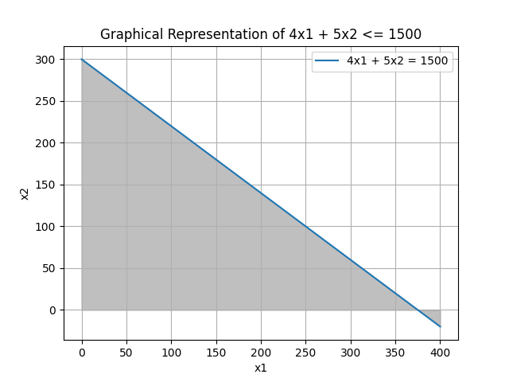

위의 설명을 그래픽으로 확인할 수 있는 그림은 위의 링크에서 확인할 수 있습니다. 회색 영역은 부등식 $4x_1 + 5x_2 \leq 1500$이 만족되는 영역을 나타냅니다.

이제 이 그래프에 다른 Constraints의 라인을 추가할 수 있습니다. 

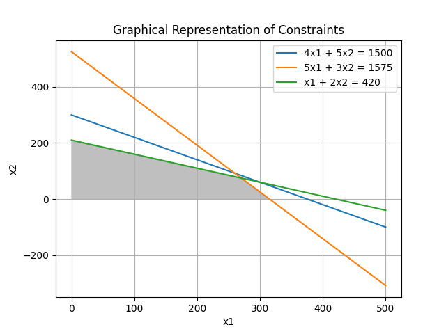

* Extreme Points: Extreme Points는 실행 가능한 영역에서 선의 끝으로서 정의됩니다. 즉, 실행 가능한 영역을 결정하는 선분의 끝점에 해당합니다. 이러한 Extreme Points는 실행 가능한 영역의 경계에 위치하며, 해당 영역의 정점들입니다. Extreme Points는 LP 모델에서 중요한 역할을 합니다. 왜냐하면 LP 문제의 최적해는 종종 Extreme Points는서 발생하기 때문입니다. 

이제, Constraints들의 아래 회색부분은 feasible region 혹은 feasible solution space를 나타냅니다. 여기서 objective function `z`에 대한 선을 그리고, 그 선이 마주하는 extreme point가 objective가 됩니다. 따라서, 저 겹치는 부분 중에, 선들이 마주하는 부분(270,75)이 바로 Objective입니다. 

- **How to find extreme point**: 최적해를 찾기 위해서는 먼저 가능한 영역을 탐색해야 합니다. 가능한 영역 내에서 objective function의 값을 최대화 또는 최소화해야 합니다. 가능한 영역은 제약 조건을 모두 만족하는 영역을 의미합니다.

- **objective function의 값이 0인 선**: objective function의 값이 0인 선은 가능한 영역을 탐색할 때 유용하게 사용될 수 있습니다. 예를 들어, objective function가 $z = 13x_1 + 11x_2 = 0$인 경우, 이는 $x_1$과 $x_2$의 가능한 조합 중에서 objective function의 값이 0인 선을 나타냅니다.

- **optimal solution**: LP 문제의 최적해는 주로 feasible region의 extreme point에서 발생합니다. 이는 feasible region의 경계에 위치한 점으로서, 해당 점에서 objective function의 값을 최대 또는 최소로 만드는 점을 의미합니다. 이러한 extreme point는 objective function을 최대화하거나 최소화하는 데 있어서 중요한 지점입니다.

#### Multiple solution

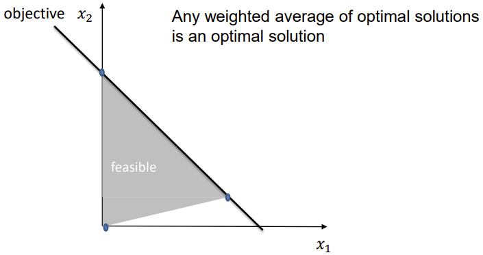

LP 문제는 종종 여러 해를 가질 수 있습니다. 이는 objective function가 하나의 제약 조건과 평행한 경우에 발생할 수 있습니다. 이러한 경우에는 무한히 많은 최적해가 존재할 수 있습니다. 이러한 다중해 상황에서는 어떤 최적해를 선택해야 하는지 결정하는 것이 중요합니다.

### Simplex Methode

두 개 이상의 decision variables가 있는 경우 graphical methods는 다루기 어렵습니다. Simplex Methode는 모든 실행 가능한 해를 조사하는 데 사용되지 않습니다. 그 대신, 최적 해를 포함하는 convex feasible regions의 작고 고유한 집합인 extreme point의 집합만 다룹니다. 

> Feasible region이 convex하다는 것은 해당 영역 내의 두 점을 연결하는 선이 영역 내에 완전히 포함되는 경우를 의미합니다.

Extreme point: feasible region의 극점은 해당 영역의 경계에 위치한 점입니다. Simplex 방법은 이러한 극점에서 출발하여 최적해를 찾습니다. feasible region이 convex하기 때문에, Simplex 방법은 이러한 극점들을 순회하면서 최적해를 찾아나갈 수 있습니다.

Convexity: feasible region이 convex하다는 것은 해당 영역 내의 임의의 두 점을 연결하는 선분이 모두 feasible region 내에 있음을 의미합니다. 따라서 Simplex 방법은 convex feasible region을 탐색하는 과정에서 최적해를 발견할 수 있습니다.

 **Simplex Method**:

    1. Feasible region의 Extreme point을 찾습니다.
    2. 이 점에서 교차하는 각 경계 선분을 조사하여 objective function의 값을 증가시키는지 확인합니다.
    3. objective function의 값이 어떤 선분을 따라서도 증가한다면, 해당 선분을 따라 이웃하는 극점으로 이동합니다. 여러 선분이 개선을 나타내는 경우, 증가율이 가장 큰 선분을 선택합니다.
    4. objective function의 값이 더 이상 증가하지 않을 때까지 단계 2와 3을 반복합니다.

예시로 돌아가 보도록 하자.

#### Simplex Methode: Example

Simplex methode로 문제를 해결해 봅시다.
- 단계 1: 모든 inequlity constraints를 slack variables를 사용하여 등식으로 변환합니다.
- slack variables로 다음과 같이 정의합니다:
   - $s_1$: 사용되지 않은 저장 공간을 나타냅니다.
   - $s_2$: 사용되지 않은 원자재를 나타냅니다.
   - $s_3$: 사용되지 않은 생산 시간을 나타냅니다.
- slack variables의 도입으로 LP 모델의 정식화가 변경됩니다.
  
따라서, 업데이트된 Objective function과 Constraints는:

$$z - 13x_1 - 11x_2 = 0 $$

$$4x_1 + 5x_2 + s_1 = 1500 $$

$$5x_1 + 3x_2 + s_2 = 1575 $$

$$x_1 + 2x_2 + s_3 = 420 $$

$$x_1 \geq 0 $$

$$x_2 \geq 0 $$

$$s_1, s_2, s_3 \geq 0 $$

한 가지 실행 가능한 해는 다음과 같습니다:
  - $x_1 = 0, x_2 = 0, s_1 = 1500, s_2 = 1575, s_3 = 420, z = 0$

이것은 **basic feasible solution**라고 합니다.

**Basic variable**는 constraint에서 isolated variable로, 해당 제약 조건의 right-hand side으로 설정될 수 있는 변수입니다. 다른 모든 변수는 **non-basic**입니다.
$z$의 값을 어떻게 증가시킬 수 있을까요?
  - 첫 번째 방정식의 변수에 대한 negative coefficients
  - 변수에 양수 값을 할당함으로써 $z$를 증가시킬 수 있습니다.
  
자세한 방법은 다음과 같습니다:

>1. Objective function에서, $x_1$과 $x_2$중 더 작은(최소) coefficient를 가지는 $x$를 **entering variable**으로 설정합니다. 
>2. 이후 entering variable의 coefficient로 right-hand-side를 나눴을 때, 값이 최소가 되는 constraint를 고릅니다. 

아래는 이 과정을 나타낸 예시입니다.

-  **Step 1**
   - 제약 조건인 4𝑥1 + 5𝑥2 + 𝑠1 = 1500에서, 만약 **𝑥2 = 𝑠1 = 0**이라면, 𝑥1 = 375입니다. 이는 Product I를 375개 생산할 충분한 저장 공간이 있다는 것을 의미합니다.: Product I의 최대 유닛을 보여줍니다. 
   - 제약 조건인 5𝑥1 + 3𝑥2 + 𝑠2 = 1575에서, 만약 **𝑥2 = 𝑠2 = 0이**라면, 𝑥1 = 315입니다. 이는 Product I를 315개 생산할 충분한 원자재가 있다는 것을 의미합니다.
   - 제약 조건인 𝑥1 + 2𝑥2 + 𝑠3 = 420에서, 만약 **𝑥2 = 𝑠3 = 0**이라면, 𝑥1 = 420입니다. 이는 Product I를 420개 생산할 충분한 시간이 있다는 것을 의미합니다.
   - 따라서, 세 가지 제약을 모두 고려할 때, Product I를 생산하는 데 충분한 자원이 있습니다. 𝑥1의 최대값은 두 번째 제약에 의해 제한됩니다: 5𝑥1 + 3𝑥2 + 𝑠2 = 1575.

- **Step 2**

    $𝑥_1$을 제한하는 방정식에서

    $$𝑥_1 = -\frac{3}{5}𝑥_2 - \frac{1}{5}𝑠_2 + 315 $$

    다른 방정식에 대입하여 다음을 얻습니다:

    $$𝑧 - \frac{16}{5}𝑥_2 + \frac{13}{5}𝑠_2 = 4095 $$

    $$\frac{13}{5}𝑥_2 + 𝑠_1 - \frac{4}{5}𝑠_2 = 240 $$

    $$𝑥_1 + \frac{3}{5}𝑥_2 + \frac{1}{5}𝑠_2 = 315 $$

    $$\frac{7}{5}𝑥_2 - \frac{1}{5}𝑠_2 + 𝑠_3 = 105 $$

    새로운 feasible solution은
    $𝑥_1 = 315$, $𝑥_2 = 0$, $𝑠_1 = 240$, $𝑠_2 = 0$, $𝑠_3 = 105$, $𝑧 = 4095$입니다.
    이것은 optimal solution이 아닙니다. 왜냐하면

    $$𝑧 - \frac{16}{5}𝑥_2 + \frac{13}{5}𝑠_2 = 4095$$

    에서 $𝑥_2$의 계수가 음수이기 때문에, $𝑥_2$에 양수 값을 할당함으로써 $𝑧$의 값이 더 증가할 수 있기 때문입니다.

    동일한 분석 절차를 Step 1에서 사용한대로 따라가보면,

    $$\frac{13}{5}𝑥_2 + 𝑠_1 - \frac{4}{5}𝑠_2 = 240$$
    에서, 만약 $𝑠_1 = 𝑠_2 = 0$이라면, $𝑥_2 = 92.3$ 입니다.

    $$𝑥_1 + \frac{3}{5}𝑥_2 + \frac{1}{5}𝑠_2 = 315$$
    에서, 만약 $𝑥_1 = 𝑠_2 = 0$이라면, $𝑥_2 = 525$ 입니다.

    $$\frac{7}{5}𝑥_2 - \frac{1}{5}𝑠_2 + 𝑠_3 = 105$$
    에서, 만약 $𝑠_2 = 𝑠_3 = 0$이라면, $𝑥_2 = 75$ 입니다.

    따라서, 마지막 제약조건은 $𝑥_2$의 최대값을 75로 제한합니다.
    따라서, 새로운 feasible solution에는 $𝑥_2 = 75$, $𝑠_2 = 𝑠_3 = 0$이 포함됩니다.

- **Step 3**

    방정식이 $𝑥_2$를 제한하는 것에서,
    $$𝑥_2 = \frac{1}{7}𝑠_2 - \frac{5}{7}𝑠_3 + 75$$
    다른 방정식에 대입하여 다음을 얻습니다:
    $$𝑧 + \frac{15}{7}𝑠_2 + \frac{16}{7}𝑠_3 = 4335$$
    $$𝑠_1 - \frac{3}{7}𝑠_2 - \frac{13}{7}𝑠_3 = 45$$
    $$𝑥_1 + \frac{2}{7}𝑠_2 - \frac{3}{7}𝑠_3 = 270$$
    $$𝑥_2 - \frac{1}{7}𝑠_2 + \frac{5}{7}𝑠_3 = 75$$

    따라서 실행 가능한 해는
    $𝑥_1 = 270$, $𝑥_2 = 75$, $𝑠_1 = 45$, $𝑠_2 = 0$, $𝑠_3 = 0$, $𝑧 = 4335$입니다.

---

아휴시발 아주 좆같은 예시입니다. 그냥 표를 이용하는 규칙을 봅시다. 

#### Simplex Methode: Tableau

- **Step I**: 초기 테이블 설정
초기 테이블을 설정합니다. constraint와 objective function으로 Tableau를 만듭니다.
    | Basic Variables | $z$   | $x_1$ | $x_2$ | $s_1$ | $s_2$ | $s_3$ | Constants |
    |-----------------|-------|-------|-------|-------|-------|-------|-----------|
    | $z$             | 1     | -13   | -11   | 0     | 0     | 0     | 0         |
    | $s_1$           | 0     | 4     | 5     | 1     | 0     | 0     | 1500      |
    | $s_2$           | 0     | 5     | 3     | 0     | 1     | 0     | 1575      |
    | $s_3$           | 0     | 1     | 2     | 0     | 0     | 1     | 420       |

- **Step II**: 다음 반복에서 non-zero variable로 할당될 값을 식별하여 objective function의 값을 증가시킵니다.
이 변수는 entering variable라고합니다.

  - objective function에서 가장 minimum negative coefficient와 연관된 non-basic variable을 확인합니다.
  - minimum negative coefficient와 동일한 두 개 이상의 non-basic variables가있는 경우 임의로 하나를 선택하고 계속 진행합니다.

  | Basic Variables | $z$   | $x_1$ | $x_2$ | $s_1$ | $s_2$ | $s_3$ | Right-hand-side | Upperbound on entering variable|
  |-----------------|-------|-------|-------|-------|-------|-------|-----------|---|
  | $z$             | 1     | _-13_   | -11   | 0     | 0     | 0     | 0         ||
  | $s_1$           | 0     | _4_     | 5     | 1     | 0     | 0     | 1500      |375|
  | $s_2$           | 0     | _5_     | 3     | 0     | 1     | 0     | 1575      |315|
  | $s_3$           | 0     | _1_     | 2     | 0     | 0     | 1     | 420       |420|

  > **Entering variable**은 $x_1$입니다. objective function에서 최소 음수 계수를 가지는 변수가 $x_1$이기 때문입니다.

  각 row에서 현재 Entering variable의 coefficient로 right-hand-side의 값을 나눕니다.  

- **Step III**: 다음 솔루션에서 non-zero variable에서 0 값을 가지게 될 변수인 leaving variable를 식별합니다.
  
  > leaving variable은 $s_2$입니다. Upperbound on entering variable이 가장 작은 row의 basic variable이 **leaving variable**로 설정됩니다. 
  
  테이블을 업데이트 합니다.
 
- **Step IV**: 두 번째 테이블에 basic variable을 입력합니다.
이전 테이블의 행 순서를 유지하고 leaving variable을 entering variable로 대체합니다.

- **Step V:** 테이블의 계수를 업데이트합니다.
    | Row number | Basic variable | $z$ | $x_1$ | $x_2$ | $s_1$ | $s_2$ | $s_3$ | Right-hand side | Upper bound on entering variable |
    |------------|----------------|-----|-------|-------|-------|-------|-------|-----------------|----------------------------------|
    | 1          | $z$            | 1   | 0     | -16/5 | 0     | 13/5  | 0     | 4095            |                                  |
    | 2          | $s_1$          | 0   | 0     | 13/5  | 1     | -4/5  | 0     | 240             |  92.3                                |
    | 3          | $x_1$          | 0   | 1     | 3/5   | 0     | 1/5   | 0     | 315             |  525                                |
    | 4          | $s_3$          | 0   | 0     | 7/5   | 0     | -1/5  | 1     | 105             |  75                                |
    
    > second entering variable은 $x_2$입니다. $x_2$의 coefficient로 각 right hand side의 값을 나눴을 때 얻어지는 값이 upperbound입니다. 
- **Step VI**: Optimality를 확인합니다.
두 번째 feasible solution도 최적이 아닙니다. 왜냐하면 objective function에 음의 계수가 포함되어 있기 때문입니다. 
더 많은 반복이 필요합니다. 
  > 다음 leaving variable은 최소 upperbound를 가지는 4번째 row의 basic variable인 $s_3$입니다.

최종 Tableau는 다음과 같습니다.:

| Row number | Basic variable | $z$ | $x_1$ | $x_2$ | $s_1$ | $s_2$ | $s_3$ | Right-hand side |
|------------|----------------|-----|-------|-------|-------|-------|-------|-----------------|
| 1          | $z$            | 1   | 0     | 0     | 0     | 15/7  | 16/7  | 4335            |
| 2          | $s_1$          | 0   | 0     | 0     | 1     | -3/7  | -13/7 | 45              |
| 3          | $x_1$          | 0   | 1     | 0     | 0     | 2/7   | -3/7  | 270             |
| 4          | $x_2$          | 0   | 0     | 1     | 0     | -1/7  | 5/7   | 75              |

#### Simplex Methode: non-standard From LPs

물론 minimizing Objective function에도 LP를 사용할 수 있습니다. 방향만 바꾸면 됩니다.

아래 식은 Maximizing을 나타냅니다.

$$z = \sum_{i=1}^{n} c_i x_i$$

그리고 아래 식은 Minimizing을 나타냅니다.

$$z' = -\sum_{i=1}^{n} c_i x_i$$

기본적으로 최소화 LP는 상한 값을 모델링하는 $\leq$ Constraints가 포함되어 있습니다. 몇몇 제한된 변수에 대한 $\geq$ Constraints도 있지만, 우리는 신경쓰지 않습니다. 

아래 예시가 주어집니다.

$$min z = 1500𝑥_1 + 1575𝑥_2 + 420𝑥_3$$
s.t.
$$4𝑥_1 + 5𝑥_2 + 𝑠_1 = 13$$
$$5𝑥_1 + 3𝑥_2 + 2𝑥_3 + 𝑠_2 = 11$$
$$𝑥_1, 𝑥_2, 𝑥_3, 𝑠_1, 𝑠_2 ≥ 0$$

주어진 문제에서 초기 해를 얻기 위해서는 모든 decision variable(𝑥1, 𝑥2, 𝑥3)를 모두 0으로 설정할 수 없습니다. 초기 솔루션을 얻기 위해 artificial variable이 크거나 같은 제약 조건에 추가될 수 있습니다. 𝑤1 및 𝑤2를 artificial variable로 정의해 봅시다.

$$4𝑥_1 + 5𝑥_2 + 𝑥_3 - 𝑠_1 + 𝑤_1 = 13 $$

$$5𝑥_1 + 3𝑥_2 + 2𝑥_3 - 𝑠_2 + 𝑤_2 = 11 $$

초기적으로 실현 가능한 솔루션은 다음과 같습니다:

$$𝑥_1 = 𝑥_2 = 𝑥_3 = 𝑠_1 = 𝑠_2 = 0, 𝑤_1 = 13, 𝑤_2 = 11 $$

objective function는 다음과 같이 변환됩니다:

$$𝑧 = 1500𝑥_1 + 1575𝑥_2 + 420𝑥_3 + 5000𝑤_1 + 5000𝑤_2 $$

𝑤1 = 𝑤2 = 0인 솔루션은 실현 가능하지만, 𝑤1 > 0, 𝑤2 > 0인 솔루션은 그렇지 않습니다. 따라서 이러한 값들을 0으로 추동시키기 위해 대규모 상수 𝑀을 objective function에 도입할 수 있습니다. 이는 big-M Methode으로 알려져 있습니다.

| Row num | Basic variable | 𝑧 | 𝑥1 | 𝑥2 | 𝑥3 | 𝑠1 | 𝑠2 | 𝑤1 | 𝑤2 | Right-hand side | Upper bound on entering variable |
|---------|----------------|---|-----|-----|-----|-----|-----|-----|-----|------------------|---------------------------------|
|    1    |        𝑧       | 1 | 43500 | 38425 | 14580 | -5000 | -5000 | 0 | 0 | 120000 |                               |
|    2    |       𝑤1       | 0 | 4 | 5 | 1 | -1 | 0 | 1 | 0 | 13 | 13/4 |
|    3    |       𝑤2       | 0 | 5 | 3 | 2 | 0 | -1 | 0 | 1 | 11 | 11/5 |

>여기서 entering variable을 정하는 기준은 Objective function에서 최대 coefficient를 고르는 것입니다.
>leaving variable을 정하는 기준 또한 최대 upperbound row를 고르는 것입니다. 

이외의 과정은 위에서 설명한 방법과 같습니다.

최종 Tableau는 다음과 같습니다:

| Row num | Basic variable | 𝑧 | 𝑥1 | 𝑥2 | 𝑥3 | 𝑠1 | 𝑠2 | 𝑤1 | 𝑤2 | Right-hand side |
|---------|----------------|---|-----|-----|-----|-----|-----|-----|-----|------------------|
|    1    |        𝑧       | 1 | -45 | 0 | 0 | -270 | -75 | -4730 | -4925 | 4335 |
|    2    |       𝑥2       | 0 | 3/7 | 1 | 0 | -2/7 | 1/7 | 2/7 | -1/7 | 15/7 |
|    3    |       𝑥1       | 0 | 13/7 | 0 | 1 | 3/7 | -3/7 | -3/7 | 5/7 | 16/7 |

보다시피 위의 maximization과 답은 같습니다.

### Modeling biochemical reactions

생화학 반응은 물리학과 화학의 법칙에 따라 진행됩니다.
물질은 아무 곳에서나 창출될 수 없으며, 물질은 사라지지 않습니다. 따라서 기질과 생성물이 균형을 이루어야 합니다.

일반적인 형태로, 주어진 집합 𝑈의 분자를 사용하는 생화학 반응은 다음과 같이 작성할 수 있습니다:

$$\alpha_1 S_1 + \alpha_2 S_2 + \cdots + \alpha_n S_n \rightarrow \beta_1 S_1 + \beta_2 S_2 + \cdots + \beta_n S_n$$

여기서:
- $\alpha_i$ 는 $S_i$ 분자의 수를 Substrate로 나타냅니다.
- $\beta_i$ 는 $S_i$ 분자의 수를 Product로 나타냅니다.

생화학 반응에서 𝑆𝑖 분자의 수가 변하는 정도는 다음과 같이 나타낼 수 있습니다:

$$\Delta_i = \beta_i - \alpha_i$$

따라서 다음과 같이 설명할 수 있습니다:
- 만약 $\beta_i - \alpha_i < 0$이면, $\Delta_i$ 만큼의 $S_i$ 분자가 consumed됩니다.
- 만약 $\beta_i - \alpha_i > 0$이면, $\Delta_i$ 만큼의 $S_i$ 분자가 produced됩니다.
- 만약 $\beta_i - \alpha_i = 0$이면, 반응은 $S_i$ 분자의 수를 변경하지 않습니다.

따라서 생화학 반응에서 각 분자수의 변화량 $\Delta_i$들을 벡터로 표현할 수 있습니다. 이 벡터는 모든 분자에 대한 변화량을 포함하고 있습니다.  

$$
r = \begin{bmatrix} \beta_1 - \alpha_1 \\ 
\beta_2 - \alpha_2 \\ 
\vdots \\ 
\beta_{n-1}-\alpha_{n-1} \\
\beta_n - \alpha_n \end{bmatrix}
$$

한 반응의 예를 들어보자.

$$𝐹𝐵𝑃 + 𝐻_2𝑂 → 𝐹6𝑃 + 𝑃𝑂_4^{3-} + 3𝐻^+$$

$U=\{𝐹𝐵𝑃, 𝐻_2𝑂, 𝑃𝑂_4^{3-}, 𝐹6𝑃, 3𝐻^+\}$ 이 반응의 reaction vector는 

$$r=
\begin{bmatrix}
-1 \\ 
-1 \\ 
1 \\ 
1 \\ 
3
\end{bmatrix}
$$

>_**NOTE**_: row의 순서는 metabolites의 ordering과 같다.

생화학 네트워크는 분자 집합 𝑈 상에서의 𝑚개의 생화학 반응을 모은 것입니다.

$$
\begin{align*}
&\alpha_{11}S_1 + \alpha_{21}S_2 + \cdots + \alpha_{n1}S_n \rightarrow \beta_{11}S_1 + \beta_{21}S_2 + \cdots + \beta_{n1}S_n \\
&\alpha_{12}S_1 + \alpha_{22}S_2 + \cdots + \alpha_{n2}S_n \rightarrow \beta_{12}S_1 + \beta_{22}S_2 + \cdots + \beta_{n2}S_n \\
&  \vdots \\
&\alpha_{1m}S_1 + \alpha_{2m}S_2 + \cdots + \alpha_{nm}S_n \rightarrow \beta_{1m}S_1 + \beta_{2m}S_2 + \cdots + \beta_{nm}S_n
\end{align*}
$$

Each with a respective reaction vector 𝑟₁, … , 𝑟ₘ.

### Stochiometric matrix

반응 벡터들인 𝑟₁, … , 𝑟ₘ을 모은 𝑛 × 𝑚 행렬을 Stochiometric matrix 행렬 𝑁이라고 합니다:

$$
\mathbf{N} = 
\begin{bmatrix}
\mathbf{r}_1 &|\mathbf{r}_2 &| \cdots & |\mathbf{r}_m \\
\end{bmatrix}
$$

또는 equivalently하게, 

$$
\mathbf{N} = 
\begin{bmatrix}
\beta_{11} - \alpha_{11} & \beta_{12} - \alpha_{12} & \cdots & \alpha_{1m} & \beta_{1m} \\
\vdots & &&\vdots  \\
\beta_{n1} - \alpha_{n1} & \beta_{n2} - \alpha_{n2} & \cdots & \alpha_{nm} & \beta_{nm}\\
\end{bmatrix}
$$

이 entries를 stoichiometric coefficients라고 합니다.

Reactions는 두 그룹으로 나눌 수 있습니다:
- Internal reactions
- Boundary 혹은 exchange reactions

**Boundary (exchange) reactions**는 다음 중 하나를 갖습니다:
* 오직 non-positive stoichiometric coefficients만 있는 경우 (즉, zero와
negative coefficients) - export 반응으로 알려져 있습니다
* 오직 non-negative stoichiometric coefficients만 있는 경우 (즉, zero와
positive coefficients) - import 반응으로 알려져 있습니다

**Internal reactions**은 적어도 하나의 negative coefficient와 하나의 positive coefficient를 포함합니다 (즉, 적어도 하나의 반대 부호를 가진 coefficients 쌍이 하나 이상 있습니다) 이는 export되거나, import된 분자가 없는, 완전히 internal 분자들끼리 일어난 반응을 의미합니다. 

예시 stoichiometric matrix를 살펴봅시다.

$$r1:\phi \to A$$

$$r2: B \to \phi$$

$$r3: A \to B$$

이 반응들은 sthochiometric matrix로 나타내질 수 있습니다.

$$
N = 
\begin{bmatrix}
1&0&-1 \\
0&-1&1
\end{bmatrix}
$$

아래 반응 또한 동일한 stochiometric matrix를 가집니다.

$$r1: A \to 2A$$

$$r2: 2B \to B$$

$$r3: A \to B$$

## Metabolic Networks

Metabolic Networks는 생화학 반응들의 집합을 나타내며 이를 통해 일련의 대사물질들이 서로 transformed되고 environment와 exchange(즉, import 및 export)됩니다.

Metabolic Networks는 다음과 같이 stoichiometric matrix에 의해 표현됩니다:

- Row는 Metabolites를 나타냅니다.
- Column은 Reactions를 나타냅니다.
- Entries는 Stoichiometric coefficients입니다:
  - Negative coefficients는 Substrate을 나타냅니다.
  - Positive coefficients는 Product를 나타냅니다.

아래는 example stoichiometric matrix입니다.

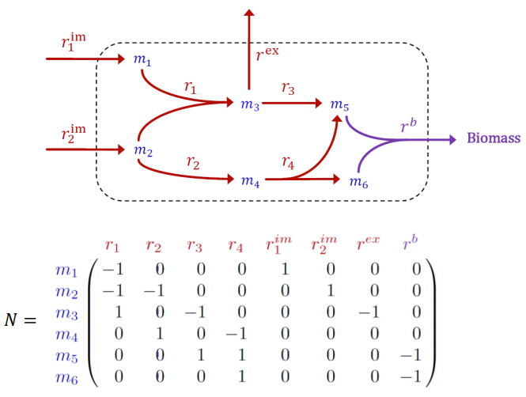

### Reaction Rate 

Reaction Rate 또는 Reaction Flux, $v_j$는 반응 $r_j$의 conversion rate, 즉 반응물에서 생성물로의 Throughput을 의미합니다.

Reaction rate는 physical quantitiy(물리량)이므로, 관련 유닛을 가집니다. constraint-based modeling에서 Flux는 다음과 같이 표현됩니다.

$$v=\frac{mol}{gDW\cdot h}$$

Flux가 물질의 농도와 시간에 매치한다는 것을 볼 수 있습니다.  

Reaction Rate는 Metabolite concentration과도 연관이 있습니다. 

Metabolite 𝑋𝑖의 농도는 시간이 지남에 따라 바뀝니다.

- 𝑋𝑖를 생성하거나 합성하는 반응
- 𝑋𝑖를 소비하거나 분해하는 반응

Metabolite 𝑋𝑖의 농도의 시간적 변화 정도는 해당 반응의 반응 속도와 𝑋𝑖가 반응에 들어가는 몰 농도의 곱과 같습니다.

- 𝑋𝑖를 **produce**하는 반응은 그 농도의 증가에 **positive**하게 기여합니다.
- 𝑋𝑖를 **consume**하는 반응은 그 농도의 감소에 **negative**하게 기여합니다.

$\Delta t$를 일정 작은 시간 간격이라고 가정했을 때, 시간 $t$에서 $t+\Delta t$까지 Metabolite $X_i$의 농도 변화는 다음과 같습니다.

$$x_i(t+\Delta t)-x_i(t)$$

농도의 변화율(rate of change in concentration)은 다음과 같습니다:

$$\frac{x_i(t+\Delta t)-x_i(t)}{\Delta t}$$

이는 다음과 같이 표현할 수도 있습니다.

>             $X_i$ 생성 반응 constribution - $X_i$ 소비 반응 constribution

Stoichiometric matrix $N$의 i번째 행 $N_i$은 metabolite $X_i$를 정의합니다.

따라서 $v$가 모든 vectors의 Reaction rates라면, 다음과 같습니다:

$$\frac{x_i(t+\Delta t)-x_i(t)}{\Delta t}=N_{i}\cdot v(t)$$

이를 $\Delta t \to 0$에 대해 극한값을 취하면: _중요하지 않음_

$$\lim_{\Delta t \to 0} \frac{x_i(t+\Delta t)-x_i(t)}{\Delta t}= \lim_{\Delta t \to 0}N_{i}\cdot v(t)$$

$$\frac{dx_i}{dt}=N_{i}\cdot v(t)$$

여기서 $v(t)$는 일반적으로 다음과 같은 형태를 가집니다:

$$ v(t)=
\begin{bmatrix}
v_1(t) \\
v_2(t) \\
\vdots \\
v_i(t)
\end{bmatrix}
$$

각 row는 각 Metabolite $X_i$에 대한 Reaction rate입니다.

그렇다면 Metabolite $X_i$의 농도변화율은 다음과 같습니다:

- $N_{m \times n}$이고, i가 row, j가 column을 가리킬 때, 

$$\frac{dx_i}{dt}=v_1(t)+\dots+v_i(t)$$

따라서, 

$$
\begin{bmatrix}
\frac{dx_1}{dt} \\
\vdots\\
\frac{dx_i}{dt}
\end{bmatrix}
=N_{i}\cdot v(t)
$$

$N_{i}\cdot v(t)$에 대한 간단한 예시를 들어보도록 하겠습니다.

> 
> $$ N_{i}\cdot v(t)=
> \begin{bmatrix}
> 1&0&-1 \\
> 0&-1&1
> \end{bmatrix}
> \begin{bmatrix} v_1 \\
> v_2 \\ 
> v_3 \end{bmatrix}$$
> 
> 따라서, 각 Metabolite A와 B의 Reaction rate는 다음과 같이 정의됩니다.
> 
> $$N_{A}\cdot v(t)=v_1 -v_3$$
> 
> $$N_{B}\cdot v(t)=v_3 -v_2$$
> 
> Reaction rate의 changing rate는 다음과 같습니다:
> 
> $$\frac{x_A(t+\Delta t)-x_A(t)}{\Delta t}$$
> 
> $$\frac{x_B(t+\Delta t)-x_B(t)}{\Delta t}$$

Reaction rate는 다음과 같은 요소에 의해 결정됩니다:
- metabolites의 농도, 𝑥
- 반응을 촉매하는 효소의 농도, 𝐸
- activator / inhibitor 의 농도
- 효소의 촉매 속도인 catalytic rate, $𝑘_{𝑐𝑎𝑡}$

즉, 반응 $r_j$에 대해서, 

$$v_j=f_j(x,E,k)$$

그러나, 실제 현실의 metabolic modeling에선, 우리는 여러 effectors와 kinetic paramters등 정확히 알지 못하는 것이 매우 매우 많습니다. 따라서 $v_j=f_j(x,E,k)$는 정확히 specified 될 수 없습니다. 

이 우리가 모르는 많은 변수들을 계산에서 제외하고, 너무나 복잡하여 계산이 불가능한 모델링을 간단하게 만들기 위해서, steady state의 개념을 도입합니다.

### Steady State

Steady State는 모델을 간소화하고 분석을 용이하게 하기 위해 사용됩니다. steady state에서는 metabolic network 내 대부분의 변수들이 일정한 값을 유지하기 때문에, 모델링이 더 간단해집니다. 

많은 생물학적 실험은 일정한 조건에서 수행되며, 이러한 조건에서 steady state에서의 모델을 사용하여 실험 결과를 설명하고 예측할 수 있습니다.

또한, 생물의 항상성에 의해 대부분의 생물학적 시스템은 외부 환경 변화에도 불구하고 상대적으로 안정된 상태를 유지합니다. 따라서 steady state에서의 모델은 실제 상황을 잘 근사합니다.

이런 steady state의 concept에서, 다음 조건들이 성립합니다.

일정 기간 동안 환경이 변하지 않으면
- 유전자 발현은 상대적으로 일정합니다.
- 효소 수준은 변하지 않습니다.

따라서 metabolites concentrate도 일정하게 유지됩니다.

또한, metabolic pool에서 system 외부로 나가는 것은 들어오는 것과 같습니다. 

이 조건 하에 system이 steady state에 있다고 가정됩니다.

일반적으로, change in metabolism은 초 단위에서 발생하는 반면, 단백질 수준 및 유전자 발현의 변화는 분 단위 또는 시간 단위로 발생합니다. 이러한 시간적 차이는 대사 활동 및 단백질 수준 및 유전자 발현 간의 특성적인 차이 때문에 발생합니다.

Thermodynamic equilibrium은 대사 과정에서의 하나의 안정상태 형태입니다. 이는 metabolic pool에 입-출이 없고 metabolic pool 내에서 물질의 농도가 일정하게 유지되는 상태를 의미합니다.

따라서, 

$$\frac{dx_i}{dt}=N_{i}\cdot f(t)=N_{i}\cdot v(t)=0$$

이고, 다음과 같이 쓸 수 있습니다.

$$Nv=0$$

시스템이 일단 steady state에 있으면 농도에 변화가 없는 한 시스템에서 벗어나지 않기 때문에 시간에 대한 의존도는 낮아질 수 있습니다.

**이제, Reaction rate를 variable로 하고, stoichiometric matrix에 해당하는 coefficients를 사용하여 linear system을 구축합니다.**

이 **linear equation system의 해**는 metabolic network가 support 할 수 있는 **set of all steady states**에 해당합니다. 

steady state의 가정 하에, 반응들의 농도변화 예를 살펴보도록 하겠습니다.

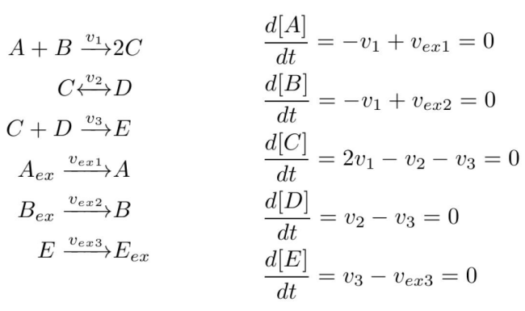

* $v_{ex}$는 export reaction을 의미합니다.
* $v_2$는 reversible reaction입니다. $Nv=0$임을 알고, v가 뭔지는 모를 때에도, 우리는 어떤 반응이 irreversible이고 어떤 반응이 reversible인지는 알 수 있습니다. 
* reversible reaction은 두개의 forward-/backward irreversible reaction으로 분리할 수 있습니다. 
* 따라서, 위의 예시에서 5개의 Metabolites와 7개의 reactions, 즉 $N_{5 \times 7}$의 stoichiometric matrix를 생성할 수 있습니다. 

따라서, 위의 예시에서 다음과 같은 식을 얻을 수 있습니다.

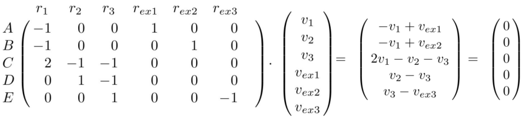

이는 결국 $Nv=0$의 형태입니다.

그러나 일반적으로, Metabolic network에는 사용 가능한 물질보다 더 많은 반응이 포함되어 있습니다. 이는 본질적으로 불완전한 linear equation system을 유발하며, 무한대로 많은 solution이 있을 수 있습니다. 

이러한 space of solutions를 좁히는 것과 biologically relevant solution을 식별하는 것이 우리의 목적입니다.

## Flux Balance Analysis - FBA

세포가 steady state에 도달하는 데 영향을 미치는 과정은 무엇일까요?
- 효소 농도와 activity 조절
- 효소 촉매 속도에 대한 evolutionary pressure

Cellular metabolism은 적응을 극대화하기 위해 진화했다는 가정 하에, 풍부한 배지에서 성장 중인 미생물에게는 이는 성장을 극대화하는 것과 일치합니다.

Metabolic reactions에서 성장으로의 규모를 어떻게 연결할 수 있을까요?

Biomass composition은 다양한 검사를 통해 획득할 수 있습니다
- DNA
- RNA
- 지질
- 단백질
- 아미노산
- 탄수화물

그런 다음 Growth는 이러한 precursors를 biomass으로 변환하는 합성 반응의 속도로 모델링될 수 있습니다.

반응 속도는 일정한 하한값(lower bound)과 상한값(upper bound)을 따릅니다.

$$v_{j,min} \leq v_j \leq v_{j,max}$$

lower bound가 0으로 설정되면, 반응은 irreversible reaction, 즉 비가역적 반응으로 간주됩니다.

$$0 \leq v_j \leq v_{j,max}$$

그렇지 않으면, lower bound가 음수인 경우, 반응은 가역적입니다.

$$a \leq v_j \leq b$$

반응의 lower bound과 upper bound가 모두 0이면, 해당 반응은 플럭스를 운반하지 않으며, 차단된 상태로 간주됩니다. 이를 **blocked reaction**이라 합니다.

Upper bound는 일반적으로 큰 수로 설정되거나 (예: 1000), 데이터로부터 결정될 수 있습니다. 예를 들어, 최대 반응 속도 (𝑉𝑚𝑎𝑥 = $𝑘_{𝑐𝑎𝑡}𝐸$)가 알려져 있는 경우입니다.

측정된 nutrient uptake나 product excretion을 특정하고 모델에 통합할 수 있습니다.

* Reaction boundaries
* Optimization of biomass

이 둘을 결합하여, linear programming 문제로 표현할 수 있습니다!

> **growth as the optimum $z^*$**
>$$z^*=\text{max } c^Tv$$
>s.t.
>$$Nv=0$$
>$$v_{min} \leq v_j \leq v_{max}$$
>where
>$$c_i =
>\begin{cases} 
> 1, i\text{ corresponds to }r_{bio} \\ 
> 0,\text{otherwise}
> \end{cases}
> $$

FBA는 주어진 nutirent에 대한 product의 이론적 최대량을 계산합니다. 

growth뿐 아니라 다른 여러 objective functions를 도입할 수 있으며, 따라서 현대 metabolic engineering의 기본 근간이 됩니다.

### Metabolic Network Reconstruction

다음 과정을 거친다.

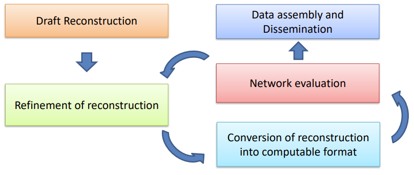

FBA, 혹은 다른 Analysis Methode를 위해 필요한 Metabolic Network의 정보는 다음과 같습니다. 

1. Full Name (**rxnNames**)
2. Short name (**rxns**)
3. Formula
4. Gene-reaction association
(**rules**)
1. Genes (**genes**)
2. Proteins (proteins)
3. Cellular Systems (subSystems)
4. Reaction direction (rev)
5. Flux lower bound (**lb**)
6.  Flux upper bound (**ub**)
7.  EC Number (rxnECNumber)

#### Defining the biomass reaction

정리하기엔 너무 얕고 distributed된 내용이다. 강의 slides 보면서 공부하자. lecture 4 후반부이다.
#### (Non-) Growth associated maintenance 

same

### Objectives

일반적으로, $z=c^Tv$는 Fluxes들의 linear combination입니다. FBA는 생물학적 metabolic network에서 Fluxes를 계산하고 분석합니다. FBA를 사용해 metabolic network의 capabilities를 조사하는 목적을 가진 objectives들에는 다양한 유형이 있습니다. 예를 들어, 주어진 substrate로부터 ATP 또는 아미노산 생산을 최대화 하는 것 입니다. 

- Objectives that represent likely physiological tasks
  - artificial biomass reaction $v_{bio}$를 통해 Flux를 최대화 하는 것은, metabolic network 내의 cellular mass 합성에 필요한 모든 precursors들로부터의 blanced output을 최대화 하는 것을 의미합니다. 이것은 어떤 microorganism이 optimize growth를 목표로 진화했다는 것에 부합합니다.

  - total Flux의 Minimization은 생물학적 시스템이 자원의 사용을 economize하는 방향으로 진화했다는 사실과 일치합니다. 이는 metabolic network가 자원을 효율적으로 활용하고 낭비를 최소화하기 위해 진화했다는 개념을 반영합니다. 

- Objectives that represent biotechnological goals
  - 특정 product의 생산량을 최대화하거나 최적화함으로|써 biotechnological process의 효율성을 높이는 것을 목표로 합니다. 예를 들어 특정 아미노산의 생산량을 최대화하는 metabolic engineering strategy를 설계할 수 있습니다. 

- Maximize a linear combination of biomass flux and metabolite production
  - Biomass flux와 metagbolite production의 objectives를 linear combination을 통해 동시에 고려할 수 있습니다. 이는 metabolic network에서 biomass 생산과 cell growth간의 trade-off를 탐색하고, 두가지 다른 objective를 동시에 최적화 할 수 있습니다. 다음과 같이 나타납니다.
  $$c_1v_{bio}+c_2v_2$$

### Convexity

Objective 함수는 특정한 Property를 가지는데, 바로 **Convexity**입니다. 여기서 function은 실수공산에서 실수로 매핑되는 함수입니다. 어떤 함수가 convex하다는 것은 그래프가 임의의 두 점을 잇는 선분 위의 모든 점에서 접점을 갖는다는 것을 의미합니다. 

$f:\mathbb{R}^n\to \mathbb{R}$이 convex 하다는 것은, 임의의 점 $x$와 $y$, 그리고 모든 $\lambda \in [0,1]$에 대해 다음이 성립한다는 것을 의미합니다.

$$f(\lambda x + (1-\lambda)y)\leq \lambda f(x) + (1-\lambda)f(y)$$

우리가 어떤 두 점을 선택했을 때, 이 두 점을 가로지르는 직선 $h$에 대해, 이 직선 위의 점 $h(z)$는 항상 $f(z)$보다 값이 크거나 같다는 것을 의미합니다.

Convexity에 대해, 다음 두 하위 조건이 있습니다.

* **Strict Convexity**

  $$\forall x,y, \; x\neq y,\; \forall \lambda \in (0,1)$$

  $$f(\lambda x + (1-\lambda)y)< \lambda f(x) + (1-\lambda)f(y)$$

* **Strong Convexity**

  $$\exist \alpha > 0$$

  $f(x)-\alpha ||x||^2$ is convex

우리가 어떤 두 점을 선택했을 때, 이 두 점을 가로지르는 직선 $h$에 대해, 이 직선 위의 점 $h(z)$에 대해 다음이 성립합니다.

$$(z,f(z))=(z,f(\lambda x + (1-\lambda)y))$$

$$h(z)= (z,f(y)+\frac{f(x)-f(y)}{x-y}\cdot (z-y))=$$

$$(z,f(y)+\lambda (f(x)-f(y)))=$$

$$(z,\lambda \cdot f(x)+(1-\lambda)\cdot f(y))$$

이때 $\lambda$는, 

$$\lambda = \frac{z-y}{x-y} \to z=\lambda x+(1-\lambda)\cdot y$$

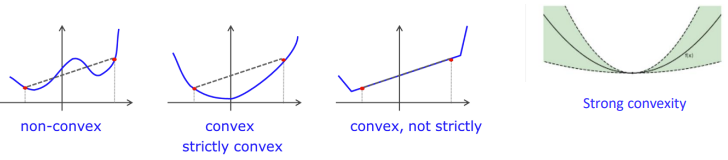

우리가 찾고자하는 optimal point는 저 convex line의 최저점, 즉 unique한 extreme point인데, 만약 convexity가 성립하지 않는다면 우리가 찾은 extreme point가 실제로 optimum인지도 명확하지 않게 됩니다. 왜냐면 몇개의 extreme points가 더 존재할 수 있고, 그것이 우리가 찾아낸 현재의 point보다 더 optimal할 수 있기 때문입니다. 따라서 Objective의 Convexity는 필수적인 성질입니다. 

이 Convexity에 의해 다음과 같은 성질이 성립합니다:

* Fact I:
  * 만약 function이 convex set에 대해 strictly convex하다면, optimal solution은 **unique**합니다.
* Fact II:
  * Strong convexity는 strict convexity를 포함합니다.
  * strict convexity는 convexity를 포함합니다.
  * 반대의 경우는 성립하지 않습니다.

만약 우리가 convex feasible space를 가진다면, 우리의 LP가 unique optimum을 가진다는 것을 보여줄 수 있습니다. 

아래 목표들은 FBA에서 사용되는 일반적인 Objectives입니다. 이들은 모두 convex function으로 표현될 수 있습니다.

* Maximize ATP production
* Minimize nutrient uptake
* Maximize biomass flux

그러나, linear function은 strictly convex하지 않습니다. 하지만 metabolic modeling에 적용되는 몇 가지 함수는 strictly convex할 수 있습니다. 그런 함수들은 대부분 non-linear이며, 복잡한 메타볼릭 네트워크를 모델링하기위해 사용됩니다. 

### Alternative optima

FBA에서 alternative optima가 발생하는 경우, 이는 biological implications를 가집니다. alternative optima는 metabolic network를 통해 동일한 목표를 달성하는 다양한 경로가 존재함을 의미합니다. 이러한 현상은 다음과 같은 implication을 가집니다.

- metabolic network는 **alteration에 robust**합니다. alternative optima는 metabolic network 내에서 발생 가능한 다양한 조절 및 변화에 대한 대처 능력을 나타냅니다. 이는 organism이 환경 변화에 대응하고 적응할 수 있는 유연성을 갖고 있음을 시사합니다.

- alternative flux distribution은 **silent phenotypes**에 해당할 수 있습니다. alternative optima는 종종 특정한 생물학적 특징이나 형질의 변화를 나타내지 않는 silent phenotypes로 해석될 수 있습니다. 이는 메타볼릭 네트워크 내에서 발생하는 다양한 플럭스 분포가 생물학적 특성에 영향을 미치지 않거나 무시할 수 있는 것을 의미합니다. 

## Flux variability Analysis - FVA

FVA는 metabolic network에서 각 반응의 Flux 변동성을 평가하는 방법입니다. 이를 통해 Alternative Optima를 식별할 수 있습니다.

일반적으로, Metabolic network의 반응은 reversible 반응과 irreversible 반응으로 구분됩니다. reversible 반응은 양방향으로 반응할 수 있으며, irreversible 반응은 한 방향으로만 반응합니다. FVA에서는 각 반응의 상한과 하한을 설정하여 해당 반응이 어떤 범위 내에서 활성화될 수 있는지를 확인합니다.

일반적으로, 반응의 상한(upper bound)은 1000 (단위: mol/gDW/h)로 설정됩니다. 이는 반응이 특정 제약 없이 최대로 활성화될 수 있음을 나타냅니다. 반면, irreversible반응의 하한은 보통 0으로 설정됩니다. 이는 해당 반응이 역으로 진행될 수 없음을 의미합니다. reversible 반응의 하한은 -1000으로 설정됩니다. 이는 reversible 반응이 최대로 역방향으로 활성화될 수 있음을 나타냅니다.

그러나 이러한 상한과 하한이 모든 경우에 도달 가능한 것은 아닙니다. 특정 상황에서는 상한과 하한이 동시에 도달할 수 없는 경우도 있습니다. 이는 특정 조건에서 Metabolic network가 제한되어 있거나, 제약 조건이 서로 충돌하는 경우 등이 그 예시입니다.

### Feasible Range

Feasible range는 steady state에서 도달 가능한 Range of fluxes를 의미합니다. 

이를 위해 다음과 같은 LP Problem을 설계합니다:

$$\text{min (max) } v_i$$

$$Nv=0,\text{ steady state}$$

$$\forall i,1 \leq i \leq m$$

$$v_{i,min} \leq v_i \leq v_{i,max}$$

이런 LP problem을 풀면 가능한 flux range를 얻을 수 있습니다. 이를 통해 flux의 하한과 상한값은 두가지 경우로 분리될 수 있습니다.

- 우선, 위의 LP 문제에서 먼저 설정된 일반적인 의미의 upper bound $v_i^{max}$와 lower bound $v_i^{min}$입니다. 
- 그 뒤 LP 문제를 해결함으로써 얻어진 실제 feasible flux range의 upper bound $v_i^{max,f}$와 lower bound $v_i^{min,f}$입니다. 주어진 최적화 문제를 통해 얻어진, 즉 steady state에서 도달 가능한 각 반응의 flux range입니다. 

이 두 값은 각각 다를 수 있지만, 같을 수도 있습니다. 

#### Blocked reaction

어떤 반응이 blocked 되었다는 것은, 해당 반응이 feasible steady state에서 어떤 flux도 운반하지 않는다는 것을 의미합니다. 따라서 이 반응은 해당 metabolic network에서 활성화되지 않으며, 해당 반응에 관련된 물질의 변환은 일어나지 않습니다. 이것은 다음과 같이 표현될 수 있습니다.

$$v_{i,min}=v_{i,max}=0$$

### Operational Range

Operational Range는 주어진 objective를 최적화하는 어떤 steady state에서 얻을 수 있는 flux의 range를 나타냅니다. 

$$\text{min (max) } v_i$$

$$Nv=0,\text{ steady state}$$

$$\forall i,1 \leq i \leq m$$

$$v_{i,min} \leq v_i \leq v_{i,max}$$

$$z=z^*$$

만약 $z=c^Tv$라면, 즉 objective가 linear인 경우, 프로그램은 convex이며, simplex methode를 이용해 해결될 수 있습니다. 

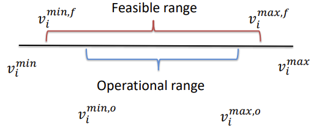

그러나, 주어진 반응이 n개인 경우, 모든 반응에 대한 feasible flux range를 결정하기 위해선 각 반응에 대해 최소값과 최대값을 결정해야 합니다. 따라서 최소값과 최대값을 결정하는데에 각각 n개의 LP문제가 필요합니다. 따라서 총 2n개의 LP문제를 풀어야 합니다.

또한, 특정 목표를 최적화하여 operational range를 결정하기 위해서도 동일한 수의 LP문제가 필요합니다. 따라서 FVA는 computational time 면에서 비용이 많이 드는 작업이며, 반응 수가 많고 네트워크가 복잡할 수록 더욱 그렇습니다. 

### Summary of alternative optima

- A barplot depicting the range for every reaction

    Alternative optima는 각 반응에 대한 range를 나타낸 boxplot으로 표현될 수 있습니다. 

    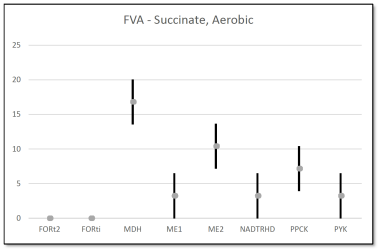

- A fraction of reactions with given percentage of feasible range used to achieve the optimum of an objective

  Alternative optima는 주어진 objective를 최적화하는 데 사용되는 flux range의 비율로 표현될 수도 있습니다. 

  $$\frac{v_i^{max,o}-v_i^{min,o}}{v_i^{max,f}-v_i^{min,f}}$$

Summary of alternative optima는 두개의 시나리오나 조건을 비교하는데 사용될 수도 있습니다. 또 이를 분석할 때 non-overlapping ranges를 분석하는 것이 유용할 수 있습니다. 이 중첩범위가 없는 반응은 서로 다른 조건이나 목표에 따라 다른 반응 패턴을 나타냅니다. 

alternative optima를 enumerate하는 방법은 주어진 반응의 최소값과 최대값을 사용하여 LP 문제를 해결하는 것입니다. 

$v_j^{max,o}$와 $v_j^{min,o}$이 주어졌을 때, 반드시 $v_j=v_j^{max,o}$ 혹은 $v_j=v_j^{min,o}$인 flux distribution이 존재합니다. 즉, 주어진 반응 j에 대한 최소값과 최대값에 도달하는 플럭스 분포를 찾는 것이 가능합니다. 

$$\text{max } v_i$$

$$Nv=0,\text{ steady state}$$

$$\forall i,1 \leq i \leq m,i\neq j$$

$$v_{i,min} \leq v_i \leq v_{i,max}$$

$$v_j=v_j^{max,o}(or,v_j=v_j^{min,o})$$

### Reaction Coupling

FVA는 네트워크 내 반응을 classify하는데 사용될 수 있습니다. 이를 통해 반응들이 주어진 objective에 대해 어떻게 동작하는지 이해할 수 있습니다. 

* **Hard-coupled to objective:**

  objective에 강력하게 coupled된 반응은 해당 objective를 최적화하는 데 필요한 경우에만 활성화됩니다. 즉, 이러한 반응의 플럭스는 objective와 완전히 **동일한 변화**를 보입니다.

* **Partially-coupled to objective:**
 
  부분적으로 objective에 coupled된 반응은 그 플럭스가 0이 아니라는 것을 보장하지만, objective와 **완전히 동일한 변화를 보장하지는 않습니다.** 즉, 이러한 반응의 플럭스는 변동할 수 있지만 **0이 아닌 값**을 유지해야 합니다.

* **Not coupled to objective:**
  
  objective에 coupled되지 않은 반응은 **플럭스가 0이 될 수 있습니다**. 이러한 반응의 플럭스는 **objective와 무관**하게 변할 수 있습니다.

* **Blocked at objective:**
  
  objective에서 차단된 반응은 플럭스가 **0만을 취할 수 있습니다**. 이러한 반응은 objective를 최적화하는 데 도움이 되지 않으며, blocked되었다고 간주됩니다.

### Flux Sampling

FVA는 flux가 취할 수 있는 최솟값과 최댓값을 제공하지만, flux sampling은 그 범위 내에서 다양한 플럭스 값의 발생 가능성을 조사합니다. 

FVA에서 feasible region은 convex하므로 각 값이 최소값과 최대값 사이의 하나의 플럭스 분포를 가지게 됩니다. 그러나 이것은 범위 내의 모든 플럭스 값이 동일한 확률로 나타날 것이라는 것을 의미하지는 않습니다. 실제로, 주어진 범위 내의 플럭스의 확률 분포는 균일하지 않을 수도 있습니다. 

Probability distribution은 여기서 다음과 같이 나타납니다.

$$\sum_uP(X=u)=1$$

이는 각각 가능한 값 $u$에 대해 확률 변수 X의 확률을 나타냅니다. 

만약 주어진 반응이 고정된 플럭스 $v_j=k$를 갖는 플럭스 분포만을 고려한다면, 이는 해당 반응이 항상 특정 값 $k$를 가질 것으로 예상되는 것입니다. 이는 확률 분포를 편향시킬 수 있습니다. 왜냐하면 실제로는 $v_j$가 $k$가 아닌 여러 다른 값일 수 있음에도 불구하고, 단 하나의 특정한 값으로 고정되어있기 때문입니다. 

따라서 플럭스의 확률 분포를 얻기 위해서는 feasible region 내에서 균일하게 분포된 플럭스 분포를 고려해야 합니다. 이렇게 하면 주어진 반응이 특정 값에 고정되지 않고 다양한 값으로 분포되는 상황을 고려할 수 있으며, 이는 실제 환경에서 발생할 수 있는 다양한 대사 상태를 반영할 수 있습니다.

균일한 무작위 샘플링은 LP의 실행 가능한 또는 optimal space를 특성화하는 데 사용될 수 있습니다. 균일한 무작위 샘플링은 네트워크 속성의 편향되지 않은 평가를 제공합니다. 이를 통해 실행 가능한 공간 또는 optimal space에서 발생할 수 있는 다양한 플럭스 분포를 탐색할 수 있습니다.

다음과 같은 "Ball steps"로 이루어질 수 있습니다.

- feasible space 내의 한 점 $v$가 주어집니다. 이 point는 flux distribution을 나타냅니다.
- 반지름이 $\delta$인 공의 중심 $v$에서 랜덤 포인트 $u$를 생성합니다.
- $u$가 feasible space에 속한다면, $v$를 $u$로 이동합니다. $v$가 $u$로 업데이트 되고, 위 단계를 반복합니다.

이 방법을 통해 feasible space 내에서 무작위로 flux distribution을 생성할 수 있습니다. 예시 이미지는 lecture 5 슬라이드에서 볼 수 있습니다.

이 방법 말고도, v를 통과하는 선 L을 무작위로 선택하는 등 `Hit and run`전략을 사용할 수도 있습니다. 

이 또한 중요한거같지 않으니 자세한 설명은 lecture 5 slide를 참고합시다.

플럭스 샘플링과 반응의 분류는 확률 분포의 형태에 기반하여 이루어질 수 있습니다. 다음은 각각의 분포 형태에 따른 분류입니다:

- **Left peak:**

  가장 낮은 값이 가장 가능성이 높은 값입니다.
  이는 주로 한쪽으로 치우친 반응 분포를 나타냅니다. 즉, 해당 반응이 특정한 방향으로 뚜렷한 플럭스를 가질 가능성이 높습니다.

* **Right peak:**

  가장 높은 값이 가장 가능성이 높은 값입니다.
  이는 주로 다른 한쪽으로 치우친 반응 분포를 나타냅니다. 즉, 해당 반응이 특정한 방향으로 뚜렷한 플럭스를 가질 가능성이 높습니다.

* **Central peak:**

  하한과 상한 사이의 값이 가장 가능성이 높은 값입니다.
  이는 주로 중심으로부터 일정 범위 내에서 평균적인 반응 분포를 나타냅니다. 즉, 해당 반응이 어느 정도의 평균적인 플럭스를 가질 가능성이 높습니다.

* **Broad peak:**

  일정 구간에서 동등하게 가능한 플럭스 값이 존재합니다.
  이는 주로 플럭스 값이 여러 다양한 값을 가질 가능성이 높은 반응 분포를 나타냅니다. 즉, 해당 반응이 여러 가지 다양한 플럭스 값을 가질 가능성이 균등하게 분포되어 있습니다.

## Flux Coupling Analysis - FCA

FCA는 반응 플럭스간의 상관 관계를 결정하는데 사용 될 수 있습니다. 

- 상관 관계를 보이는 반응을 효율적으로 결정할 수 있는 방법이 있을까요?

  한 가지 방법은 플럭스 샘플링을 사용하여 상관 관계를 확인하는 것입니다. 그러나 이것은 비용이 많이 드는 방법일 수 있습니다. FCA를 사용하면 이러한 상관 관계를 효율적으로 식별할 수 있습니다. 여러 선형 프로그램을 풀지 않고도 상관 관계를 분석할 수 있습니다.

- Metabolic network의 구조가 반응 플럭스 간의 종속성을 어떻게 유도하는지 지정할 수 있을까요?

  FCA를 통해 Metabolic network의 토폴로지와 구조가 반응 플럭스 간의 상호 작용에 어떻게 영향을 미치는지 이해할 수 있습니다. 특히, 플럭스 커플링 패턴을 통해 네트워크의 모듈성, 경로 간의 상호 작용, 플럭스 제어 포인트 등을 분석할 수 있습니다.

- 이러한 종속성의 생물학적 함의는 무엇인가요?

  FCA를 사용하여 발견된 반응 간의 종속성은 생물학적으로 중요한 메커니즘을 나타낼 수 있습니다. 이러한 종속성은 Metabolic network의 기능적 특성, 세포 내 에너지 및 물질 전달, 대사 제어 등을 이해하는 데 도움이 될 수 있습니다. 종속성의 해석은 Metabolic network의 동작과 질병 상태 간의 관련성을 탐구하는 데 기여할 수 있습니다.

FCA의 주요 목표는 reactions pair을 그들의 dependence에 기반하여 분류하는 것입니다. 반응 간의 dependence는 반응 커플링이라고 불립니다. 이 분류를 달성하기 위해 FBA와 유사한 수식을 사용할 것을 보일 것입니다.

Reaction coupling에는 세가지 유형이 있습니다.

- **Directional coupling:**

  한 반응의 flux가 증가하거나 감소함에 따라 다른 반응의 flux가 일정 방향으로 **함께 증가하거나 감소**하는 경우입니다. 즉, 두 반응 간에는 **일관된 방향성**이 있습니다.

- **Partial coupling**:

  한 반응의 flux가 증가하거나 감소하면 다른 반응의 flux가 일정 방향으로 함께 증가하거나 감소하지만, 이 **관계가 완전하지 않고 일부 경우에만 적용**되는 경우입니다.

- **Full coupling**:

  한 반응의 flux가 증가하거나 감소하면 다른 반응의 flux가 **동일한 비율로 함께 증가**하거나 감소하는 경우입니다. 즉, 두 반응 간에는 **완전한 상관 관계**가 있습니다.

이 셋중 무엇도 아닌 경우엔 **uncoupled**입니다.

### Directionoal Coupling

다음과 같이 정의됩니다.

어떤 반응 $R_i$가 반응 $R_j$에 directional coupled되어있다는 것은, 모든 steady state flux distribution에서 $R_i$의 non-zero steady state flux가 $R_j$의 non-zero steatdy state flux 를 의미하는 경우입니다. 그 반대는 성립하지 않습니다.

수학적으로는 다음과 같이 표현할 수 있습니다. 

$$Nv=0,v_i \neq 0, v_j\neq 0$$

$$R_i \to R_j,i\to j$$

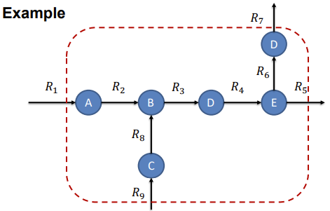

즉, $A\to B$인 $R_2$와 $B\to C$인 $R_3$이 있을 때, 이 둘은 directional coupled 입니다. $R_2 \to R_3$이고, 이것은 $R_2$가 일어나면 $R_3$가 일어난다는 것과 마찬가지입니다. 

여기서, 

$$\frac{dc_B}{dt}=v_2+v_8-v_3=0$$

입니다. 따라서 $v_2\neq 0$이면, $v_3\neq 0$또한 성립합니다.

### Partial Coupling

다음과 같이 정의됩니다:

어떤 반응 $R_i$가 반응 $R_j$에 partial coupled되어있다는 것은, $R_i$의 non-zero flux가 $R_j$의 non-zero flux를 의미하지만, 두 반응 간의 비율이 고정되어있지 않고 변할 수 있는 경우입니다. 또한 reverse도 성립합니다.

수학적으로는 다음과 같이 표현할 수 있습니다. 

$$Nv=0,v_i \neq 0, v_j\neq 0,v_i/v_j\neq const$$

$$R_i \leftrightarrow R_j,i\leftrightarrow j$$

다음과 같은 예시를 고려할 수 있습니다.

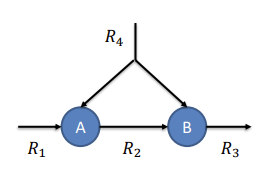

여기서, 

$$\frac{dc_A}{dt}=v_1+v_4-v_2=0$$

$$\frac{dc_B}{dt}=v_2+v_4-v_3=0$$

- 두번째 식에 의해, $v_2\neq 0$ 이면 $v_3\neq 0$임이 성립합니다. 
- 또한 두 식 모두에 의해, $v_2 \neq 0$임이 성립하고, 
- 첫번째 식에 의해 $v_4 \neq 0$이면 $v_2 \neq 0$이 성립합니다.

partial coupling은 네트워크의 전체적인 특성으로서 나타나는 **Emergent property**의 한 예 입니다. 이것은 개별적인 서브 네트워크나 구성 요소의 특성이 아닌 전체 네트워크의 상호작용에 의해 결정됩니다. 

partial coupling이 R4처럼 multisubstrate reactions를 필요로 하는지 여부는 상황에 따라 다릅니다. partial coupling은 multisubstrate reactions와 관련이 있을 수 있지만, 그렇지 않은 경우도 있을 수 있습니다. 

### Full Coupling

어떤 반응 $R_i$가 반응 $R_j$에 full coupled 되어있다는 것은 $R_i$의 non-zero flux가 $R_j$의 non-zero flux를 뜻할 뿐 아니라, 두 반응간의 비율이 항상 일정하고 고정되어 있는 경우입니다. 

수학적으로는 다음과 같이 표현할 수 있습니다. 

$$Nv=0,v_i \neq 0, v_j\neq 0,\frac{v_i}{v_j}= const$$

이는 역으로도 성립합니다. 

$$R_i \Leftrightarrow R_j,i\Leftrightarrow j$$

이는 두 반응간의 관계가 상호 의존적이며 변하지 않는다는 것을 의미합니다. 

이 예시에서, $R_3$과 $R_4$는 fully coupled입니다. 

$$R_3 \Leftrightarrow R_4$$

$$\frac{dc_D}{dt}=v_3-v_4=0$$

따라서,

$$\frac{v_3}{v_4}=1$$

### Linear Fractional Program - LFP

Fluxes끼리 상관성을 보이는 반응들을 식별하기 위한 더 효율적인 방법이 있을까요? 1개의 LP 문제만으로 충분할까요? 아니면 더 많은 sample이 필요한가요?

Reaction couplings를 식별하기 위한 Computational ways에는 linear fractional program이 있습니다. 

$$\text{max(min) } \frac{v_i}{v_j}$$

$$Nv=0,\text{ steady state}$$

$$\forall i,1 \leq i \leq m$$

$$v_{i}^{min} \leq v_i \leq v_{i}^{max}$$

이것을 **linear fractional program(LFP)** 이라 부릅니다. 

모든 반응이 irreversible이라 가정할 때, 모든 $v_i$와 $v_j$는 0 이상의 값을 가질 수 있습니다. 

따라서, 모든 $\frac{v_i}{v_j}$의 범위는 $[0,\infty)$입니다.

5가지의 coupling이 가능합니다:

> 1. $0 \leq \frac{v_i}{v_j} \leq c$ (일부 상수 $c > 0$)
>     - **Directional coupling** $i \to j$
> 2. $c_1 \leq \frac{v_i}{v_j} \leq c_2$ (일부 상수 $c_1 > 0$ 및 $c_2 > 0$, $c_1 \neq c_2$)
>     - **Partial coupling** $i \leftrightarrow j$
> 3. $\frac{v_i}{v_j} = c$ (일부 상수 $c > 0$)
>     - **Full coupling** $i \Leftrightarrow j$
> 4. $c \leq \frac{v_j}{v_i}$ (일부 상수 $c > 0$, 상한 없음)
>     - **Directional coupling** $j \to i$
> 5. $0 \leq \frac{v_i}{v_j}$ (상한 없음)
>     - **Uncoupled**

따라서 다음과 같이 업데이트 됩니다.

$$\text{min(max) } \frac{v_i}{v_j}$$

$$Nv=0,\text{ steady state}$$

$$\forall i,1 \leq i \leq m$$

$$0 \leq v_i \leq v_{i}^{max}$$

LFP를 해결하기 위해, 임의의 양수 $t$를 도입하여 분모 분자 및 모든 constraint에 곱해보겠습니다. 이를 통해 LFP를 표준 LP로 변환할 수 있습니다.

$$\text{max(min) } \frac{v_it}{v_jt}$$

$$N(vt)=0,\text{ steady state}$$

$$\forall i,1 \leq i \leq m$$

$$0 \leq v_it \leq v_{i}^{max}t$$

$$t \geq 0$$

만약 $v_j>0$이라면, $t=\frac{1}{v_j}$입니다. 

따라서, $v'=vt$로 치환하면, $v'_j=1$입니다. 그렇다면 LFP의 형태는 다음과 같이 쓸 수 있습니다.

$$\text{max(min) } v'_i$$

$$Nv'=0,\text{ steady state}$$

$$\forall i,1 \leq i\neq j \leq m$$

$$0 \leq v_i' \leq v_{i}^{max}t$$

$$v_j'=1$$

$$t \geq 0$$

이 변환을 **Charnes-Cooper transformation**이라 합니다.

한 가지 반응에 대해 다른 (𝑚 − 1)개의 반응에 대한 커플링을 결정하기 위해 우리는 2(𝑚 − 1)개의 LP를 해결해야 합니다. 모든 반응에 대해 이를 수행해야 하므로 총 LP의 수는 2𝑚(𝑚 − 1)이 됩니다. 

#### Charnes-Cooper Transformation

$$d^Tx+\beta > 0$$

의 가정 하에,

$$\mathbf{max}\frac{c^Tx+ \alpha}{d^Tx+\beta}$$

s.t.

$$Ax\leq b$$

위 식을 다음과 같이 두 부분으로 나눌 수 있습니다.

$$\mathbf{max}\frac{c^Tx+ \alpha}{d^Tx+\beta}=\mathbf{max}\frac{c^T}{d^Tx+\beta}x+\frac{ \alpha}{d^Tx+\beta}$$

이때, 어떤 변수가 y가 다음과 같을 때,

$$y=\frac{1}{d^Tx+\beta}x=tx$$

여기서 변수 t는 다음과 같습니다.

$$t=\frac{1}{d^Tx+\beta}=\frac{1}{v_j}$$

따라서, 원래 식을 다음과 같이 변경할 수 있습니다.

$$\mathbf{max}\frac{c^Tx+ \alpha}{d^Tx+\beta}=c^Ty+\alpha t$$

## Minimization of Metabolic Adjustment - MOMA

### Performance of mutatns

FBA의 중요한 응용 중 하나는 Knock-out 변이를 시뮬레이션하는 것입니다. 유전학에서 Knock-out 변이란 유전자의 삭제 또는 비활성화로 인해 해당 유전자가 부호화하는 단백질이 없어지는 현상을 말합니다. FBA에서 Knock-out 변이를 시뮬레이션하는 것은 해당되는 반응 플럭스를 제로로 제한하여 Metabolic network에서 해당 반응을 제거하는 것입니다.

예를 들어, 유전자 𝑔가 특정 반응 𝑟을 촉매하는 효소를 부호화하는 경우를 생각해봅시다. 유전자 𝑔의 Knock-out을 시뮬레이션하기 위해서는 해당 반응의 플럭스(𝑣𝑟)를 제로로 설정합니다. 이렇게 하면 대사 모델에서 유전자 𝑔와 관련된 효소 활동이 제거됩니다. 그런 다음 이 제약 조건을 가지고 FBA 문제를 해결하여 Knock-out 변이의 대사 형질을 분석할 수 있습니다.

유전자 𝑔의 Knock-out을 𝑣𝑟 = 0로 설정하고 그 FBA LP를 해결함으로써 시뮬레이션됩니다. FBA은 장기적 진화 압력 아래 성장을 최적화하는 유기체에 적용될 수 있습니다. 이는 knock-out을 쉽게 시뮬레이션할 수 있게 해줍니다.

더 복잡한 경우에는 동일한 반응을 촉매하는 isoenzyme이나 여러 단위로 구성된 enzyme complex와 같은 경우가 있습니다. 이러한 경우들은 GPR Rule에 의거하여 모델링될 수 있습니다. 

- **FBA가 knock out mutant의 flux distribution을 시뮬레이션하는데 적합합니까?**

  FBA는 일반적으로 실험실에서 인공적으로 생성된 knock-out 변이에 대한 플럭스 분포 시뮬레이션에 **적합**합니다. 그러나 이러한 knock-out 변이는 보통 자연적으로 형성된 wild type과는 다른 진화적 압력에 노출되지 않습니다. 이들은 성장을 최적화하기 위한 플럭스를 조절하는 조절 메커니즘이 없을 수 있습니다. 이에 따라 knock-out 변이의 실현 가능한 공간(feasibility space)은 wild type과 다를 수 있습니다.

  따라서, **mutant의 feasibility space가 wild type과 얼마나 연관되어있는지가 중요**합니다.

  Mutant의 feasibility space는 일반적으로 wild type의 feasibility space에 포함됩니다. 이는 모든 플럭스 용량의 하한과 상한이 동일하다고 가정할 때 성립합니다. 

**MOMA**는 gene deletions에 대한 optimal growth flux state의 가정을 완화합니다. mutant는 초기의 optimal growth flux distribution이 아닐 가능성이 높습니다. 이는 WT최적과 mutant 최적 사이의 중간상태일 것입니다. 

**MOMA는 mutant optimum flux가 wild type의 optimum과 가까이 머무를 것 이라는 가설에 기반합니다.** 따라서 MOMA의 수학적 접근은 FBA에서 사용되는 LP와 다릅니다. 이는 Flux space에서 거리의 최소화를 포함합니다. 

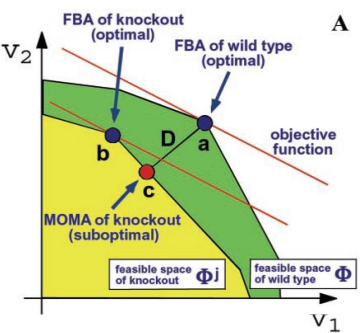

### MOMA Hypothesis

MOMA는 주어진 벡터 v로 부터 mutant feasible space에서 거리가 최소인 점 w를 찾습니다. 

knock-out feasible space에서 벡터 w를 찾는 것은 아래의 Euclidean distance를 이용하여, 거리가 최소화가 되는 지점을 계산함으로써 이루어질 수 있습니다.

$$\sqrt{\sum_{i=1}^{m}(w_i-v_i)^2}$$

위의 식은 아래의 식이 minimized될때 함께 최소화됩니다.

$$\sum_{i=1}^{m}(w_i-v_i)^2$$

우리는 이 식을 여러 파트로 분리할 수 있습니다. 

$$\sum_{i=1}^{m}(w_i-v_i)^2=\sum_{i=1}^{m}(w_i^2-2w_iv_i+v_i^2)$$

$$\sum_{i=1}^{m}w_i^2-2\sum_{i=1}^{m}w_iv_i+\sum_{i=1}^{m}v_i^2$$

여기서 $w_i$가 우리가 찾길 원하는 벡터이고, $v_i$는 이미 정해진 값, 즉 상수로써, 계산에 영향을 미치지 않기 때문에 계산에서 제외될 수 있습니다. 

가운데 $v_iw_i$부분은 다음과 같이 표현될 수 있습니다.

$$\sum_{i=1}^{m}v_iw_i=v^Tw$$

이 부분은 이미 쉽게 계산이 가능하지만, 맨 앞의 2차식 같은 경우 계산이 어렵습니다. 이를 계산하기 용이하게 아래와 같이 변환할 수 있습니다. 

$$\sum_{i=1}^{m}w_i^2=w^TI_mw$$

그러나 이 부분은 아직도 이차식으로 자리합니다. 이를 계산할 수 있는 방법으로는 여러가지가 있습니다.

### Quadratic programming - QP

Quadratic programming은 다음과 같은 형태로 존재합니다.

$$\mathbf{min}\frac{1}{2}x^TQx+c^Tx$$

s.t.

$$Ax\leq b$$

이는 앞의 quadratic part와 뒤의 linear part로 나뉠 수 있습니다. 따라서, 다음과 같이 쓰일 수 있습니다.

$$w^TI_mw-(2v^T)w+const$$

이는 위의 QP의 일반적 형태와 일치합니다. 

---

일반적으로 QP의 quadratic part에 사용되는 $Q$는 symmetric합니다. 이 $Q$의 eigenvalue를 사용할 수 있습니다.

$$Qx=\lambda x$$

$$(Q-\lambda I)x=0$$

$$\mathbf{det}(Q-\lambda I)=0$$

- 만약 $Q$의 모든 eigenvalues가 양수라면, matrix는 **positive definite**입니다.
- 만약 몇 eigenvalues가 0이고, 나머지는 양수라면, matrix는 **positive semidefinite**입니다.
- 만약 matrix가 positive semidefinite가 아니라면, **negative semidefinite** 혹은 **indefinite**입니다. 

> - $Q$가 positive semidefinite이면, $x^TQx$는 convex입니다.    
> - $Q$가 positive definite이면, $x^TQx$는 strictly convex입니다. 

제곱 프로그래밍 (Quadratic Programming, QP) 문제를 해결하기 위해 다양한 접근 방법이 있습니다:

- **Interior Point Method:** 
  
  Interior Point Method은 QP 문제를 해결하기 위해 Interior Point을 향해 이동하는 방법입니다. 이 방법은 주어진 제약 조건을 고려하면서 objective function를 최적화하는 접근 방법으로, global optimum solution을 찾는 데 효과적입니다.

- **Active Set Method:** 
  
  Active Set Method은 문제를 푸는 동안 Active 제약 조건을 식별하고 해당 제약 조건에 대한 최적해를 찾습니다. 이 방법은 QP 문제를 작은 부분 문제로 분해하여 해결하는 방법으로, 주어진 문제의 제약 조건과 objective function를 함께 고려합니다.

- **Augmented Lagrangian Method:** 
  
  Augmented Lagrangian Method은 제약 조건이 있는 최적화 문제를 해결하기 위한 방법 중 하나입니다. 이 방법은 라그랑주안 함수를 수정하여 추가된 제약 조건을 고려합니다. 이 방법은 주어진 문제를 작은 부분 문제로 분해하여 해결하는 방법으로, 주어진 문제의 제약 조건과 objective function를 함께 고려합니다.

- **Conjugate Gradient Method:** 
  
  Conjugate Gradient Method은 QP 문제를 해결하기 위한 반복적인 최적화 방법입니다. 이 방법은 objective function의 기울기를 사용하여 최적화 문제를 해결하는 반복적인 접근 방법으로, 최적해를 찾기 위해 반복적으로 기울기를 수정합니다.

- **Extensions to Simplex Algorithm:** 
  
  심플렉스 알고리즘은 선형 프로그래밍 문제를 해결하는 데 사용되지만, 일부 확장은 QP 문제를 해결하는 데 사용될 수 있습니다. 이 방법은 제약 조건을 고려하면서 objective function를 최적화하는 방법으로, 선형 및 이차 제약 조건을 동시에 고려합니다.

### MOMA Formulation

wild type $v$의 steady state flux distribution가 주어졌을 때, QP problem 형식의 MOMA는 다음과 같이 수학적으로 쓰일 수 있습니다.

$$\text{min }w^TI_mw-(2v^T)w$$

s.t.

$$Nw=0$$

$$w_j=0$$

$$\forall i,1 \leq i \neq j \leq m$$

$$w_i^{min} \leq w_i \leq w_i^{max}$$

biomass의 최적화는 MOMA식에 명시적으로 포함되어있지 않습니다. 

유전자 Knock-out은 해당 반응의 플럭스를 제로로 설정하여 시뮬레이션됩니다. 이는 모든 isoenzyme이 특정 반응과 관련된 유전자가 삭제되거나 단백질 복합체의 모든 단위가 삭제된 경우에 수행됩니다 (비록 이것이 항상 생물학적 현실을 정확하게 반영하지는 않을 수 있습니다. 왜냐하면 어떤 단백질 복합체는 일부 단위가 제거되어도 일부 기능을 여전히 수행할 수 있기 때문입니다).

MOMA는 FBA로 예측된 것보다 자연스럽게 더 낮은 수율을 나타냅니다. 이는 MOMA가 주어진 제약 조건을 충족하면서도 가능한 한 와일드 타입에 가까운 대사 상태를 찾기 때문입니다. 결과적으로, MOMA는 종종 FBA로 예측된 이상적인 최적 성장률보다는 부족한 성장률을 나타내며, 특히 네트워크가 유전자 Knock-out과 같은 변동을 경험하는 상황에서 더 그렇습니다.

실험적 증거에 따르면, 많은 경우에 유전자 삭제 후 growth rate는 와일드 타입에 비해 감소하나, 이후 점차 증가하여 거의 와일드 타입 수준에 도달합니다.

MOMA는 이러한 변화를 설명하는 한 가지 방법을 제공하지만, 이는 모든 플럭스에 대한 수많은 작은 변화를 내포하며, 몇 개의 큰 변화가 아닌 같은 값을 가진 적은 수의 플럭스에 대한 큰 변화를 내포합니다.

이러한 특성들은 Euclidean norm을 반영합니다!

## Regulatory on/off Minimization - ROOM

세포는 유전자 Knock-out 이후의 플럭스 변화를 실현하기 위한 유전자 규제 변화를 최소화합니다: 이는 유전자 Knock-out 이후의 대사적 적응 비용을 최소화하려는 생물학적 전략을 반영합니다. 즉, 세포는 가능한 한 적은 유전자 규제 변경으로 플럭스 변화를 실현하려고 합니다.

ROOM은 **Boolean On/Off** 로 간단하게 기술될 수 있습니다: 이는 유전자의 활성화 또는 억제를 간단한 On/Off 형태로 기술할 수 있다는 가정을 의미합니다. 따라서 각 유전자 규제 변경에는 크기에 관계없이 고정된 비용이 할당됩니다.

ROOM은 다른 측정 항목을 사용하며, 충분히 큰 플럭스 변화를 최소화합니다. 이는 MILP(Mixed Integer Linear Programming)로 캐스팅됩니다. 각 반응 $i$에 대해 유의미한 플럭스 변화가 있는 경우 
$y_i=1$로 표시되고, 그렇지 않으면 $y_i=0$입니다. $y_i$는 각 반응이 유의미한 플럭스 변화를 나타내는지 여부를 나타냅니다.

$$
\begin{cases}
y_i=1, changes\\
y_i=0, otherwise
\end{cases}
$$

유의한 변화의 상한과 하한은 주어진 와일드 타입 플럭스 분포 $v$와 상대적 변화를 결정하는 $\delta$ 및 sensitivity bound $\epsilon$ 이 두 parameter에 기반하여 설정됩니다. $v_i^u$와 $v_i^l$은 각각 유의한 변화의 상한과 하한을 나타냅니다.

따라서 ROOM을 수학적으로 나타낸 MILP 공식은 다음과 같습니다.

$$min \sum_{i=1}^m y_i$$

s.t.

$$Nw=0$$

$$w_j=0$$

$$\forall i, 1 \leq i \leq m$$

$$w_i^{min} \leq w_i \leq w_i^{max}$$

$$\forall i, i \leq i \leq m, y_i \in \{0,1\}$$

$$w_i-y_i(w_i^{max}-v_i^u) \leq v_i^u$$

$$w_i-y_i(w_i^{min}-v_i^l) \geq v_i^l$$

$$v_i^u = v_i + \delta|v_i| + \epsilon$$

$$v_i^l = v_i - \delta|v_i| - \epsilon$$

많기도 해라..

binary value $y_i$값에 따라 위의 조건은 변화합니다. 

- $y_i=1$의 경우,

  flux change에 대한 상한과 하한 $v_i^u$와 $v_i^l$은:

  $$w_i-w_i^{max}-v_i^u \leq v_i^u$$

  $$w_i-w_i^{min}-v_i^l \geq v_i^l$$

- $y_i=0$의 경우, 

  flux change에 대한 상한과 하한 $v_i^u$와 $v_i^l$은:

  $$w_i \leq v_i^u$$

  $$w_i \geq v_i^l$$

ROOM는 MOMA와 마찬가지로 biomass optimization를 고려하지 않습니다. MOMA는 유전자 Knock-out 후의 Metabolic network의 최적 성장률을 찾는 데 중점을 두는 반면, ROOM은 유전자 규제의 변화를 최소화하여 Metabolic network의 변화를 설명하는 데 중점을 둡니다.

ROOM은 분기 지점에서 한 경로를 선택하는 경향이 있습니다. 이것은 "linearity hypothesis"이라고도 합니다. 이는 두 분기 모두를 통과하는 대신 한 분기만을 선택한다는 것을 의미합니다. 이는 ROOM이 다른 메트릭을 사용하여 플럭스를 평가하고 최소화하고 있기 때문에 발생합니다. MOMA가 주어진 조건에서 최적의 대사 상태를 찾으려고 하는 반면, ROOM은 유전자 규제의 변화를 최소화하려고 합니다.

## Metabolic engineering

1. Can one design strategy to increase product of interest based only on knock-outs?
  - OptKnock
2. Can one design strategy to increase product of interest by inserting non-native genes (in combination with knockouts)?
  - OptStrain
3. How difficult is to design a strategy that also includes overxpression targets?
  - 존나 어려움

Metabolic engineering에서 중요한 설계 원칙 중 하나는 세포의 growth을 원하는 metabolite의 생산과 결합하는 것입니다. 이 원칙은 원하는 metabolite의 production을 세포의 metabolic function의 필수 부산물로 만드는 것입니다. 따라서 이 metabolite의 production은 생물체의 대사 기능의 필수적인 부분이 됩니다. 성장은 생산을 추진하는 주요 동력이 됩니다.

이 원칙은 cell growth와 production of metabolites를 서로 연관시켜 optimizing growth을 통해 metabolite의 production을 optimize함으로써 metabolic engineering 목표를 달성하려는 것입니다. 

- **Weak Coupling**

  Weak Coupling에서는 충분히 높은 production 수율이 최대 또는 최대에 근접한 생물량 수율에서 달성됩니다.
  
  다시 말해, Weak Coupling에서는 biomass production이 최대로 유지될 때, 원하는 metabolite의 production이 충분히 높은 수준에 도달합니다. 이러한 경우, organism의 growth가 production의 주요 동력이 되며, biomass production과 metabolite production 사이에는 Strong Coupling이 있습니다.

- **Strong Coupling**

  Strong Coupling에서는 production이 성장 없이도 반드시 발생해야 합니다.

  이것은 원하는 metabolite production이 생물체의 growth와 독립적으로 발생할 수 있음을 의미합니다. 즉, production이 growth에 의해 드라이브되지 않고, production을 위한 특별한 조건이 필요합니다. Metabolic network는 원하는 metabolite production을 자동으로 유도하는 것으로 구성되어 있습니다. 예를 들어, 원하는 metabolite production은 해당 물질의 전구체 또는 중간체의 production이 완전히 급이 들어가거나 반응의 특정 경로에 따라 직접적으로 조절될 수 있습니다.

### Bilevel Programming

그렇다면, 우리가 원하는 Metabolite의 production을 최대화하기 위한 최선의 Knock-out combination 을 어떻게 하면 찾을 수 있습니까?

주어진 Metabolic network에서 가능한 모든 knock-out combination을 고려하기 위해 다음과 같은 수학적 optimization problem을 고려할 수 있습니다:

모든 subset $T \subseteq L$에 대해,

$$\text{max } v_{chemical}$$

s.t.

$$Nv=0$$

$$\forall j \in T, v_j=0$$

$$\forall i,i \notin T$$

$$v_i^{min} \leq v_i \leq v_i^{max}$$

$$v_{bio} \geq \alpha z^*$$

* 여기서 $v_{chemical}$은 우리가 최대화를 원하는 metabolite의 생산량입니다. 
* $T$는 제거할 반응에 대한 subset을 의미합니다. 
* $v_{bio}$는 biomass production입니다.
* $z^*$는 optimal growth flux입니다.
* $\alpha$는 strong coupling을 정의하는 파라미터입니다.

따라서, 위의 질문은 다음과 같이 바뀝니다. 

> 최적의 biomass production을 보장하면서 원하는 metabolite의 production을 최대화 하기 위해 knock-out이 필요한 reactions를 식별하는 방법은 무엇입니까?

이는 "optimal biomass production"이라는 optimization problem이 해결되었다는 가정 하에, "optimal metabolite production"이라는 또 다른 optimization problem이 등장하는, 즉, 두개의 nested optimizations입니다. 이것을 **bilevel programming**이라 부릅니다. 

knock-out이 필요한 반응을 식별하기 위해, 위의 ROOM에서 소개되었던 개념(binary variables)을 가져올 수 있습니다.

* $y_i =1$이면, 해당 반응이 knock-out되지 않았음을 의미합니다.
* $y_i=0$이면, 해당 반응이 knock-out되었음을 의미합니다. 

knock-out이 되었다는 말은, 이 반응에 대한 Flux의 상한과 하한이 모두 0이 라는 말과 같습니다. 따라서, 상한과 하한을 다음과 같이 쓸 수 있습니다.

$$y_iv_i^{min} \leq v_i \leq y_iv_i^{max}$$

즉, $y_i=0$일 때, $v_i=0$입니다. 

이러한 binary variable은 다음의 조건을 충족해야 합니다.

$$\sum_{i=1}^m(1-y_i) \leq K$$

이 조건을 통해 최대 knock-out reactions의 개수를 제한할 수 있습니다.

따라서 optimization problem은 다음과 같이 쓰입니다:

$$\text{max } v_{chemical}$$

s.t.  $\{$

$$\text{max } v_{bio}$$

  s.t $\{$

  $$Nv=0$$

  $$\forall i, 1 \leq i \leq m$$

  $$y_iv_i^{min} \leq v_i \leq y_iv_i^{max}$$

  $$y_i \in \{0,1\}$$

  $$\sum_{i=1}^m(1-y_i) \leq K$$

  $$\}\}$$

nested된 내부의 optimization problem은 FBA로 간단하게 해결할 수 있습니다. 

그렇다면 이런 bilevel problem은 어떻게 해결합니까?

두가지의 방식이 있습니다:

* **KKT conditions**
* **Dual problems**

### KKT conditions

KKT(Karush-Kuhn-Tucker) condition은 제한이 있는 optimization problem의 해를 찾기 위한 필요 조건으로, 주어진 optimization problem에 대한 최적해의 조건을 나타냅니다.

주어진 문제가 다음과 같이 constraint가 없는 문제일 때:

$$\text{min } f(x)$$

s.t.

$$x \in \mathbb{R}^n$$

여기서 x는 n차원 벡터입니다. 이때, $f(x)$가 local minimizer $x^*$에서 극소값을 가질 때, $f(x)$가 $x^*$에서 연속적으로 미분 가능한 경우 다음과 같은 KKT conditions이 성립합니다:

$$\nabla f(x^*)=0$$

즉, $f(x)$는 $x^*$에서 stationary합니다. 이를 **Gradient**라 합니다. 

여기서 $f(x^*)$는 벡터로, 다음과 같은 형태를 가집니다:

$$\nabla f(x^*)=
\begin{bmatrix}
\frac{\partial f}{\partial x_1} \\
\vdots \\
\frac{\partial f}{\partial x_n}
\end{bmatrix}
$$

하나의 변수에 대한 함수를 최적화하는 방법은 해당 함수를 미분하고 미분한 함수가 0이되는 지점을 찾는 것입니다. 이 점이 함수의 극소값 또는 극대값이 될 수 있습니다. 

두 변수에 대한 함수를 최적화하는 경우에도 마찬가지입니다. 함수를 각 변수에 대해 편미분하여 편미분한 함수가 0이 되는 지점을 찾습니다.

다음 예시를 통해 더 자세히 살펴보겠습니다

$$\text{min } 2x_1^2+x_2^2$$

s.t.

$$x_1 + x_2 = 1$$

problem이 constrained되지 않았다고 가정할 때,

$$\frac{\partial f(x_1,x_2)}{\partial x_1}=4x_1=0$$

$$\frac{\partial f(x_1,x_2)}{\partial x_2}=2x_2=0$$

즉, 다음과 같은 벡터 형태입니다.

$$\nabla f(x)=
\begin{bmatrix}
\frac{\partial f}{\partial x_1} \\
\frac{\partial f}{\partial x_2}
\end{bmatrix}
=\begin{bmatrix}
4x_1 \\
2x_2
\end{bmatrix}
=\begin{bmatrix}
0 \\
0
\end{bmatrix}
$$

여기서 해는 $x_1=x_2=0$이지만, 이는 실제 constraint $x_1 + x_2 = 1$를 만족하지 않습니다.

이 constraint를 만족하기 위해, 식을 조금 변형합니다. 우리는 **Penalty**를 부여하는 방식으로 식을 변형할 수 있습니다.

위의 optimization problem의 objective를 다음과 같이 변형할 수 있습니다.

$$L(x,\lambda) = 2x_1^2+x_2^2+\lambda(1-x_1-x_2)$$

이것은 problem의 **Lagrangian**으로 불리며, $\lambda$에 해당하는 값은 constraint의 항들을 모두 한변으로 이동시켜 만들어집니다.

$$(x_1+x_2=1) \to (1-x_1-x_2=0)$$

우리는 각 $\lambda$에 여러 다른 값, 즉 여러 다른 **penalty**를 대입함으로써 solution을 찾을 수 있습니다.

* $\lambda=0$
  * $x_1=x_2=0$, $1-x_1-x_2=1$
* $\lambda=1$
  * $x_1=\frac{1}{4}$, $x_2=\frac{1}{2}$, $1-x_1-x_2=\frac{1}{4}$
* $\lambda=2$
  * $x_1=\frac{1}{2}$, $x_2=1$, $1-x_1-x_2=-\frac{1}{2}$
* $\lambda=\frac{4}{3}$
  * $x_1=\frac{1}{3}$, $x_2=\frac{2}{3}$, $1-x_1-x_2=0$
  * constraint를 만족

---

#### Equality Constrained Optimization

이렇듯, 다음과 같은 equality constrained optimization 문제가 있을 때:

$$\text{min } f(x)$$

s.t.

$$\forall,1\leq i \leq m$$

$$h_i(x)=c_i$$

$$x \in \mathbb{R}^n$$

다음과 같이 Lagrangian을 통해 문제가 해결될 수 있습니다. 

$$L(x,\lambda)=f(x)+\sum_{i=1}^m \lambda_i(c_i-h_i(x))$$

위의 예시를 빌려와 설명하자면,

* $f(x)=2x_1^2+x_2^2$
* $h(x)=x_1 + x_2$
* $c=1$

또한, 다음이 성립합니다.

$$\nabla_xL(x,\lambda)=\nabla_xf(x)-\sum_{i=1}^m \lambda_i\nabla_xh_i(x)$$

즉, Lagrangian $\lambda_i$이 0일 때, $L$과 $\nabla_xf(x)$도 0이 되기 때문에, homogeneous한 $f(x)$를 풀 수 있습니다. 

#### Why is L(x, λ) = f(x) of interest? 

왜 $L(x, \lambda)$가 중요합니까?

위의 최적화 문제를 해결하는 $x^*$가 있다고 해봅시다. 그렇다면 다음 두가지 경우가 가능합니다:

1. $\nabla h_1(x^*), \nabla h_2(x^*), ..., \nabla h_m(x^*)$가 linear dependent인 경우, 즉,  $\sum_{i=1}^m \lambda_i \nabla h_i(x^*) = 0$를 만족하는 일부 $\lambda_i$가 존재합니다.
2. 다음을 만족하는 $\lambda^*$가 존재합니다:
   
  $$\frac{\partial L(x^*, \lambda^*)}{\partial x_1} = \cdots = \frac{\partial L(x^*, \lambda^*)}{\partial x_n}  = \frac{\partial L(x^*, \lambda^*)}{\partial \lambda_1}  = \cdots = \frac{\partial L(x^*, \lambda^*)}{\partial \lambda_m} = 0$$

사실 뭔소린지는 잘 모르겠습니다. 

다음 예시에서 살펴봅시다. 

> $$\text{min } x_1+x_2+x_3^2$$
> s.t.
> $$x_1=1$$
>
> $$x_1^2+x_2^2=1$$
>
> 이 녀석은 다음과 같은 라그랑지안을 가집니다:
> 
> $$L(x,\lambda) =x_1+x_2+x_3^2+\lambda_1(1-x_1)+\lambda_2(1-x_1^2-x_2^2)$$
> 
> 이 라그랑지안이 $x_1=1$, $x_2=x_3=0$에서 optimum을 가질 때, 
> 
> $$\frac{\partial L(x^*, \lambda^*)}{\partial x_2}=1$$
> 
> 또,
> 
> $$\nabla h_1(x^*)=
> \begin{bmatrix}
> 1&0&0
> \end{bmatrix}
> $$
> 
> $$\nabla h_2(x^*)=
> \begin{bmatrix}
> 2&0&0
> \end{bmatrix}
> $$

다른 것도 볼까요?

> $$\text{min } 2x_1^2+x_2^2$$
> 
> s.t.
> 
> $$x_1 + x_2 = 1$$
> 
> $$L(x,\lambda) = 2x_1^2+x_2^2+\lambda(1-x_1-x_2)$$
> 
> 이 라그랑지안은 다음에서 optimum을 가집니다:
> 
> $$\frac{\partial L(x^*, \lambda^*)}{\partial x_1}=4x_1^*-\lambda^*=0$$
> 
> $$\frac{\partial L(x^*, \lambda^*)}{\partial x_2}=2x_2^*-\lambda^*=0$$
> 
> $$\frac{\partial L(x^*, \lambda^*)}{\partial \lambda^*}=1-x_1^*-x_2^*=0$$
> 
> 이는 다음의 해를 도출합니다:
> 
> $$x_1^*=\frac{1}{3}, x_2^*=\frac{2}{3}, \lambda^*=\frac{4}{3}$$

이해가 되시나용? 아니용! ㅎㅎ 

그래프에서 보면 다음과 같습니다.

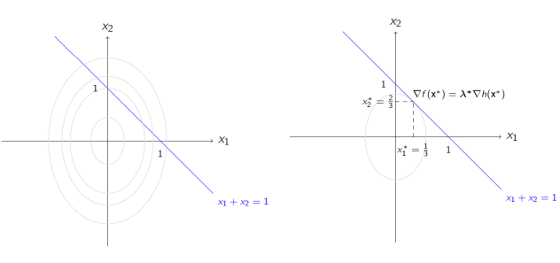

에휴시발

---

#### Equality, Inequality Constrained Optimization

암튼, equality, inequality constraint를 모두 가지는 optimization의 경우:

$$\text{min } f(x)$$

s.t.

$$\forall i,1\leq i \leq m$$

$$h_i(x)=c_i$$

$$\forall i,1\leq i \leq l$$

$$g_i(x)\leq b_i$$

$$x \in \mathbb{R}^n$$

해당 문제에서 feasible solution $x_0$이 주어졌을 때, binding constraint는 다음을 만족합니다:

$$g_i(x)- b_i=0$$

이는 optimum에서, 몇 constraints는 binding된다는 것을 의미합니다.

여기서 Lagrangian은 다음과 같습니다:

$$L(x, \lambda, \mu) = f(x) + \sum_{i=1}^{m} \lambda_i (c_i - h_i(x)) + \sum_{i=1}^{l} \mu_i (b_i - g_i(x))$$

#### Why is L(x, λ, μ) = f(x) of interest?

$L(x, \lambda, \mu)$가 중요한 이유는 다음과 같습니다.

위의 optimization problem을 해결하는 $x^*$가 있다고 가정해 봅시다. 그럼 다음의 두 가지 경우가 가능합니다:

1. $\nabla h_1(x^*), \nabla h_2(x^*), ..., \nabla h_m(x^*), \nabla g_1(x^*), ... , \nabla g_l(x^*)$가 linear dependent인 경우
  
     * 즉, 다음을 만족하는 만족하는 일부 $\lambda_i$와 $\mu_i$가 존재하는 경우
 
  $$\sum_{i=1}^{m} \lambda_i \nabla h_i(x^*) + \sum_{i=1}^{l} \mu_i \nabla g_i(x^*) = 0$$

2. 다음을 만족하는 $\lambda^*$와 $\mu^*$가 존재하는 경우:
  $$\nabla f(x^*) -\sum_{i=1}^{m} \lambda^*_i \nabla h_i(x^*) -\sum_{i=1}^{l} \mu^*_i \nabla g_i(x^*) = 0$$

  $$\mu^*_i g_i(x^*) = 0$$

  $$\mu^*_i \geq 0$$

여기서, feasible point $x_0$에 대해 다음과 같은 조건이 만족됩니다:

$$\nabla f(x_0) - \sum_{i=1}^{m} \lambda_i \nabla h_i(x_0) - \sum_{i=1}^{l} \mu_i \nabla g_i(x_0) = 0$$

$$\mu_i g_i(x_0) = 0$$

$$\mu_i \geq 0$$

여기서 $\mu_i g_i(x_0) = 0$ 조건은 complementary slackness이라고 합니다. 만약 $n$개의 complementary slackness가 있다면, 해결해야 할 가능한 시스템은 $2^n$개가 됩니다.

KKT 조건은 Optimum point에 대한 necessary conditions(필요 조건)입니다!

두개의 예시를 보겠습니다:

> $$\text{maximize } x$$
> 
> s.t.
> 
> $$-1 - x^3 + y \leq 0$$
> 
> $$-y \leq 0$$
> 
> 라그랑지안 함수는 다음과 같습니다:
> 
> $$L(x, y, \lambda, \mu) = x + \mu_1 ((1 - x)^3 - y) + \mu_2(y)$$
> 
> global optimum $(x, y) = (1,0)$에서, gradients는 다음과 같습니다:
> 
> $$\nabla f(x, y) = \left( \frac{\partial f(x,y)}{\partial x}, \frac{\partial f(x,y)}{\partial y} \right) = (1, 0)$$
> 
> $$\nabla g_1(x, y) = (3(1-x)^2, 1) = (0, 1)$$
> 
> $$\nabla g_2(x, y) = (0, -1)$$
> 
> 어떤 $\mu$ 도 다음을 만족하지 않습니다:
> 
> $$\nabla f(x_0) - \sum_{i=1}^{2} \mu_i \nabla g_i(x_0) = 0$$
> 
> 즉, 위의 첫 번째 경우가 성립합니다!

하이고씨팔 두번째를 봅시다잉

> $$\text{max } -(x - 2)^2 - 2(y-1)^2$$
> 
> s.t.
> 
> $$x + 4y \leq 3$$
> 
> $$-x + y \leq 0$$
> 
> 라그랑지안 함수는 다음과 같습니다:
> 
> $$L(x, y, \lambda, \mu) = -(x - 2)^2 - 2(y-1)^2 + \mu_1(3 - x - 4y) + \mu_2(x - y)$$
> 
> KKT conditions는 다음과 같습니다:
> 
> $$\frac{\partial L}{\partial x} = -2(x - 2) - \mu_1 + \mu_2 = 0$$
> 
> $$\frac{\partial L}{\partial y} = -2(y - 1) - 4\mu_1 - \mu_2 = 0$$
> 
> $$\mu_1 (3 - x - 4y) = 0 \\
> \mu_2 (x - y) = 0 \\
> \mu_1, \mu_2 \geq 0$$
> 
> 두 complementary conditions, $\mu_1 (3 - x - 4y) = 0$와 $\mu_2 (x - y) = 0$으로부터 네 가지 cases가 나타납니다:
> 
> 1. $\mu_1 = 0$, $\mu_2 = 0$
> 2. $\mu_1 = 0$, $x - y = 0$
> 3. $3 - x - 4y = 0$, $\mu_2 = 0$
> 4. $x - y = 0$, $3 - x - 4y = 0$
> 
> 이 네가지 방정식을 사용하여 네 가지 solution subset을 얻을 수 있습니다.
> 
> 그중 function을 minimize하는 해는:
> 
> $x^* = \frac{5}{3}$, $y^* = \frac{1}{3}$, 그리고 $f(x^*, y^*) = -\frac{4}{9}$

ㄱ..그만..

#### KKT conditions - sufficient

KKT condition이 optimality를 보장하는 경우는 언제인가요?

추가 조건은 KKT condition이 최적성을 보장할 수 있도록 할 수 있습니다. 이는 inequalities만 고려될 때 해당합니다.

따라서 함수 $g_i(x)$가 볼록(convex)해야 합니다.

만약 equlities도 고려된다면, KKT conditions는 그 자체로 optimality를 보장하는데 충분조건이 됩니다. 이때에는 대응하는 함수 $h_i(x)$가 linear해야 합니다.

### Duality LP

LP의 duality는 LP문제와 이와 관련된 Dual problem 간의 특별한 관계를 나타냅니다. 일반적으로 LP문제의 Duality는 **Primal problem**과 **Dual problem**간의 관계로 설명됩니다. 

Primal problem은 LP 문제의 원래 형태로, 주어진 objective function를 최대화하거나 최소화하면서 주어진 제약 조건 하에서 변수를 결정하는 것입니다. 이를 일반적으로 다음과 같이 표현할 수 있습니다:

$$\text{max }c^Tx$$

s.t.

$$Ax \leq b \\
x \geq 0$$

이 primal problem의 lagrangian은 다음의 형태를 가집니다.

$$L(x,\mu)=c^Tx+\mu(b-Ax)$$

이를 다음과 같이 바꿔쓸 수 있습니다.

$$L(x,\mu)=\mu b+(x^T-\mu A)x$$

이 primal problem은 다음과 같은 dual problem을 가집니다.

$$\text{min }\lambda b$$

s.t.

$$\lambda A \geq c^T \\
\lambda \geq 0$$

이 Primal problem과 Dual problem사이엔 Duality가 존재합니다. 이는 다음과 같은 성질을 가집니다.

* **Optimality Property:**

  주어진 primal과 dual은 다음과 같은 관계를 가집니다.

  $$c^Tx=\lambda b$$

  즉, **primal의 optimum과 dual의 optimum은 서로 같습니다.** 

* **Unboundedness Property:**

  **만약 두 문제중 하나가 unbounded이면, 다른 하나는 infeasible합니다.** 즉, primal이나 dual중 하나가 무한대로 발산하면, 즉 경계가 없다면, 다른 문제는 해를 갖지 않습니다.

* **Strong Duality Property:**

  만약 primal LP의 Optimum이 존재하면, Dual problem의 Optimum또한 존재합니다. 이는 위의 Optimality Property와 기본적으로 같습니다. 

  $$\text{max }c^Tx=\text{min }\lambda b$$

---

위에서 주어진 primal problem에 대해, $(c^T-\lambda A)x=0$는 dual의 **complementary slackness condition**입니다. 

이는 primal problem의 decision variable x와 dual problem의 lagrangian $\lambda$ 사이의 조건입니다. 

이것은 모든 decision variable x와 그에 상응하는 lagrangian λ에 대해 해당 변수에 대한 slack variable가 0이거나 decision variable가 0임을 의미합니다. 즉, 어떤 해 x에 대해, $c^T-\lambda A=0$이거나 $x=0$입니다. 

이것은 primal problem에서, decision variable을 증가시킬 때, 이에 상응하는 dual variable이 얼마나 증가해야 하는지를 결정하는 조건입니다. 

따라서, $\lambda_i>0$이면 해당 resource가 완전히 사용된것을 나타내며, $\lambda_i=0$이면 해당 resource가 완전히 사용되지 않았음을 의미합니다. 

Dual variable $\lambda$는 **shadow prices**라고도 불립니다. 이들은 primal problem의 constraints를 하나씩 완화(relax)했을 때 objective function 값이 얼마나 변하는지를 나타내는데 사용될 수 있습니다. 따라서, shadow price는 각 constraints에 대한 "가용성"을 나타냅니다.

각 constraint에 해당하는 shadow price는 해당 constraint를  relax할 때 objective function 값이 얼마나 증가하거나 감소하는지를 나타냅니다.

따라서, shadow price는 해당 constraint의 중요성을 나타내며, 해당 자원의 한 단위의 가격이나 가치로 해석될 수 있습니다. 각 constraint는 shadow price를 가집니다. 

### OptKnock

다음과 같은 Bilevel Program이 주어졌을 때,

$$\text{max } v_{chemical}$$

s.t.  $\{$

$$\text{max } v_{bio}$$

s.t $\{$

  $$Nv=0$$

  $$\forall i, 1 \leq i \leq m$$

  $$y_iv_i^{min} \leq v_i \leq y_iv_i^{max}$$

  $$y_i \in \{0,1\}$$

  $$\sum_{i=1}^m(1-y_i) \leq K$$

  $$\}\}$$

OptKnock은 위 문제에서 Duality of LP와 KKT conditions를 고려하여 구성될 수 있습니다. 이에 대해 두가지 방법이 있습니다. 

* 내부 LP의 Dual problem을 구성하고, weak optimality condition을 적용합니다.
* 내부 LP에 대한 KKT condition을 구성합니다.

이 중 OptKnock은 위 방법을 이용하여 구성됩니다.

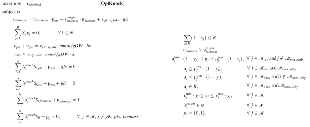

### OptStrain

우리는 Knock-out을 이용해 production을 increase 하는 방법을 알아보았습니다. 이제, knock-out에 추가적으로 **non-native gene을 삽입함으로써 production을 증가**시킬 수 있는 방법에 대해 알아봅시다.

OptStrain은 OptKnock에 대한 확장기능으로써, non-native gene을 insertion할 수 있는 방법입니다. 

다음 네 가지 스텝을 통해 이루어질 수 있습니다.

1. Creation of a universal database of metabolic reactions
   
   * 먼저, 모든 대사 반응에 대한 유니버셜 데이터베이스를 생성합니다. 이 데이터베이스는 대사 네트워크에서 가능한 모든 반응을 포함하고 있습니다.
   * 이 데이터베이스는 주로 KEGG를 기반으로 합니다. KEGG는 대사 경로 및 생물학적 기능과 관련된 다양한 생물학적 정보를 포함하는 대표적인 데이터베이스입니다. 여기서 정보를 추출합니다.
   * 반복 단위 또는 unspecified alkyl groups가 있는 R을 제거합니다. 일부 화합물은 반복 단위 또는 알킬기(R)와 같은 unspecified 기능을 가지고 있을 수 있습니다. 이러한 화합물은 데이터베이스에서 제거될 수 있습니다.
   *  화합물 간의 반응이 균형을 이루지 않는 경우, 이러한 반응은 불균형한 것으로 간주되고 제거됩니다. 이는 대사 네트워크의 정확성을 유지하기 위해 수행됩니다.
2. Maximum theoretical yield calculation for a product given a substrate origin

   * 주어진 substrate origin에 대한 최대 이론적 수율을 계산합니다. 여기선 origin(native or non-native)나 사용된 반응의 개수에 대해선 고려하지 않습니다.
   * 대상 metabolite의 생산 및 소비 반응의 합을 최대화합니다. 
   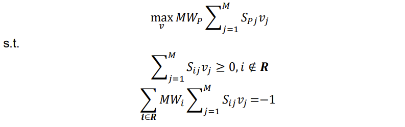

3. Identification of stoichiometrically balanced pathway(s) that minimizes the number of non-native functionalities

   * non-native functionalities의 개수를 최소화하는 stoichiometrically balanced pathway를 찾습니다. 
  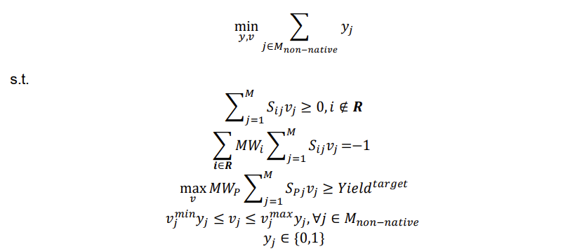
   * maximal production과 minimal non-native functionalities의 최적성 기준을 모두 보장하면서 alternative solution을 식별하는 방법은 다음과 같습니다:
     * MILP 문제를 반복적으로 해결하고, 추가 constraint를 포함하여 해답을 찾습니다. 이를 **integer cut**이라 합니다.
    
     $$y_1+y_2+y_3\leq 2$$

      이는 이미 선택된 모든 세개의 반응이 다시 함께 식별되지 않도록 합니다. 즉, 다른 alternative solution을 찾아냅니다.

4. Incorporation of the non-native biotransformation into the production host and further optimization
 
  * non-native biotransformation을 수행하기 위해 host의 metabolic network에 reactions를 포함시킵니다. stoichiometric matrix를 확장시킵니다.
  * product of interest와 growth를 커플링(결합)합니다. 이는 host의 metabolic network에서 생산 반응의 흐름을 최대화하면서 성장을 최대화하거나 최소화하는 것을 의미합니다. 

OptStrain의 적용 사례를 봅시다.

> E. coli를 호스트로 사용하기로 결정했습니다. 이를 위해 KEGG 데이터베이스를 Methylobacterium extroquens AM1의 반응과 결합하여 대사 네트워크의 범용 데이터베이스를 생성했습니다. 이 데이터베이스에는 탄소, 산소, 수소, 질소, 황, 인으로 균형 조정된 약 3000개의 반응이 포함되어 있습니다.
> 
> 다양한 하부원료 선택이 가능하며, 이에는 펜토스 및 헥소스 설탕과 같은 당류뿐만 아니라 아세테이트, 라크타트, 말산, 글리세롤, 피루베이트, 성취산, 메탄올 등이 포함됩니다.
> 
> 제 2단계에서는 수소 생산량을 최대화하려고 합니다. 이는 메탄올을 사용하여 달성되며, 이는 수소 대 탄소 원자의 비율이 가장 높기 때문입니다. 메탄올을 소비하는 경우, 0.126 g의 수소를 달성할 수 있습니다. 단위당 수소 생산량은 메탄올 소비량당 수소 생산량을 의미합니다.
> 
> Methylobacterium extorquens AM1은 메탄올을 탄소 및 에너지원으로 사용하여 생존할 수 있는 선택적 메틸로트로프(facultative methylotroph)입니다. 이러한 유형의 미생물은 탄소원으로 메탄올을 사용할 수 있지만, 다른 탄소원도 사용할 수 있습니다.
> 
> 수소 생산을 가능하게 하는 비기질 반응이 필요한데, 이는 이 미생물이 메틸로트로프로서 일반적으로 수행하지 않는 화학 반응입니다. 이 반응은 일반적으로 수소를 생성하는 수소화효소(hydrogenase)에 의해 수행됩니다. 이는 프로톤을 수소로 환원시키는 반응을 포함합니다.
> 
> 또 다른 비기질 반응은 N5, N10-메테닐테트라하이드로메탄오프테린 수소효소(N5,N10-methenyltetrahydromethanopterin hydrogenase)에 의해 수행됩니다. 이 반응은 테트라하이드로메탄오프테린을 테트라하이드로메탄오프로틴과 수소로 전환하는 반응입니다.
> 
> 이러한 비기질 반응이 필요한 이유는 메틸로트로프가 일반적으로 수행하지 않는 화학 반응이기 때문입니다. 이러한 유형의 미생물로부터 수소를 생산하는 것은 이전에 어려웠으며, 이러한 비기질 반응을 도입함으로써 새로운 기회가 제공됩니다.

---

### OptReg

OptReg은 또한 OptKnock의 또 다른 확장입니다. OptReg에서는 Knock-out뿐만 아니라, down- or up-regulated되어야 하는 biochemical reactions를 식별합니다. 이를 통해 최적화를 위한 조금 더 정교한 metabolic engineering strategie를 달성합니다.

이 방법은 플럭스가 주어진 안정 상태 플럭스보다 충분히 작거나 크다면 down/up-regulated된 것으로 간주합니다. 이것은 regulation strength parameter인 𝐶로 알려진 파라미터를 고려함으로써 달성됩니다.

이 parameter는 반응이 변경되기 위해 극복해야 하는 임계값을 정량화합니다. 이 파라미터는 0과 1 사이의 값을 가질 수 있습니다. 𝐶의 값이 높을수록 반응이 조절되기 위해 요구되는 조건이 강화됩니다.

$v_{j,L}^0$와 $v_{j,U}^0$는 steady state에서 허용되는 flux를 나타냅니다. 이는 FVA를 통해 얻어질 수 있습니다. 또한 여기서 모든 반응은 irreversible하다고 가정합니다.

* 주어진 Flux가 steady state Flux보다 충분히 작으면, down regulated reaction으로 간주됩니다. 따라서 flux의 range는 다음과 같습니다:

  $$v_j^{min}\leq v_j \leq v^0_{j,L}(1-C)+v_j^{min}C$$

* 주어진 Flux가 steady state Flux보다 충분히 크면, up regulated reaction으로 간주됩니다. 따라서 flux의 range는 다음과 같습니다:

  $$v^0_{j,U}(1-C)+v_j^{max}C \leq v_j \leq v_j^{max}$$

up regulation, down regulation, 그리고 knock-out을 판별하기 위해 총 3개의 binary variables가 필요합니다.

$$y_j^k=0 \text{, for knocked-out}\\
y_j^d=0 \text{, for downregulated} \\
y_j^u=0 \text{, for upregulated}$$

또한, 한 반응은 동시에 업-다운 조절되거나 녹아웃될 수 없습니다.

$$(1-y_j^k)+(1-y_j^d)+(1-y_j^u)\leq 1$$

또 전체 조절의 총량을 제한할 수 있습니다.

$$\sum_j(1-y_j^k)(1-y_j^d)(1-y_j^u)\leq L$$

또한 한 반응이 reversible하다고 할 때, 순방향과 역방향이 모두 같은방향으로 regulated될 수 없습니다.

$$y_{j,f}^d+y_{j,b}^d \geq 1\\
y_{j,f}^u+y_{j,b}^u \geq 1$$

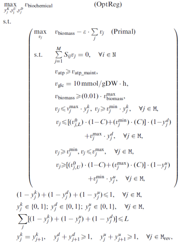

## parsimonious enzyme usage FBA- pFBA

### with reaction splitting

우리는 대사 네트워크를 모델링할 때 세포 또는 생물학적 시스템이 목적을 최적화한다고 가정합니다. 그러나 이러한 모델링 단계는 계산 가능한 수학적 프로그래밍 접근 방식을 필요로 합니다. 이를 위해서는 계산상 효율적인 방법이 필요합니다.

예를 들어, Flux Coupling Analysis는 선형 분수 프로그램에 기반한 방법입니다. 그러나 선형 분수 프로그램은 일반적으로 계산상 매우 복잡하고 비싸기 때문에, 좀 더 효율적인 계산을 위해 LP(선형 프로그래밍)으로 변환해야 합니다.

이러한 변환 기법 중 하나로 Chalmers-Cooper 변환을 사용할 수 있습니다. 이 변환은 선형 분수 프로그램을 선형 프로그래밍으로 변환하는 방법 중 하나입니다. 이를 통해 계산상 효율적인 방식으로 Flux Coupling Analysis를 수행할 수 있습니다.

pFBA (parsimonious enzyme usage FBA)는 효율적인 대사 토폴로지를 결정하는 데 기여할 수 있는 유전자 및 단백질의 하위 집합을 결정하는 것을 목표로 합니다. 진화 생물학적으로, 효소를 만드는데 일반적으로 비용이 발생하고, 효소를 유지 및 합성을 실행하는 사이클에서 또한 비용이 발생하기 때문입니다. 때문에 **pFBA에서는 추가적으로 Flux 자체를 최소화** 합니다. 이를 위해 대사 네트워크에서 모든 가역 반응이 두 개의 가역 반응으로 분리됩니다.

이는 두가지 스텝으로 이루어집니다.

1. Optimal biomass 결정을 위한 FBA:

  먼저 FBA를 풀어서 최적의 생체량을 결정합니다. FBA는 대사 네트워크에서 흐르는 대사 흐름을 최적화하여 특정 조건에서의 최대 세포 성장률을 예측합니다.

2. 총 Flux 최소화:

  이후, 전체 대사 네트워크에서 흐르는 총 플럭스를 최소화합니다. 이것은 다음과 같이 수학적으로 정의됩니다:

  $$\text{min }\sum_iv_i$$

  s.t.

  $$Nv=0$$

  $$v_{bio}=v_{bio,lb}$$

  $$0\leq v \leq v_{max}$$

pFBA의 목적은 효소 사용량을 최소화하여 생체 metabolic network의 효율성을 높이는 것입니다.

따라서, 사용되는 Genes는 다음과 같이 분류될 수 있습니다.

* **Essential**
  * 생존에 필수적인 유전자로서, 해당 유전자가 없으면 세포가 생존할 수 없습니다.
* **pFBA optima**
  * pFBA 최적화에 기여하는 유전자로서, 특정 조건에서 최소 효소 사용량을 실현하는데 중요한 역할을 합니다.
* **Enzymatically less efficient (ELE)**
  * 해당 유전자의 반응은 대사 네트워크에서 필요한 기능을 수행할 수 있지만, 더 적은 단계로 이루어진 대안 경로가 존재합니다.
* **Metabolically less efficient (MLE)**
  *  해당 유전자의 반응은 대사 네트워크의 전반적인 효율성을 저하시킵니다. 이러한 반응은 사용되더라도 세포의 성장률을 감소시킬 수 있습니다.
*  **No flux in the experimental condtions (pFBA no-flux)** 
   *  험 조건에서 해당 유전자와 관련된 반응의 플럭스가 관찰되지 않는 경우입니다.
  
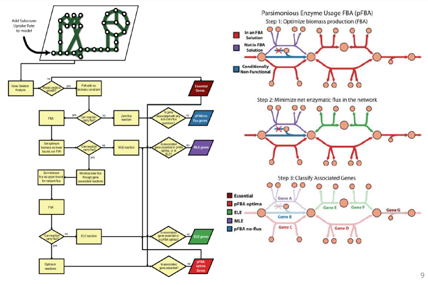

### without reaction splitting

reaction을 forward와 backward 두가지로 나누지 않고도 pFBA를 사용할 수 있습니다. 그러나 위의 LP를 바로 사용할 순 없습니다. 이 경우 다음 substitution이 필요합니다. 

$$v_i=v_i^+-v_i^-\\
|v_i|=v_i^++v_i^-$$

s.t. 

$$v_i^+,v_i^-\geq 0$$

따라서, 다음과 같은 LP를 고안할 수 있습니다.

  $$\text{min }\sum_i|v_i|=\text{min }\sum_iv_i^++v_i^-$$

  s.t.

  $$Nv=0$$

  $$v_i=v_i^+-v_i^-$$

  $$v_{bio}=v_{bio,lb}$$

  $$v_{min}\leq v \leq v_{max}$$

  $$v_i^+,v_i^-\geq 0$$

이는 모든 반응의 Flux의 합이 최소가 되도록 합니다.

이 최적화 문제는 최소 플럭스가 각 반응의 양의 및 음의 플럭스 중 적어도 하나가 0이면 동일한 목표 값을 가집니다. 이 경우, $v_i$는 다음과 같이 정의됩니다:

- $v_i=v_i^+$ (if $v_i \geq 0$)
- $v_i=-v_i^-$ (if $v_i \leq 0$)

만약 $v_i^+$와 $v_i^-$가 모두 0이 아닌 양수이고, 그 중 더 작은 값 $\delta$라고 가정해봅시다. 이때 두 값에서 $\delta$를 빼도 $v_i=v_i^+-v_i^-$는 변하지 않습니다. 

그러나, 이는 결국 objective에서 $2\delta$를 빼게 되는 것으로, 이는 최적성을 부정합니다. objective는 더 작아질 수 없기 때문에, 이는 모순입니다.

따라서, 다음의 형태를 다다음과 같이 변형합니다. 

> $$\text{min }\sum_i c_i|x_i|$$
> 
> s.t.
> 
> $$Ax \leq b$$

다음으로 변형:

$$\text{min }\sum_i c_i(x_i^++x_i^-)$$

s.t.

$$A(x^++x^-) \leq b$$

$$x^+,x^- \geq 0$$

### Minmax objective

"최대 오차 최소화 추정" 문제는 선형 프로그래밍 (LP)을 사용하여 최적화됩니다. 이 문제는 최대 오차를 최소화하면서 데이터 포인트와 모델 예측 간의 최대 오차를 최소화하는 모델을 찾는 것입니다. 일반적으로 이 문제는 최대 절대 오차를 최소화하는 문제로 변환됩니다.

최대 오차 최소화 추정을 다루는 일반적인 접근 방법은 다음과 같습니다:

- LP Transformation: 먼저, 최대 오차 최소화 추정 문제를 선형 프로그래밍 문제로 변환합니다. 이것은 일반적으로 최대 절대 오차를 최소화하는 선형 프로그래밍 문제로 변환됩니다.

- Least Maximum Deviation Estimation: 변환된 선형 프로그래밍 문제를 풀어서 최적의 모델을 찾습니다. 이 최적의 모델은 데이터 포인트와 모델 예측 간의 최대 오차를 최소화하면서 모든 데이터 포인트에 대해 최대 절대 오차를 최소화합니다.

$$\text{min max }\sum_j c_{kj}x_j$$

s.t.

$$Ax \leq b\\
x \geq 0$$

이는 일반적인 LP의 형태와 다르니, 변형해줍니다. 이를 위해 새 decision variable z를 도입합니다.

- $\sum_j c_{kj}x_j \leq z$ for every $k \in K$

이를 통해 z에 대한 optimal value가 k의 최댓값보다 크지 않도록 합니다. 

$$\text{min }z$$

s.t.

$$\sum_j c_{kj}x_j \leq z$$

$$Ax \leq b\\
x \geq 0$$

아 그냥 시발 강의 10은 ppt보고 공부하자
